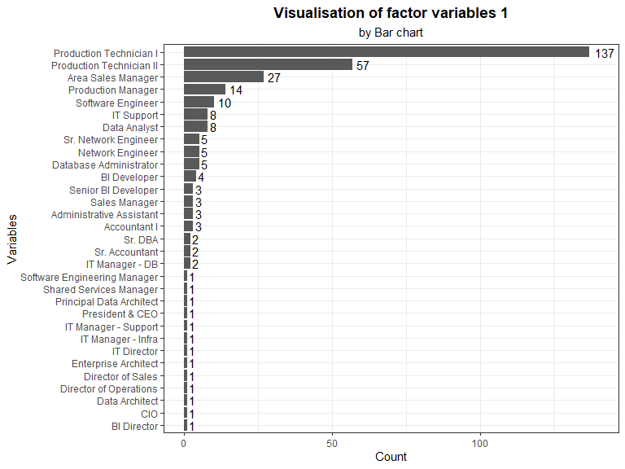
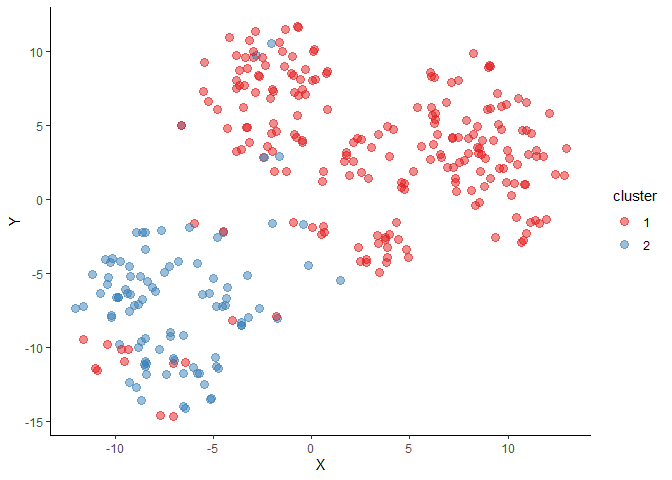

Human Resources Data Clustering & PC Analysis
================
Kar Ng
2022-05

-   [1 SUMMARY](#1-summary)
-   [2 R PACKAGES](#2-r-packages)
-   [3 INTRODUCTION](#3-introduction)
-   [4 DATA PREPARATION](#4-data-preparation)
    -   [4.1 Data import](#41-data-import)
    -   [4.2 Data description](#42-data-description)
    -   [4.3 Data exploration](#43-data-exploration)
-   [5 DATA CLEANING](#5-data-cleaning)
    -   [5.1 Variables removals](#51-variables-removals)
    -   [5.2 New Variable: Age](#52-new-variable-age)
    -   [5.3 New Variable: years_worked](#53-new-variable-years_worked)
    -   [5.4 Trim](#54-trim)
    -   [5.5 Factor conversion](#55-factor-conversion)
    -   [5.6 CitizenDesc](#56-citizendesc)
    -   [5.7 HispanicLatino](#57-hispaniclatino)
    -   [5.8 Missing data check](#58-missing-data-check)
-   [6 VISUALISATION](#6-visualisation)
    -   [6.1 Numerical variables](#61-numerical-variables)
    -   [6.2 factor variables 1](#62-factor-variables-1)
    -   [6.3 factor variables 2](#63-factor-variables-2)
    -   [6.4 Distribution study of continuous
        variable](#64-distribution-study-of-continuous-variable)
-   [7 CLUSTERING](#7-clustering)
    -   [7.1 Distance metrics](#71-distance-metrics)
    -   [7.1 Gower with PAM](#71-gower-with-pam)
-   [8 PRINCIPAL COMPONENT](#8-principal-component)
-   [REFERENCE](#reference)

## 1 SUMMARY

## 2 R PACKAGES

``` r
library(tidyverse)
library(kableExtra)
library(lubridate)
library(skimr)
library(tidytext)
library(factoextra)
library(FactoMineR)
library(cluster)    # For daisy function
library(cowplot)
library(Rtsne)
```

## 3 INTRODUCTION

This project analyses a set of human resource data by applying one of
the core machine learning technique, “Principal Components (PC)
methods”, which belong to the “unsupervised” branch of machine learning
domain.

There are 5 types of principal components methods:

-   Principal Component Analysis (PCA)  
-   Correspondence Analysis (CA)  
-   Multiple Correspondence Analysis (MCA)  
-   Factor Analysis of Mixed Data (FAMD)  
-   Multiple Factor Analysis (MFA)

These PC methods are designed for different type of datasets, I would
not explain why and how are these methods different from each other here
and for which type of datasets but I will apply the most appropriate one
for the dataset used in this project.

Principal component methods are typically used for multivariate analysis
(MVA) when we are analysing datasets that have many variables. PC
methods will quickly help us identifying the most important variables
that contribute the most in explaining the variations in the data sets.

During computation, PC methods will extract all the variations in the
multivariate dataframe and expressed them into a few new variables
called principal components (there are other inter-changeable terms with
similar meaning in this context, such as “dims” or “axes”). After
previous step, many special plots of PC will be plotted to understand
the result. Important to note that the goal of PC methods is to identify
main directions along which the variation is maximal (KASSAMBARA A
2017).

## 4 DATA PREPARATION

A public dataset called “Human Resources Data Set” by DR.RICH on
Kaggle.com has been downloaded for analysis. *Kaggle.com* is a popular
website for data science community to share datasets, codes and
knowledge.

This dataset

### 4.1 Data import

Following code upload the dataset into R.

``` r
hr <- read.csv("hr_dataset.csv", 
               fileEncoding = "UTF-8-BOM",
               na.strings = T,
               header = T,
               row.names = NULL)
```

### 4.2 Data description

Following is the data dictionary/description of this dataset, downloaded
from this link: [Rpubs](https://rpubs.com/rhuebner/hrd_cb_v14), created
by the author, Dr. Rich Huebner.


### 4.3 Data exploration

There are 311 rows and 35 columns in the dataset. Following show the
variable “type” allocated by R to each of the column (also known as
variables or features), along with several starting values of these
variables.

``` r
glimpse(hr)
```

    ## Rows: 311
    ## Columns: 36
    ## $ Employee_Name              <chr> "Adinolfi  Wilson  K", "Ait Sidi  Karthikey~
    ## $ EmpID                      <int> 10026, 10084, 10196, 10088, 10069, 10002, 1~
    ## $ MarriedID                  <int> 0, 1, 1, 1, 0, 0, 0, 0, 0, 0, 1, 1, 0, 0, 0~
    ## $ MaritalStatusID            <int> 0, 1, 1, 1, 2, 0, 0, 4, 0, 2, 1, 1, 2, 0, 2~
    ## $ GenderID                   <int> 1, 1, 0, 0, 0, 0, 0, 1, 0, 1, 0, 1, 1, 1, 1~
    ## $ EmpStatusID                <int> 1, 5, 5, 1, 5, 1, 1, 1, 3, 1, 5, 5, 1, 1, 5~
    ## $ DeptID                     <int> 5, 3, 5, 5, 5, 5, 4, 5, 5, 3, 5, 5, 3, 5, 5~
    ## $ PerfScoreID                <int> 4, 3, 3, 3, 3, 4, 3, 3, 3, 3, 3, 3, 4, 3, 3~
    ## $ FromDiversityJobFairID     <int> 0, 0, 0, 0, 0, 0, 0, 0, 1, 0, 1, 1, 1, 0, 0~
    ## $ Salary                     <int> 62506, 104437, 64955, 64991, 50825, 57568, ~
    ## $ Termd                      <int> 0, 1, 1, 0, 1, 0, 0, 0, 0, 0, 1, 1, 0, 0, 1~
    ## $ PositionID                 <int> 19, 27, 20, 19, 19, 19, 24, 19, 19, 14, 19,~
    ## $ Position                   <chr> "Production Technician I", "Sr. DBA", "Prod~
    ## $ State                      <chr> "MA", "MA", "MA", "MA", "MA", "MA", "MA", "~
    ## $ Zip                        <int> 1960, 2148, 1810, 1886, 2169, 1844, 2110, 2~
    ## $ DOB                        <chr> "7/10/1983", "5/05/1975", "09/19/88", "09/2~
    ## $ Sex                        <chr> "M ", "M ", "F", "F", "F", "F", "F", "M ", ~
    ## $ MaritalDesc                <chr> "Single", "Married", "Married", "Married", ~
    ## $ CitizenDesc                <chr> "US Citizen", "US Citizen", "US Citizen", "~
    ## $ HispanicLatino             <chr> "No", "No", "No", "No", "No", "No", "No", "~
    ## $ RaceDesc                   <chr> "White", "White", "White", "White", "White"~
    ## $ DateofHire                 <chr> "7/05/2011", "3/30/2015", "7/05/2011", "1/0~
    ## $ DateofTermination          <chr> "", "6/16/2016", "9/24/2012", "", "9/06/201~
    ## $ TermReason                 <chr> "N/A-StillEmployed", "career change", "hour~
    ## $ EmploymentStatus           <chr> "Active", "Voluntarily Terminated", "Volunt~
    ## $ Department                 <chr> "Production       ", "IT/IS", "Production  ~
    ## $ ManagerName                <chr> "Michael Albert", "Simon Roup", "Kissy Sull~
    ## $ ManagerID                  <int> 22, 4, 20, 16, 39, 11, 10, 19, 12, 7, 14, 2~
    ## $ RecruitmentSource          <chr> "LinkedIn", "Indeed", "LinkedIn", "Indeed",~
    ## $ PerformanceScore           <chr> "Exceeds", "Fully Meets", "Fully Meets", "F~
    ## $ EngagementSurvey           <dbl> 4.60, 4.96, 3.02, 4.84, 5.00, 5.00, 3.04, 5~
    ## $ EmpSatisfaction            <int> 5, 3, 3, 5, 4, 5, 3, 4, 3, 5, 4, 3, 4, 4, 5~
    ## $ SpecialProjectsCount       <int> 0, 6, 0, 0, 0, 0, 4, 0, 0, 6, 0, 0, 5, 0, 0~
    ## $ LastPerformanceReview_Date <chr> "1/17/2019", "2/24/2016", "5/15/2012", "1/0~
    ## $ DaysLateLast30             <int> 0, 0, 0, 0, 0, 0, 0, 0, 0, 0, 0, 0, 0, 0, 0~
    ## $ Absences                   <int> 1, 17, 3, 15, 2, 15, 19, 19, 4, 16, 12, 15,~

Randomly sample 10 rows of data from the table:

``` r
sample_n(hr, 10)
```

    ##          Employee_Name EmpID MarriedID MaritalStatusID GenderID EmpStatusID
    ## 1        Walker  Roger 10190         0               0        1           1
    ## 2    Knapp  Bradley  J 10208         0               0        1           1
    ## 3  Fernandes  Nilson   10308         1               1        1           1
    ## 4       Simard  Kramer 10178         1               1        1           1
    ## 5       Rhoads  Thomas 10058         0               2        1           5
    ## 6       Daneault  Lynn 10099         0               0        0           1
    ## 7        Wilkes  Annie 10204         0               2        0           5
    ## 8       Maurice  Shana 10053         1               1        0           1
    ## 9     Villanueva  Noah 10253         0               0        1           1
    ## 10    Bunbury  Jessica 10188         1               1        0           5
    ##    DeptID PerfScoreID FromDiversityJobFairID Salary Termd PositionID
    ## 1       5           3                      0  66541     0         20
    ## 2       5           3                      0  46654     0         19
    ## 3       5           1                      0  64057     0         19
    ## 4       3           3                      0  87826     0          9
    ## 5       5           3                      0  45115     1         19
    ## 6       6           3                      0  65729     0         21
    ## 7       5           3                      0  58062     1         19
    ## 8       5           3                      0  54132     0         19
    ## 9       6           3                      0  55875     0          3
    ## 10      6           3                      0  74326     1          3
    ##                    Position State   Zip        DOB Sex MaritalDesc
    ## 1  Production Technician II    MA  2459  2/10/1976  M       Single
    ## 2   Production Technician I    MA  1721 11/10/1977  M       Single
    ## 3   Production Technician I    MA  2132   10/18/89  M      Married
    ## 4              Data Analyst    MA  2110  2/08/1970  M      Married
    ## 5   Production Technician I    MA  2176   07/22/82  M     Divorced
    ## 6             Sales Manager    VT  5473   04/19/90   F      Single
    ## 7   Production Technician I    MA  1876   07/30/83   F    Divorced
    ## 8   Production Technician I    MA  2330   11/22/77   F     Married
    ## 9        Area Sales Manager    ME  4063  7/11/1989  M       Single
    ## 10       Area Sales Manager    VA 21851  6/01/1964   F     Married
    ##            CitizenDesc HispanicLatino                  RaceDesc DateofHire
    ## 1           US Citizen             No Black or African American  8/18/2014
    ## 2           US Citizen             No Black or African American  2/17/2014
    ## 3           US Citizen             No                     White  5/11/2015
    ## 4           US Citizen            Yes                     White  1/05/2015
    ## 5           US Citizen            Yes                     White  5/16/2011
    ## 6           US Citizen             No                     White  5/05/2014
    ## 7           US Citizen             No                     White  1/10/2011
    ## 8           US Citizen             No                     White  5/31/2011
    ## 9           US Citizen             No                     Asian  3/05/2012
    ## 10 Eligible NonCitizen             No Black or African American  8/15/2011
    ##    DateofTermination        TermReason       EmploymentStatus        Department
    ## 1                    N/A-StillEmployed                 Active Production       
    ## 2                    N/A-StillEmployed                 Active Production       
    ## 3                    N/A-StillEmployed                 Active Production       
    ## 4                    N/A-StillEmployed                 Active             IT/IS
    ## 5          1/15/2016          retiring Voluntarily Terminated Production       
    ## 6                    N/A-StillEmployed                 Active             Sales
    ## 7          5/14/2012  Another position Voluntarily Terminated Production       
    ## 8                    N/A-StillEmployed                 Active Production       
    ## 9                    N/A-StillEmployed                 Active             Sales
    ## 10         8/02/2014  Another position Voluntarily Terminated             Sales
    ##       ManagerName ManagerID RecruitmentSource PerformanceScore EngagementSurvey
    ## 1   Ketsia Liebig        19 Employee Referral      Fully Meets             3.11
    ## 2   Ketsia Liebig        19          LinkedIn      Fully Meets             3.10
    ## 3        Amy Dunn        11            Indeed              PIP             1.56
    ## 4      Simon Roup         4 Employee Referral      Fully Meets             3.32
    ## 5    Elijiah Gray        16          LinkedIn      Fully Meets             5.00
    ## 6  Debra Houlihan        15            Indeed      Fully Meets             4.62
    ## 7   Ketsia Liebig        19     Google Search      Fully Meets             3.60
    ## 8   David Stanley        14            Indeed      Fully Meets             5.00
    ## 9      John Smith        17           Website      Fully Meets             4.50
    ## 10     John Smith        17     Google Search      Fully Meets             3.14
    ##    EmpSatisfaction SpecialProjectsCount LastPerformanceReview_Date
    ## 1                5                    0                  2/12/2019
    ## 2                3                    0                  2/06/2019
    ## 3                5                    0                  1/03/2019
    ## 4                3                    7                  1/14/2019
    ## 5                4                    0                  3/30/2015
    ## 6                4                    0                  1/24/2019
    ## 7                5                    0                  2/06/2011
    ## 8                4                    0                  1/10/2019
    ## 9                4                    0                  1/18/2019
    ## 10               5                    0                  2/10/2013
    ##    DaysLateLast30 Absences
    ## 1               0        4
    ## 2               0        3
    ## 3               6       15
    ## 4               0       16
    ## 5               0       11
    ## 6               0        8
    ## 7               0        9
    ## 8               0        8
    ## 9               0       11
    ## 10              1       19

The first column is a column recording employee names. I have made this
column the name of each rows (or known as observation). It is the
standard format required for PC methods.

## 5 DATA CLEANING

The data may seem perfectly to go however numerous important cleaning
and manipulation tasks have been identified and will be perfectly
completed in this section.

``` r
hr <- hr %>% 
  column_to_rownames(var = "Employee_Name")
```

### 5.1 Variables removals

I will be removing some irrelevant or repeated variables that may not
help in our analysis to understand the hidden trends in the data. They
are:

-   EmpID  
-   MaritalStatusID  
-   GenderID  
-   EmpStatusID  
-   DeptID  
-   PerfScoreID  
-   PositionID  
-   Zip  
-   ManagerID  
-   LastPerformanceReview_Date

After removal of above features, the numbers of columns have been
reduced from 35 to 25.

``` r
hr2 <- hr %>%
  dplyr::select(-EmpID, -MaritalStatusID, -GenderID, -EmpStatusID, -DeptID, -PerfScoreID, -PositionID, -Zip, -ManagerID, -LastPerformanceReview_Date)
  
glimpse(hr2)
```

    ## Rows: 311
    ## Columns: 25
    ## $ MarriedID              <int> 0, 1, 1, 1, 0, 0, 0, 0, 0, 0, 1, 1, 0, 0, 0, 0,~
    ## $ FromDiversityJobFairID <int> 0, 0, 0, 0, 0, 0, 0, 0, 1, 0, 1, 1, 1, 0, 0, 0,~
    ## $ Salary                 <int> 62506, 104437, 64955, 64991, 50825, 57568, 9566~
    ## $ Termd                  <int> 0, 1, 1, 0, 1, 0, 0, 0, 0, 0, 1, 1, 0, 0, 1, 1,~
    ## $ Position               <chr> "Production Technician I", "Sr. DBA", "Producti~
    ## $ State                  <chr> "MA", "MA", "MA", "MA", "MA", "MA", "MA", "MA",~
    ## $ DOB                    <chr> "7/10/1983", "5/05/1975", "09/19/88", "09/27/88~
    ## $ Sex                    <chr> "M ", "M ", "F", "F", "F", "F", "F", "M ", "F",~
    ## $ MaritalDesc            <chr> "Single", "Married", "Married", "Married", "Div~
    ## $ CitizenDesc            <chr> "US Citizen", "US Citizen", "US Citizen", "US C~
    ## $ HispanicLatino         <chr> "No", "No", "No", "No", "No", "No", "No", "No",~
    ## $ RaceDesc               <chr> "White", "White", "White", "White", "White", "W~
    ## $ DateofHire             <chr> "7/05/2011", "3/30/2015", "7/05/2011", "1/07/20~
    ## $ DateofTermination      <chr> "", "6/16/2016", "9/24/2012", "", "9/06/2016", ~
    ## $ TermReason             <chr> "N/A-StillEmployed", "career change", "hours", ~
    ## $ EmploymentStatus       <chr> "Active", "Voluntarily Terminated", "Voluntaril~
    ## $ Department             <chr> "Production       ", "IT/IS", "Production      ~
    ## $ ManagerName            <chr> "Michael Albert", "Simon Roup", "Kissy Sullivan~
    ## $ RecruitmentSource      <chr> "LinkedIn", "Indeed", "LinkedIn", "Indeed", "Go~
    ## $ PerformanceScore       <chr> "Exceeds", "Fully Meets", "Fully Meets", "Fully~
    ## $ EngagementSurvey       <dbl> 4.60, 4.96, 3.02, 4.84, 5.00, 5.00, 3.04, 5.00,~
    ## $ EmpSatisfaction        <int> 5, 3, 3, 5, 4, 5, 3, 4, 3, 5, 4, 3, 4, 4, 5, 4,~
    ## $ SpecialProjectsCount   <int> 0, 6, 0, 0, 0, 0, 4, 0, 0, 6, 0, 0, 5, 0, 0, 0,~
    ## $ DaysLateLast30         <int> 0, 0, 0, 0, 0, 0, 0, 0, 0, 0, 0, 0, 0, 0, 0, 0,~
    ## $ Absences               <int> 1, 17, 3, 15, 2, 15, 19, 19, 4, 16, 12, 15, 9, ~

### 5.2 New Variable: Age

At the year of writing this project is 2022, and therefore the
calculation of age will be 2022 minus DOB (date of birth) in the
dataset. The DOB will be replaced with “Age”.

``` r
hr2 <- hr2 %>%  
  mutate(yearDOB = substr(DOB, start = 7, stop = 8),
         yearbirth = as.numeric(paste0(19, yearDOB)),
         Age = 2022 - yearbirth) %>%   
  relocate(Age, .after = State) %>% 
  dplyr::select(-DOB, -yearDOB, -yearbirth)
```

Now, the variable “DOB” has been replaced by “Age”, 7th variable, and
following shows the age of all employees in the dataset.

``` r
hr2$Age
```

    ##   [1]  24  25  34  34  24  45  43  39  25  24  25  48  24  39  45  41  56  52
    ##  [19]  24  25  52  64  24  32  55  58  24  25  32  35  39  53  26  24  45  56
    ##  [37]  24  24  24  24  59  27  25  25  39  25  39  34  24  41  44  42  25  25
    ##  [55]  47  39  45  36  24  26  32  70 103  43  34  45  25 103  71  55  24  40
    ##  [73]  35 103 103  34  25 103  49  49  23  48  44  33  24  24  35  44  35  67
    ##  [91]  33  35  41 103 103  25  24  43  59  26  37 103 103  52  25  25  24  33
    ## [109]  51  33  30  53 103  41  36  43 103 103  24  39  33  26  45  24  70  25
    ## [127]  24  50  34  38  38  56  37  24  24  23  46  46  31  25  56 103  58  63
    ## [145] 103  26  36 103  46  43  68 103 103 103  24  53  36  25  43 103  38  24
    ## [163]  35  43  24  24  34  41  41  43 103  46  40  47  49 103  24  46 103 103
    ## [181] 103  45  35  24  24  54  46  24  37  30 103  52 103  25  24 103  42  52
    ## [199]  24  39  25  26  33  24  37  42  27  23 103  43  40  25  43  24  34  33
    ## [217]  36  36  25  25  38  24  41  34  38  61  52 103  24  38 103  40  25  24
    ## [235]  25  25  24  37 103  49  50 103  35  25  26  36  26  48  36  35  24  25
    ## [253]  41  37  25  34  35  59  38  35  26  25  24  54  47  49  40  25  24  37
    ## [271]  24  44 103  54  24  35  25  69  26  26  47  26  54  39  24  39  37  53
    ## [289]  31  35 103  24  24  24  24  25  67  24  24  25  35  26  39 103 103  37
    ## [307]  24  24  43  43  44

### 5.3 New Variable: years_worked

There are two variables in the date set: DateofHire and
DateofTermination.

I will compute the days of each employee worked/works by using the date
of termination (DateofTermination) minus date of hire (DateofHire), and
for present employee I will use today’s date (5-May-2022) minus the date
of hire to obtain the total number of days worked.

``` r
hr2 <- hr2 %>% 
  mutate(DateofHire = mdy(DateofHire),
         DateofTermination = mdy(DateofTermination),
         days_worked = ifelse(is.na(DateofTermination),
                              today() - DateofHire,
                              DateofTermination - DateofHire),
         years_worked = round(days_worked/365, 1)) %>% 
  relocate(years_worked, .after = RaceDesc) %>% 
  dplyr::select(-DateofHire, -DateofTermination, -days_worked)
```

Following shows number of years, with 1 decimal place, worked by each
employee in the dataset.

``` r
hr2$years_worked
```

    ##   [1] 10.9  1.2  1.2 14.4  5.2 10.4  7.5  8.7 12.9  7.4  6.0  4.5  7.5 10.3  4.5
    ##  [16]  6.5  5.8 11.1  1.2  8.9 10.1  8.8  7.9 11.1  3.2  2.0  7.3  0.9  1.2 13.6
    ##  [31]  7.7  8.5  3.0 10.2 11.1 10.8  6.3  8.5  8.2  5.9  7.8  7.7  5.7  8.0  8.9
    ##  [46] 10.0  4.4 10.6  9.7  1.6  1.1  5.9  8.9  5.2 11.9 13.4  7.4  7.2  5.9  7.5
    ##  [61]  8.1  7.5  9.9 10.6  3.9  5.1 10.4  7.7  4.6  7.9  5.3  8.0 10.3  9.4 10.1
    ##  [76]  7.4  8.4 11.4  7.7 12.1  6.2  7.5  8.2  7.9  6.5  4.0  2.1  7.9  8.3  4.5
    ##  [91]  7.0  7.2 10.4  2.1  1.8  3.9 11.1 13.4 10.7 12.1  7.2 11.0  7.2  5.0  1.2
    ## [106]  3.2  7.7  7.3  0.1  7.2  8.5 10.9  1.1  7.4  8.0  9.9  8.7  8.8  7.0  2.9
    ## [121]  5.1  2.7 10.5  8.5  3.9  8.0  9.8  2.4  7.8  0.6  7.2  8.1  0.2 10.3  6.0
    ## [136]  7.0  2.1  1.6  8.8  9.6  8.7 10.9  8.4  6.5  7.4  7.9  5.2  2.5  8.7  8.8
    ## [151]  9.9  3.7  2.3  8.3 11.4 11.2  7.5  4.9  1.2  9.9  8.4  1.0  5.6  6.9  6.4
    ## [166] 10.0 10.1  8.7  7.2  8.9 11.3  3.2  8.8  7.3  4.0  5.0  8.4  6.0  1.1  8.5
    ## [181]  8.5 11.0  7.2  9.4  5.9  4.6  7.2  9.8  3.1 10.6 10.3  9.0 10.4  7.3  9.2
    ## [196]  9.0  8.9  5.3  2.5  3.2  8.0  9.2  8.9  8.9  7.5  4.1  1.3  8.7  8.7  8.3
    ## [211]  7.4  2.9  3.8  1.4  7.0  4.2  4.4  1.7  5.6 10.1  7.5  1.4 14.6 10.4  7.1
    ## [226]  8.4  0.7  4.5  5.6  6.5  8.0  4.7 10.5  0.1  0.6  5.0  5.4  8.9  7.3  3.8
    ## [241]  5.4  8.4  7.4  9.3  3.8  9.6  5.9  9.6 11.7  0.8  7.7  8.7  7.7  8.8  7.4
    ## [256]  7.1  5.5  7.7  8.0  2.0  8.5 11.0  5.9 10.3  9.6  2.1 11.4  8.0  7.7  8.3
    ## [271] 11.7 13.4  7.4 10.0  7.9  5.1  3.9  6.2  7.7  5.2  3.2  9.3 16.4  8.3  1.1
    ## [286]  5.2  3.5  7.2 10.9  3.5 10.8 10.2  2.0  4.4  6.9  7.8  0.3  3.1  5.3  7.2
    ## [301]  3.3  4.3  1.3  3.5  3.1  7.7  7.9  7.1 12.1  7.2  7.7

### 5.4 Trim

This section trim the unnecessary leading and trailing whitespaces of
character variables in the dataset.

``` r
hr2 <- hr2 %>% 
  mutate_if(is.character, trimws)
```

### 5.5 Factor conversion

Some “numeric” and “textual” features will need to be converted into
“factor” type because of their categorical nature.

-   All textual features that formed by character “chr” in the dataset
    need conversion. Following shows all of these textual variables in
    the datasets.

``` r
str(hr2 %>% 
  select(is.character))
```

    ## Warning: Predicate functions must be wrapped in `where()`.
    ## 
    ##   # Bad
    ##   data %>% select(is.character)
    ## 
    ##   # Good
    ##   data %>% select(where(is.character))
    ## 
    ## i Please update your code.
    ## This message is displayed once per session.

    ## 'data.frame':    311 obs. of  13 variables:
    ##  $ Position         : chr  "Production Technician I" "Sr. DBA" "Production Technician II" "Production Technician I" ...
    ##  $ State            : chr  "MA" "MA" "MA" "MA" ...
    ##  $ Sex              : chr  "M" "M" "F" "F" ...
    ##  $ MaritalDesc      : chr  "Single" "Married" "Married" "Married" ...
    ##  $ CitizenDesc      : chr  "US Citizen" "US Citizen" "US Citizen" "US Citizen" ...
    ##  $ HispanicLatino   : chr  "No" "No" "No" "No" ...
    ##  $ RaceDesc         : chr  "White" "White" "White" "White" ...
    ##  $ TermReason       : chr  "N/A-StillEmployed" "career change" "hours" "N/A-StillEmployed" ...
    ##  $ EmploymentStatus : chr  "Active" "Voluntarily Terminated" "Voluntarily Terminated" "Active" ...
    ##  $ Department       : chr  "Production" "IT/IS" "Production" "Production" ...
    ##  $ ManagerName      : chr  "Michael Albert" "Simon Roup" "Kissy Sullivan" "Elijiah Gray" ...
    ##  $ RecruitmentSource: chr  "LinkedIn" "Indeed" "LinkedIn" "Indeed" ...
    ##  $ PerformanceScore : chr  "Exceeds" "Fully Meets" "Fully Meets" "Fully Meets" ...

Following codes complete the conversion task for these textual features.

``` r
hr2 <- hr2 %>% 
  mutate_if(is.character, as.factor)
```

-   With regards to numeric features, features that need to be converted
    into factor type are MarriedID, FromDiversityJobFairID, Termd, and
    EmpSatisfaction.

``` r
str(hr2 %>% 
      select(-is.factor))
```

    ## Warning: Predicate functions must be wrapped in `where()`.
    ## 
    ##   # Bad
    ##   data %>% select(is.factor)
    ## 
    ##   # Good
    ##   data %>% select(where(is.factor))
    ## 
    ## i Please update your code.
    ## This message is displayed once per session.

    ## 'data.frame':    311 obs. of  11 variables:
    ##  $ MarriedID             : int  0 1 1 1 0 0 0 0 0 0 ...
    ##  $ FromDiversityJobFairID: int  0 0 0 0 0 0 0 0 1 0 ...
    ##  $ Salary                : int  62506 104437 64955 64991 50825 57568 95660 59365 47837 50178 ...
    ##  $ Termd                 : int  0 1 1 0 1 0 0 0 0 0 ...
    ##  $ Age                   : num  24 25 34 34 24 45 43 39 25 24 ...
    ##  $ years_worked          : num  10.9 1.2 1.2 14.4 5.2 10.4 7.5 8.7 12.9 7.4 ...
    ##  $ EngagementSurvey      : num  4.6 4.96 3.02 4.84 5 5 3.04 5 4.46 5 ...
    ##  $ EmpSatisfaction       : int  5 3 3 5 4 5 3 4 3 5 ...
    ##  $ SpecialProjectsCount  : int  0 6 0 0 0 0 4 0 0 6 ...
    ##  $ DaysLateLast30        : int  0 0 0 0 0 0 0 0 0 0 ...
    ##  $ Absences              : int  1 17 3 15 2 15 19 19 4 16 ...

Following codes complete the conversion task for these selected
numerical features.

``` r
hr2 <- hr2 %>% 
  mutate(MarriedID = as.factor(MarriedID),
         FromDiversityJobFairID = as.factor(FromDiversityJobFairID),
         Termd = as.factor(Termd),
         EmpSatisfaction = as.factor(EmpSatisfaction))
```

After conversion, we are able to use following code to summaries the
dataset. For example, there are 187 of “0” and 124 of “1” for Married
ID. The type of this variable has to be in factor form to make this
summary feasible.

Different categories (or known as “level”) in each factor variables are
now feasible and countable.

``` r
summary(hr2 %>% 
          dplyr::select(is.factor))
```

    ##  MarriedID FromDiversityJobFairID Termd                       Position  
    ##  0:187     0:282                  0:207   Production Technician I :137  
    ##  1:124     1: 29                  1:104   Production Technician II: 57  
    ##                                           Area Sales Manager      : 27  
    ##                                           Production Manager      : 14  
    ##                                           Software Engineer       : 10  
    ##                                           Data Analyst            :  8  
    ##                                           (Other)                 : 58  
    ##      State     Sex        MaritalDesc               CitizenDesc  HispanicLatino
    ##  MA     :276   F:176   Divorced : 30   Eligible NonCitizen: 12   no :  1       
    ##  CT     :  6   M:135   Married  :124   Non-Citizen        :  4   No :282       
    ##  TX     :  3           Separated: 12   US Citizen         :295   yes:  1       
    ##  VT     :  2           Single   :137                             Yes: 27       
    ##  AL     :  1           Widowed  :  8                                           
    ##  AZ     :  1                                                                   
    ##  (Other): 22                                                                   
    ##                              RaceDesc               TermReason 
    ##  American Indian or Alaska Native:  3   N/A-StillEmployed:207  
    ##  Asian                           : 29   Another position : 20  
    ##  Black or African American       : 80   unhappy          : 14  
    ##  Hispanic                        :  1   more money       : 11  
    ##  Two or more races               : 11   career change    :  9  
    ##  White                           :187   hours            :  8  
    ##                                         (Other)          : 42  
    ##                EmploymentStatus                Department          ManagerName 
    ##  Active                :207     Admin Offices       :  9   Brannon Miller: 22  
    ##  Terminated for Cause  : 16     Executive Office    :  1   Elijiah Gray  : 22  
    ##  Voluntarily Terminated: 88     IT/IS               : 50   Kelley Spirea : 22  
    ##                                 Production          :209   Kissy Sullivan: 22  
    ##                                 Sales               : 31   Michael Albert: 22  
    ##                                 Software Engineering: 11   Amy Dunn      : 21  
    ##                                                            (Other)       :180  
    ##           RecruitmentSource          PerformanceScore EmpSatisfaction
    ##  Indeed            :87      Exceeds          : 37     1:  2          
    ##  LinkedIn          :76      Fully Meets      :243     2:  9          
    ##  Google Search     :49      Needs Improvement: 18     3:108          
    ##  Employee Referral :31      PIP              : 13     4: 94          
    ##  Diversity Job Fair:29                                5: 98          
    ##  CareerBuilder     :23                                               
    ##  (Other)           :16

### 5.6 CitizenDesc

There are three categories for the variable “CitizenDesc”, Eligible
NonCitizen (12 employees), Non-Citizen (4 employees) and 295 US Citizen
employees. I can’t see why I can’t merge “Eligible NonCitizen” and
“Non-Citizen”, and therefore this section will perform this task. 12 of
the “Eligible NonCitizen” will be grouped to “Non-Citizen”.

``` r
hr2 <- hr2 %>% 
  mutate(CitizenDesc = fct_recode(CitizenDesc,
                                  "Non-Citizen" = "Eligible NonCitizen"))
```

Let’s check, and the conversion has been completed.

``` r
table(hr2$CitizenDesc)
```

    ## 
    ## Non-Citizen  US Citizen 
    ##          16         295

### 5.7 HispanicLatino

The HispanicLatino has following 4 categories.

``` r
table(hr2$HispanicLatino)
```

    ## 
    ##  no  No yes Yes 
    ##   1 282   1  27

The “no” and “Yes” should be a mistake and have to be converted to “No”
and “Yes”. Following code complete the conversion.

``` r
hr2 <- hr2 %>% 
  mutate(HispanicLatino = fct_recode(HispanicLatino,
                                  "No" = "no",
                                  "Yes" = "yes"))
```

Let’s check, and the conversion has been completed.

``` r
table(hr2$HispanicLatino)
```

    ## 
    ##  No Yes 
    ## 283  28

### 5.8 Missing data check

This section check missing data (“NA”) in the dataset and will be
managed accordingly.

``` r
skim_without_charts(hr2)
```

<table style="width: auto;" class="table table-condensed">
<caption>
Data summary
</caption>
<thead>
<tr>
<th style="text-align:left;">
</th>
<th style="text-align:left;">
</th>
</tr>
</thead>
<tbody>
<tr>
<td style="text-align:left;">
Name
</td>
<td style="text-align:left;">
hr2
</td>
</tr>
<tr>
<td style="text-align:left;">
Number of rows
</td>
<td style="text-align:left;">
311
</td>
</tr>
<tr>
<td style="text-align:left;">
Number of columns
</td>
<td style="text-align:left;">
24
</td>
</tr>
<tr>
<td style="text-align:left;">
\_\_\_\_\_\_\_\_\_\_\_\_\_\_\_\_\_\_\_\_\_\_\_
</td>
<td style="text-align:left;">
</td>
</tr>
<tr>
<td style="text-align:left;">
Column type frequency:
</td>
<td style="text-align:left;">
</td>
</tr>
<tr>
<td style="text-align:left;">
factor
</td>
<td style="text-align:left;">
17
</td>
</tr>
<tr>
<td style="text-align:left;">
numeric
</td>
<td style="text-align:left;">
7
</td>
</tr>
<tr>
<td style="text-align:left;">
\_\_\_\_\_\_\_\_\_\_\_\_\_\_\_\_\_\_\_\_\_\_\_\_
</td>
<td style="text-align:left;">
</td>
</tr>
<tr>
<td style="text-align:left;">
Group variables
</td>
<td style="text-align:left;">
None
</td>
</tr>
</tbody>
</table>

**Variable type: factor**

<table>
<thead>
<tr>
<th style="text-align:left;">
skim_variable
</th>
<th style="text-align:right;">
n_missing
</th>
<th style="text-align:right;">
complete_rate
</th>
<th style="text-align:left;">
ordered
</th>
<th style="text-align:right;">
n_unique
</th>
<th style="text-align:left;">
top_counts
</th>
</tr>
</thead>
<tbody>
<tr>
<td style="text-align:left;">
MarriedID
</td>
<td style="text-align:right;">
0
</td>
<td style="text-align:right;">
1
</td>
<td style="text-align:left;">
FALSE
</td>
<td style="text-align:right;">
2
</td>
<td style="text-align:left;">
0: 187, 1: 124
</td>
</tr>
<tr>
<td style="text-align:left;">
FromDiversityJobFairID
</td>
<td style="text-align:right;">
0
</td>
<td style="text-align:right;">
1
</td>
<td style="text-align:left;">
FALSE
</td>
<td style="text-align:right;">
2
</td>
<td style="text-align:left;">
0: 282, 1: 29
</td>
</tr>
<tr>
<td style="text-align:left;">
Termd
</td>
<td style="text-align:right;">
0
</td>
<td style="text-align:right;">
1
</td>
<td style="text-align:left;">
FALSE
</td>
<td style="text-align:right;">
2
</td>
<td style="text-align:left;">
0: 207, 1: 104
</td>
</tr>
<tr>
<td style="text-align:left;">
Position
</td>
<td style="text-align:right;">
0
</td>
<td style="text-align:right;">
1
</td>
<td style="text-align:left;">
FALSE
</td>
<td style="text-align:right;">
31
</td>
<td style="text-align:left;">
Pro: 137, Pro: 57, Are: 27, Pro: 14
</td>
</tr>
<tr>
<td style="text-align:left;">
State
</td>
<td style="text-align:right;">
0
</td>
<td style="text-align:right;">
1
</td>
<td style="text-align:left;">
FALSE
</td>
<td style="text-align:right;">
28
</td>
<td style="text-align:left;">
MA: 276, CT: 6, TX: 3, VT: 2
</td>
</tr>
<tr>
<td style="text-align:left;">
Sex
</td>
<td style="text-align:right;">
0
</td>
<td style="text-align:right;">
1
</td>
<td style="text-align:left;">
FALSE
</td>
<td style="text-align:right;">
2
</td>
<td style="text-align:left;">
F: 176, M: 135
</td>
</tr>
<tr>
<td style="text-align:left;">
MaritalDesc
</td>
<td style="text-align:right;">
0
</td>
<td style="text-align:right;">
1
</td>
<td style="text-align:left;">
FALSE
</td>
<td style="text-align:right;">
5
</td>
<td style="text-align:left;">
Sin: 137, Mar: 124, Div: 30, Sep: 12
</td>
</tr>
<tr>
<td style="text-align:left;">
CitizenDesc
</td>
<td style="text-align:right;">
0
</td>
<td style="text-align:right;">
1
</td>
<td style="text-align:left;">
FALSE
</td>
<td style="text-align:right;">
2
</td>
<td style="text-align:left;">
US : 295, Non: 16
</td>
</tr>
<tr>
<td style="text-align:left;">
HispanicLatino
</td>
<td style="text-align:right;">
0
</td>
<td style="text-align:right;">
1
</td>
<td style="text-align:left;">
FALSE
</td>
<td style="text-align:right;">
2
</td>
<td style="text-align:left;">
No: 283, Yes: 28
</td>
</tr>
<tr>
<td style="text-align:left;">
RaceDesc
</td>
<td style="text-align:right;">
0
</td>
<td style="text-align:right;">
1
</td>
<td style="text-align:left;">
FALSE
</td>
<td style="text-align:right;">
6
</td>
<td style="text-align:left;">
Whi: 187, Bla: 80, Asi: 29, Two: 11
</td>
</tr>
<tr>
<td style="text-align:left;">
TermReason
</td>
<td style="text-align:right;">
0
</td>
<td style="text-align:right;">
1
</td>
<td style="text-align:left;">
FALSE
</td>
<td style="text-align:right;">
18
</td>
<td style="text-align:left;">
N/A: 207, Ano: 20, unh: 14, mor: 11
</td>
</tr>
<tr>
<td style="text-align:left;">
EmploymentStatus
</td>
<td style="text-align:right;">
0
</td>
<td style="text-align:right;">
1
</td>
<td style="text-align:left;">
FALSE
</td>
<td style="text-align:right;">
3
</td>
<td style="text-align:left;">
Act: 207, Vol: 88, Ter: 16
</td>
</tr>
<tr>
<td style="text-align:left;">
Department
</td>
<td style="text-align:right;">
0
</td>
<td style="text-align:right;">
1
</td>
<td style="text-align:left;">
FALSE
</td>
<td style="text-align:right;">
6
</td>
<td style="text-align:left;">
Pro: 209, IT/: 50, Sal: 31, Sof: 11
</td>
</tr>
<tr>
<td style="text-align:left;">
ManagerName
</td>
<td style="text-align:right;">
0
</td>
<td style="text-align:right;">
1
</td>
<td style="text-align:left;">
FALSE
</td>
<td style="text-align:right;">
21
</td>
<td style="text-align:left;">
Bra: 22, Eli: 22, Kel: 22, Kis: 22
</td>
</tr>
<tr>
<td style="text-align:left;">
RecruitmentSource
</td>
<td style="text-align:right;">
0
</td>
<td style="text-align:right;">
1
</td>
<td style="text-align:left;">
FALSE
</td>
<td style="text-align:right;">
9
</td>
<td style="text-align:left;">
Ind: 87, Lin: 76, Goo: 49, Emp: 31
</td>
</tr>
<tr>
<td style="text-align:left;">
PerformanceScore
</td>
<td style="text-align:right;">
0
</td>
<td style="text-align:right;">
1
</td>
<td style="text-align:left;">
FALSE
</td>
<td style="text-align:right;">
4
</td>
<td style="text-align:left;">
Ful: 243, Exc: 37, Nee: 18, PIP: 13
</td>
</tr>
<tr>
<td style="text-align:left;">
EmpSatisfaction
</td>
<td style="text-align:right;">
0
</td>
<td style="text-align:right;">
1
</td>
<td style="text-align:left;">
FALSE
</td>
<td style="text-align:right;">
5
</td>
<td style="text-align:left;">
3: 108, 5: 98, 4: 94, 2: 9
</td>
</tr>
</tbody>
</table>

**Variable type: numeric**

<table>
<thead>
<tr>
<th style="text-align:left;">
skim_variable
</th>
<th style="text-align:right;">
n_missing
</th>
<th style="text-align:right;">
complete_rate
</th>
<th style="text-align:right;">
mean
</th>
<th style="text-align:right;">
sd
</th>
<th style="text-align:right;">
p0
</th>
<th style="text-align:right;">
p25
</th>
<th style="text-align:right;">
p50
</th>
<th style="text-align:right;">
p75
</th>
<th style="text-align:right;">
p100
</th>
</tr>
</thead>
<tbody>
<tr>
<td style="text-align:left;">
Salary
</td>
<td style="text-align:right;">
0
</td>
<td style="text-align:right;">
1
</td>
<td style="text-align:right;">
69020.68
</td>
<td style="text-align:right;">
25156.64
</td>
<td style="text-align:right;">
45046.00
</td>
<td style="text-align:right;">
55501.50
</td>
<td style="text-align:right;">
62810.00
</td>
<td style="text-align:right;">
72036.0
</td>
<td style="text-align:right;">
250000.0
</td>
</tr>
<tr>
<td style="text-align:left;">
Age
</td>
<td style="text-align:right;">
0
</td>
<td style="text-align:right;">
1
</td>
<td style="text-align:right;">
43.91
</td>
<td style="text-align:right;">
24.09
</td>
<td style="text-align:right;">
23.00
</td>
<td style="text-align:right;">
25.00
</td>
<td style="text-align:right;">
37.00
</td>
<td style="text-align:right;">
49.0
</td>
<td style="text-align:right;">
103.0
</td>
</tr>
<tr>
<td style="text-align:left;">
years_worked
</td>
<td style="text-align:right;">
0
</td>
<td style="text-align:right;">
1
</td>
<td style="text-align:right;">
6.99
</td>
<td style="text-align:right;">
3.18
</td>
<td style="text-align:right;">
0.10
</td>
<td style="text-align:right;">
4.80
</td>
<td style="text-align:right;">
7.50
</td>
<td style="text-align:right;">
8.9
</td>
<td style="text-align:right;">
16.4
</td>
</tr>
<tr>
<td style="text-align:left;">
EngagementSurvey
</td>
<td style="text-align:right;">
0
</td>
<td style="text-align:right;">
1
</td>
<td style="text-align:right;">
4.11
</td>
<td style="text-align:right;">
0.79
</td>
<td style="text-align:right;">
1.12
</td>
<td style="text-align:right;">
3.69
</td>
<td style="text-align:right;">
4.28
</td>
<td style="text-align:right;">
4.7
</td>
<td style="text-align:right;">
5.0
</td>
</tr>
<tr>
<td style="text-align:left;">
SpecialProjectsCount
</td>
<td style="text-align:right;">
0
</td>
<td style="text-align:right;">
1
</td>
<td style="text-align:right;">
1.22
</td>
<td style="text-align:right;">
2.35
</td>
<td style="text-align:right;">
0.00
</td>
<td style="text-align:right;">
0.00
</td>
<td style="text-align:right;">
0.00
</td>
<td style="text-align:right;">
0.0
</td>
<td style="text-align:right;">
8.0
</td>
</tr>
<tr>
<td style="text-align:left;">
DaysLateLast30
</td>
<td style="text-align:right;">
0
</td>
<td style="text-align:right;">
1
</td>
<td style="text-align:right;">
0.41
</td>
<td style="text-align:right;">
1.29
</td>
<td style="text-align:right;">
0.00
</td>
<td style="text-align:right;">
0.00
</td>
<td style="text-align:right;">
0.00
</td>
<td style="text-align:right;">
0.0
</td>
<td style="text-align:right;">
6.0
</td>
</tr>
<tr>
<td style="text-align:left;">
Absences
</td>
<td style="text-align:right;">
0
</td>
<td style="text-align:right;">
1
</td>
<td style="text-align:right;">
10.24
</td>
<td style="text-align:right;">
5.85
</td>
<td style="text-align:right;">
1.00
</td>
<td style="text-align:right;">
5.00
</td>
<td style="text-align:right;">
10.00
</td>
<td style="text-align:right;">
15.0
</td>
<td style="text-align:right;">
20.0
</td>
</tr>
</tbody>
</table>

From the above function, there is no any missing data detected by the
column “n_missing” or by the column “complete_rate”.

Alternatively, I can count the number of missing value (“NA”) in each
column by following code.

``` r
colSums(is.na(hr2))
```

    ##              MarriedID FromDiversityJobFairID                 Salary 
    ##                      0                      0                      0 
    ##                  Termd               Position                  State 
    ##                      0                      0                      0 
    ##                    Age                    Sex            MaritalDesc 
    ##                      0                      0                      0 
    ##            CitizenDesc         HispanicLatino               RaceDesc 
    ##                      0                      0                      0 
    ##           years_worked             TermReason       EmploymentStatus 
    ##                      0                      0                      0 
    ##             Department            ManagerName      RecruitmentSource 
    ##                      0                      0                      0 
    ##       PerformanceScore       EngagementSurvey        EmpSatisfaction 
    ##                      0                      0                      0 
    ##   SpecialProjectsCount         DaysLateLast30               Absences 
    ##                      0                      0                      0

There is no any missing data detected.

## 6 VISUALISATION

This section will help to understand data distribution of each variable
and more importantly, to detect outliers.

There are different type of outliers, some outliers may arise from typos
but some may be real outliers. For example, executive members may have
significant higher salary than most of the employees. This section will
find and deal with false outliers, which are those that may be resulted
from human errors. The true outliers would not be an issue in this
project, because principal components methods will scale all numerical
variables to make all variables comparable, and therefore this step,
known as standardisation, will transform these true outliers.

### 6.1 Numerical variables

Insights from following summary:

-   All employees have their days of absences for worked evenly
    distributed between 0 to 20  
-   Most employees have age between 32 to 55  
-   Employees were very on time to work but except a few  
-   Employees were very engaging with majority of the scores fall
    between 4 to 5  
-   Typical salary range between 50k to 70k approximately  
-   There are a small number of employees had many special projects  
-   Most employees from this company worked between 5 to 10 years

``` r
# df

df6.1 <- hr2 %>% 
  dplyr::select(-is.factor) %>% 
  pivot_longer(1:7, names_to = "my_var", values_to = "my_values")

# graph

ggplot(df6.1, aes(x = my_values, fill = my_var)) +
  geom_histogram(color = "black") +
  facet_wrap(~my_var, scales = "free") +
  theme_bw() +
  theme(legend.position = "none",
        plot.title = element_text(face = "bold", hjust = 0.5),
        plot.subtitle = element_text(hjust = 0.5)) +
  labs(title = "Visualisation of Numerical variables",
       subtitle = "by Histogram",
       x = "Variables",
       y = "Count")
```

<!-- -->

### 6.2 factor variables 1

There are 17 factor variables to look at, I have spread this examination
into two parts. In this part “factor variables 1”, I will look at the
first 9 factor variables and examine the remaining in next section.

``` r
# df

df6.2 <- hr2 %>% 
  dplyr::select(is.factor) %>% 
  dplyr::select(-Position) %>% 
  pivot_longer(1:8, names_to = "my_var", values_to = "my_values") %>% 
  group_by(my_var, my_values) %>% 
  summarise(count = n()) %>% 
  ungroup() %>% 
  mutate(label = reorder_within(x = my_values, by = count, within = my_var))

# graph

ggplot(df6.2, aes(y = label, x = count, fill = my_values)) +
  geom_bar(stat = "identity") +
  geom_text(aes(label = count), hjust = 1) +
  facet_wrap(~my_var, scales = "free", ) +
  theme_bw() +
  theme(legend.position = "none",
        plot.title = element_text(face = "bold", hjust = 0.5),
        plot.subtitle = element_text(hjust = 0.5)) +
  scale_y_reordered() +
  labs(title = "Visualisation of factor variables 1",
       subtitle = "by Bar chart",
       y = "Variables",
       x = "Count")
```

<!-- -->

Following shows the number of workers in each position in the
organisation.

``` r
hr2 %>% 
  dplyr::select(Position) %>% 
  group_by(Position) %>% 
  summarise(count = n()) %>% 
  ggplot(aes(y = fct_reorder(Position, count), x = count)) +
  geom_bar(stat = "identity") +
  geom_text(aes(label = count), hjust = -0.3) +
  theme_bw() +
  theme(plot.title = element_text(face = "bold", hjust = 0.5),
        plot.subtitle = element_text(hjust = 0.5)) +
  labs(title = "Visualisation of factor variables 1",
       subtitle = "by Bar chart",
       y = "Variables",
       x = "Count") +
  scale_x_continuous(lim = c(0, 140))
```

<!-- -->

### 6.3 factor variables 2

This section examine the remaining 8 factor variables.

``` r
# df

df6.3 <- hr2 %>% 
  dplyr::select(is.factor) %>% 
  pivot_longer(10:17, names_to = "my_var", values_to = "my_values") %>% 
  group_by(my_var, my_values) %>% 
  summarise(count = n()) %>% 
  ungroup() %>% 
  mutate(label = reorder_within(x = my_values, by = count, within = my_var))

# graph

ggplot(df6.3, aes(y = label, x = count, fill = my_values)) +
  geom_bar(stat = "identity") +
  geom_text(aes(label = count), hjust = 1) +
  facet_wrap(~my_var, scales = "free", ) +
  theme_bw() +
  theme(legend.position = "none",
        plot.title = element_text(face = "bold", hjust = 0.5),
        plot.subtitle = element_text(hjust = 0.5)) +
  scale_y_reordered() +
  labs(title = "Visualisation of factor variables 1",
       subtitle = "by Bar chart",
       y = "Variables",
       x = "Count")
```

<!-- -->

### 6.4 Distribution study of continuous variable

A number of continuous variables are non-normality and contains
outliers.

``` r
# set df

df6.4 <- hr2 %>% select_if(is.numeric)
df6.4 <- df6.4 %>% 
  pivot_longer(c(1:7), names_to = "myvar", values_to = "myval") %>% 
  mutate(myvar = as.factor(myvar))

# plot

ggplot(df6.4, aes(y = myvar, x = myval)) +
  geom_boxplot() +
  facet_wrap(~myvar, scales = "free")
```

<!-- -->

After completing basic simple visualisation, we will now dive into more
advanced data mining technique.

## 7 CLUSTERING

Clustering is a series of different techniques to find distinct groups
of data within a dataset. To be specific in terms of “observation” and
“variable”, clustering is trying to group similar observations together,
and each group should be distinct from each other.

### 7.1 Distance metrics

The data is a mixed dataset and a special type of distance metrics to
measure distance between observation will be used which is called Gower
distance. For continuous variables inside the dataset, the Gower
function will use manhattan distance, whereas for categorical variables,
Gower function will use dice distance. Gower will then combine all these
distance together and form a single distance value and which can be
known as Gower distance.

To compute gower distance between observations,

``` r
glimpse(hr2)
```

    ## Rows: 311
    ## Columns: 24
    ## $ MarriedID              <fct> 0, 1, 1, 1, 0, 0, 0, 0, 0, 0, 1, 1, 0, 0, 0, 0,~
    ## $ FromDiversityJobFairID <fct> 0, 0, 0, 0, 0, 0, 0, 0, 1, 0, 1, 1, 1, 0, 0, 0,~
    ## $ Salary                 <int> 62506, 104437, 64955, 64991, 50825, 57568, 9566~
    ## $ Termd                  <fct> 0, 1, 1, 0, 1, 0, 0, 0, 0, 0, 1, 1, 0, 0, 1, 1,~
    ## $ Position               <fct> Production Technician I, Sr. DBA, Production Te~
    ## $ State                  <fct> MA, MA, MA, MA, MA, MA, MA, MA, MA, MA, MA, MA,~
    ## $ Age                    <dbl> 24, 25, 34, 34, 24, 45, 43, 39, 25, 24, 25, 48,~
    ## $ Sex                    <fct> M, M, F, F, F, F, F, M, F, M, F, M, M, M, M, M,~
    ## $ MaritalDesc            <fct> Single, Married, Married, Married, Divorced, Si~
    ## $ CitizenDesc            <fct> US Citizen, US Citizen, US Citizen, US Citizen,~
    ## $ HispanicLatino         <fct> No, No, No, No, No, No, No, No, No, No, Yes, Ye~
    ## $ RaceDesc               <fct> White, White, White, White, White, White, White~
    ## $ years_worked           <dbl> 10.9, 1.2, 1.2, 14.4, 5.2, 10.4, 7.5, 8.7, 12.9~
    ## $ TermReason             <fct> "N/A-StillEmployed", "career change", "hours", ~
    ## $ EmploymentStatus       <fct> Active, Voluntarily Terminated, Voluntarily Ter~
    ## $ Department             <fct> Production, IT/IS, Production, Production, Prod~
    ## $ ManagerName            <fct> Michael Albert, Simon Roup, Kissy Sullivan, Eli~
    ## $ RecruitmentSource      <fct> LinkedIn, Indeed, LinkedIn, Indeed, Google Sear~
    ## $ PerformanceScore       <fct> Exceeds, Fully Meets, Fully Meets, Fully Meets,~
    ## $ EngagementSurvey       <dbl> 4.60, 4.96, 3.02, 4.84, 5.00, 5.00, 3.04, 5.00,~
    ## $ EmpSatisfaction        <fct> 5, 3, 3, 5, 4, 5, 3, 4, 3, 5, 4, 3, 4, 4, 5, 4,~
    ## $ SpecialProjectsCount   <int> 0, 6, 0, 0, 0, 0, 4, 0, 0, 6, 0, 0, 5, 0, 0, 0,~
    ## $ DaysLateLast30         <int> 0, 0, 0, 0, 0, 0, 0, 0, 0, 0, 0, 0, 0, 0, 0, 0,~
    ## $ Absences               <int> 1, 17, 3, 15, 2, 15, 19, 19, 4, 16, 12, 15, 9, ~

``` r
gower.dis <- daisy(hr2, 
                   metric = "gower",
                   type = list(logratio = c("Age", "DaysLateLast30", "Salary", "SpecialProjectsCount"))) # log transformation to which column?

summary(gower.dis)
```

    ## 48205 dissimilarities, summarized :
    ##    Min. 1st Qu.  Median    Mean 3rd Qu.    Max. 
    ## 0.03686 0.35647 0.43925 0.43992 0.52201 0.88346 
    ## Metric :  mixed ;  Types = N, N, I, N, N, N, I, N, N, N, N, N, I, N, N, N, N, N, N, I, N, I, I, I 
    ## Number of objects : 311

The Gower distance metric has now been computed for 311 rows of
observations for this dataset with mixed data-types.

Following show the most similar and different pair in the dataset.

``` r
gower_mat <- as.matrix(gower.dis)

hr2[which(gower_mat == min(gower_mat[gower_mat != min(gower_mat)]),   # min for most similar
          arr.ind = T)[1, ], ]
```

    ##                   MarriedID FromDiversityJobFairID Salary Termd
    ## Mahoney  Lauren           0                      0  45395     0
    ## Hudson  Jane              0                      0  55425     0
    ##                                  Position State Age Sex MaritalDesc CitizenDesc
    ## Mahoney  Lauren   Production Technician I    MA  24   F      Single  US Citizen
    ## Hudson  Jane      Production Technician I    MA  24   F      Single  US Citizen
    ##                   HispanicLatino RaceDesc years_worked        TermReason
    ## Mahoney  Lauren               No    White          8.4 N/A-StillEmployed
    ## Hudson  Jane                  No    White         10.3 N/A-StillEmployed
    ##                   EmploymentStatus Department   ManagerName RecruitmentSource
    ## Mahoney  Lauren             Active Production Ketsia Liebig          LinkedIn
    ## Hudson  Jane                Active Production Ketsia Liebig          LinkedIn
    ##                   PerformanceScore EngagementSurvey EmpSatisfaction
    ## Mahoney  Lauren        Fully Meets              4.6               4
    ## Hudson  Jane           Fully Meets              4.8               4
    ##                   SpecialProjectsCount DaysLateLast30 Absences
    ## Mahoney  Lauren                      0              0       14
    ## Hudson  Jane                         0              0        4

``` r
hr2[which(gower_mat == max(gower_mat[gower_mat != max(gower_mat)]),   # max for most different
          arr.ind = T)[1, ], ]
```

    ##                  MarriedID FromDiversityJobFairID Salary Termd
    ## Monroe  Peter            1                      1 157000     0
    ## Anderson  Carol          0                      0  50825     1
    ##                                 Position State Age Sex MaritalDesc CitizenDesc
    ## Monroe  Peter         IT Manager - Infra    MA 103   M     Married Non-Citizen
    ## Anderson  Carol  Production Technician I    MA  24   F    Divorced  US Citizen
    ##                  HispanicLatino                  RaceDesc years_worked
    ## Monroe  Peter               Yes Black or African American         10.3
    ## Anderson  Carol              No                     White          5.2
    ##                         TermReason       EmploymentStatus Department
    ## Monroe  Peter    N/A-StillEmployed                 Active      IT/IS
    ## Anderson  Carol   return to school Voluntarily Terminated Production
    ##                      ManagerName  RecruitmentSource  PerformanceScore
    ## Monroe  Peter    Jennifer Zamora Diversity Job Fair Needs Improvement
    ## Anderson  Carol   Webster Butler      Google Search       Fully Meets
    ##                  EngagementSurvey EmpSatisfaction SpecialProjectsCount
    ## Monroe  Peter                2.39               3                    6
    ## Anderson  Carol              5.00               4                    0
    ##                  DaysLateLast30 Absences
    ## Monroe  Peter                 4       13
    ## Anderson  Carol               0        2

### 7.1 Gower with PAM

K-means clustering method cannot be applied on the daisy function, and
therefore the clustering algorithms typically used for Gower distance is
Partitioning around Medoid (PAM) and Hierarchical clustering.

**Determining Best K**

This section will perform PAM, however, the optimal will need to be
determined. I will use silhouette width for this task, which is one of
the internal cluster validation to see the quality of cluster. It has
value ranges from -1 to 1, the higher the silhouette metric, the better
the clustering. In fact, the overall silhouette metric of a k (number of
clustering) is computed from all silhouette metric of individual
observation within relevant cluster.

Applying for-loop for all silhouette width of each K:

``` r
sil_df <- c(NA)

for (i in 2:10) {
  res.pam <- pam(gower.dis, diss = T, k = i)
  sil_df[i] <- res.pam$silinfo$avg.width
}

sil_df
```

    ##  [1]         NA 0.20980180 0.11209966 0.09928759 0.08855734 0.08265032
    ##  [7] 0.08623387 0.08743733 0.06593819 0.07428010

Plot the graph:

``` r
plot(sil_df,
     xlab = "Number of Cluster (K)",
     ylab = "Silhouette Width",
     bty = "n")
lines(sil_df)
```

<!-- --> **PAM for K =
2**

Silhouette plot suggests that the dataset is best to be clustered into 2
groups. Therefore, I will create a PAM to cluster the dataset into 2
clusters (2 K).

``` r
res.pam <-  pam(gower.dis, diss = T, k = 2)
```

All observations in the dataset have been clustered into 2 clusters and
each cluster has following size.

``` r
table(res.pam$clustering)
```

    ## 
    ##   1   2 
    ## 216  95

**Add Cluster groups to Data**

In this step, I add the clustering result into the dataset for further
analysis.

``` r
hr2_pam <- cbind(hr2, cluster = res.pam$clustering) %>% 
  mutate(cluster = as.factor(cluster)) %>% 
  relocate(cluster, .before = MarriedID)
```

**Analyse the result of PAM clustering**

Following is the summary of variables from cluster 1:

``` r
cluster1_stat <- hr2_pam %>% 
  filter(cluster == "1") 
  
summary(cluster1_stat[, -1]) 
```

    ##  MarriedID FromDiversityJobFairID     Salary       Termd  
    ##  0:145     0:202                  Min.   : 45046   0:201  
    ##  1: 71     1: 14                  1st Qu.: 56328   1: 15  
    ##                                   Median : 63080          
    ##                                   Mean   : 70584          
    ##                                   3rd Qu.: 72728          
    ##                                   Max.   :250000          
    ##                                                           
    ##                      Position      State          Age         Sex    
    ##  Production Technician I :89   MA     :186   Min.   : 23.00   F:120  
    ##  Production Technician II:36   CT     :  6   1st Qu.: 25.00   M: 96  
    ##  Area Sales Manager      :22   TX     :  2   Median : 37.00          
    ##  Production Manager      :10   VT     :  2   Mean   : 44.21          
    ##  IT Support              : 8   AL     :  1   3rd Qu.: 49.25          
    ##  Software Engineer       : 7   AZ     :  1   Max.   :103.00          
    ##  (Other)                 :44   (Other): 18                           
    ##     MaritalDesc       CitizenDesc  HispanicLatino
    ##  Divorced : 17   Non-Citizen:  8   No :197       
    ##  Married  : 71   US Citizen :208   Yes: 19       
    ##  Separated: 11                                   
    ##  Single   :113                                   
    ##  Widowed  :  4                                   
    ##                                                  
    ##                                                  
    ##                              RaceDesc    years_worked   
    ##  American Indian or Alaska Native:  3   Min.   : 0.100  
    ##  Asian                           : 22   1st Qu.: 7.400  
    ##  Black or African American       : 54   Median : 8.400  
    ##  Hispanic                        :  1   Mean   : 8.406  
    ##  Two or more races               :  8   3rd Qu.:10.000  
    ##  White                           :128   Max.   :16.400  
    ##                                                         
    ##              TermReason                EmploymentStatus
    ##  N/A-StillEmployed:201   Active                :201    
    ##  unhappy          :  3   Terminated for Cause  :  4    
    ##  performance      :  2   Voluntarily Terminated: 11    
    ##  retiring         :  2                                 
    ##  return to school :  2                                 
    ##  Another position :  1                                 
    ##  (Other)          :  5                                 
    ##                 Department          ManagerName           RecruitmentSource
    ##  Admin Offices       :  6   Brannon Miller: 18   Indeed            :71     
    ##  Executive Office    :  1   Kelley Spirea : 17   LinkedIn          :63     
    ##  IT/IS               : 40   David Stanley : 16   Employee Referral :25     
    ##  Production          :136   Ketsia Liebig : 16   Google Search     :18     
    ##  Sales               : 25   Elijiah Gray  : 14   Diversity Job Fair:14     
    ##  Software Engineering:  8   Janet King    : 14   CareerBuilder     :13     
    ##                             (Other)       :121   (Other)           :12     
    ##           PerformanceScore EngagementSurvey EmpSatisfaction
    ##  Exceeds          : 29     Min.   :1.120    1: 2           
    ##  Fully Meets      :168     1st Qu.:3.723    2: 7           
    ##  Needs Improvement:  9     Median :4.300    3:84           
    ##  PIP              : 10     Mean   :4.106    4:51           
    ##                            3rd Qu.:4.622    5:72           
    ##                            Max.   :5.000                   
    ##                                                            
    ##  SpecialProjectsCount DaysLateLast30      Absences    
    ##  Min.   :0.000        Min.   :0.0000   Min.   : 1.00  
    ##  1st Qu.:0.000        1st Qu.:0.0000   1st Qu.: 4.00  
    ##  Median :0.000        Median :0.0000   Median :10.00  
    ##  Mean   :1.403        Mean   :0.3565   Mean   :10.01  
    ##  3rd Qu.:1.250        3rd Qu.:0.0000   3rd Qu.:15.00  
    ##  Max.   :8.000        Max.   :6.0000   Max.   :20.00  
    ## 

Following is the summary of variables from cluster 2:

``` r
cluster2_stat <- hr2_pam %>% 
  filter(cluster == "2") 
  
summary(cluster2_stat[, -1])
```

    ##  MarriedID FromDiversityJobFairID     Salary       Termd 
    ##  0:42      0:80                   Min.   : 45115   0: 6  
    ##  1:53      1:15                   1st Qu.: 53785   1:89  
    ##                                   Median : 60340         
    ##                                   Mean   : 65467         
    ##                                   3rd Qu.: 69593         
    ##                                   Max.   :148999         
    ##                                                          
    ##                      Position      State         Age         Sex   
    ##  Production Technician I :48   MA     :90   Min.   : 23.00   F:56  
    ##  Production Technician II:21   OH     : 1   1st Qu.: 25.00   M:39  
    ##  Area Sales Manager      : 5   PA     : 1   Median : 36.00         
    ##  Production Manager      : 4   TN     : 1   Mean   : 43.23         
    ##  Software Engineer       : 3   TX     : 1   3rd Qu.: 48.00         
    ##  Administrative Assistant: 2   VA     : 1   Max.   :103.00         
    ##  (Other)                 :12   (Other): 0                          
    ##     MaritalDesc      CitizenDesc HispanicLatino
    ##  Divorced :13   Non-Citizen: 8   No :86        
    ##  Married  :53   US Citizen :87   Yes: 9        
    ##  Separated: 1                                  
    ##  Single   :24                                  
    ##  Widowed  : 4                                  
    ##                                                
    ##                                                
    ##                              RaceDesc   years_worked               TermReason
    ##  American Indian or Alaska Native: 0   Min.   : 0.100   Another position:19  
    ##  Asian                           : 7   1st Qu.: 1.900   unhappy         :11  
    ##  Black or African American       :26   Median : 3.800   more money      :10  
    ##  Hispanic                        : 0   Mean   : 3.766   career change   : 9  
    ##  Two or more races               : 3   3rd Qu.: 5.150   attendance      : 7  
    ##  White                           :59   Max.   :10.500   hours           : 7  
    ##                                                         (Other)         :32  
    ##                EmploymentStatus                Department         ManagerName
    ##  Active                : 6      Admin Offices       : 3   Amy Dunn      :13  
    ##  Terminated for Cause  :12      Executive Office    : 0   Webster Butler:12  
    ##  Voluntarily Terminated:77      IT/IS               :10   Michael Albert: 9  
    ##                                 Production          :73   Elijiah Gray  : 8  
    ##                                 Sales               : 6   Kissy Sullivan: 8  
    ##                                 Software Engineering: 3   Simon Roup    : 6  
    ##                                                           (Other)       :39  
    ##           RecruitmentSource          PerformanceScore EngagementSurvey
    ##  Google Search     :31      Exceeds          : 8      Min.   :2.000   
    ##  Indeed            :16      Fully Meets      :75      1st Qu.:3.600   
    ##  Diversity Job Fair:15      Needs Improvement: 9      Median :4.200   
    ##  LinkedIn          :13      PIP              : 3      Mean   :4.118   
    ##  CareerBuilder     :10                                3rd Qu.:4.770   
    ##  Employee Referral : 6                                Max.   :5.000   
    ##  (Other)           : 4                                                
    ##  EmpSatisfaction SpecialProjectsCount DaysLateLast30      Absences    
    ##  1: 0            Min.   :0.0          Min.   :0.0000   Min.   : 1.00  
    ##  2: 2            1st Qu.:0.0          1st Qu.:0.0000   1st Qu.: 6.00  
    ##  3:24            Median :0.0          Median :0.0000   Median :11.00  
    ##  4:43            Mean   :0.8          Mean   :0.5474   Mean   :10.75  
    ##  5:26            3rd Qu.:0.0          3rd Qu.:0.0000   3rd Qu.:16.00  
    ##                  Max.   :7.0          Max.   :6.0000   Max.   :20.00  
    ## 

Following is the two medoids used to form the two clusters, and which
might be helpful for understanding and interpreting result.

``` r
hr2[res.pam$medoids, ]
```

    ##                MarriedID FromDiversityJobFairID Salary Termd
    ## Ivey  Rose             0                      0  51908     0
    ## Panjwani  Nina         1                      0  63515     1
    ##                               Position State Age Sex MaritalDesc CitizenDesc
    ## Ivey  Rose     Production Technician I    MA  31   F      Single  US Citizen
    ## Panjwani  Nina Production Technician I    MA  25   F     Married  US Citizen
    ##                HispanicLatino RaceDesc years_worked        TermReason
    ## Ivey  Rose                 No    White          8.8 N/A-StillEmployed
    ## Panjwani  Nina             No    White          2.9  Another position
    ##                      EmploymentStatus Department    ManagerName
    ## Ivey  Rose                     Active Production Brannon Miller
    ## Panjwani  Nina Voluntarily Terminated Production   Elijiah Gray
    ##                RecruitmentSource PerformanceScore EngagementSurvey
    ## Ivey  Rose                Indeed      Fully Meets             3.99
    ## Panjwani  Nina     Google Search      Fully Meets             3.89
    ##                EmpSatisfaction SpecialProjectsCount DaysLateLast30 Absences
    ## Ivey  Rose                   3                    0              0       14
    ## Panjwani  Nina               4                    0              0        7

**Visualisation with t-SNE**

``` r
# Make a tsne object with gower dis of the dataset

tsne_object <- Rtsne(gower.dis, is_distance = T)

# tsne df

tsne_df <- tsne_object$Y %>% 
  data.frame() %>% 
  rename("X" = "X1",
         "Y" = "X2") %>%     # Extract XY of tsne object
  mutate(cluster = res.pam$clustering,
         cluster = as.factor(cluster))
  
# Plot

ggplot(tsne_df, aes(x = X, y = Y, color = cluster)) +
  geom_point(alpha = 0.5, size = 3)  +
  theme_classic() +
  scale_color_brewer(palette = "Set1")
```

<!-- --> The plot shows
two separated clusters that PAM was able to detect. These two clusters
are not perfect with several contamination, but these are minority.

## 8 PRINCIPAL COMPONENT

Following code saves the cleaned dataset into csv into the allocated
file for storage purpose.

``` r
write.csv(hr2_pam, "hr2_pam.csv")
```

Import the csv file back and a little transformation (convert character
variable into factor.)

``` r
hr_data <- read.csv("hr2_pam.csv", row.names = 1)
hr_data <- hr_data %>% 
  mutate_if(is.character, as.factor) %>% 
  mutate(cluster = as.factor(cluster)
         ) 
```

``` r
kar.famd <- FAMD(hr_data, graph = F)
```

``` r
fviz_famd_ind(kar.famd, 
              habillage = "cluster",
              repel = T)
```

    ## Warning: ggrepel: 98 unlabeled data points (too many overlaps). Consider
    ## increasing max.overlaps

    ## Warning: ggrepel: 288 unlabeled data points (too many overlaps). Consider
    ## increasing max.overlaps

<!-- -->

## REFERENCE

Clustering and dimensionality reduction techniques on the Berlin Airbnb
data and the problem of mixed data (n.d.),viewed 15 May 2022
<https://rstudio-pubs-static.s3.amazonaws.com/579984_6b9efbf84ee24f00985c29e24265d2ba.html>

KASSAMBARA A 2017, *Practical Guide To Principal Component Methods in
R*, Edition 1, sthda.com

Rich Huebner 2020, *Human Resources Data Set*, viewed 2 May 2022,
<https://www.kaggle.com/datasets/rhuebner/human-resources-data-set?resource=download>

Rich Huebner 2021, *Codebook - HR Dataset v14*, viewed 3 May 2022,
<https://rpubs.com/rhuebner/hrd_cb_v14>

Wicked Good Data - r 2016,
*<https://www.r-bloggers.com/2016/06/clustering-mixed-data-types-in-r/>*,
viewed 8 May 2022
