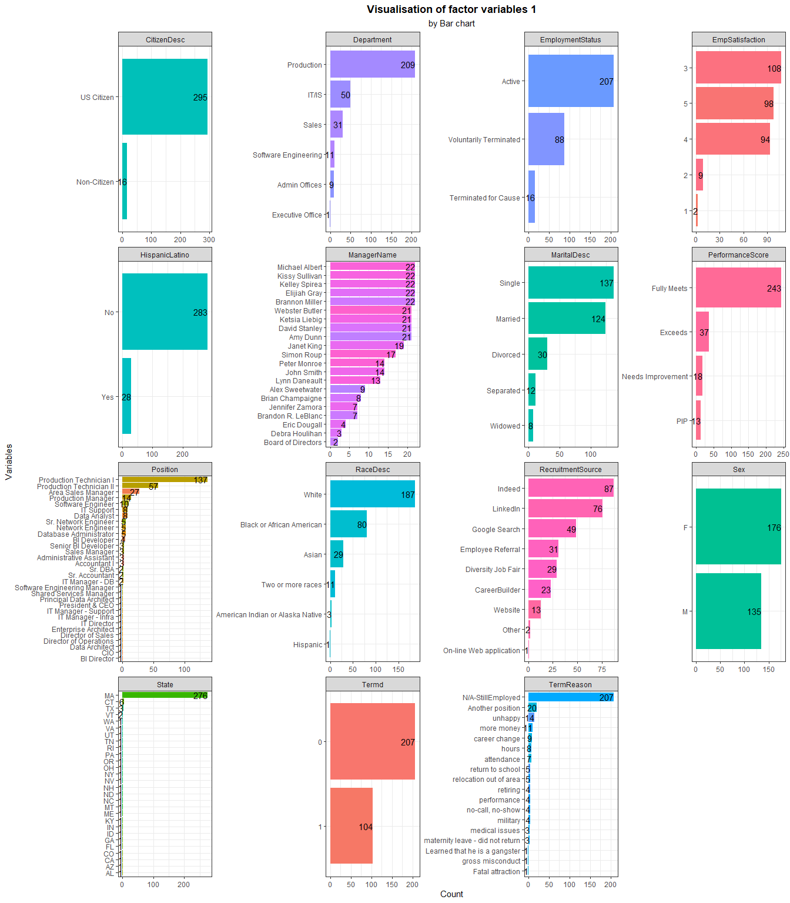
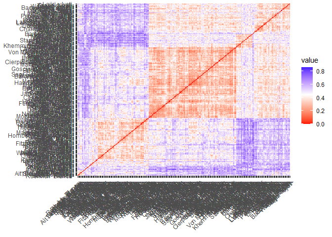
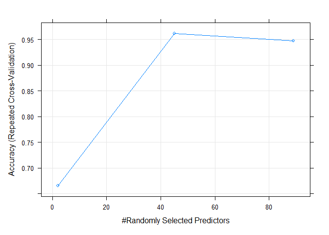
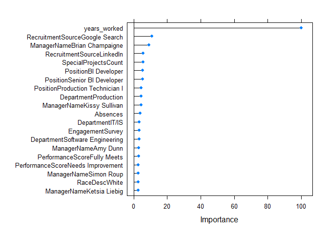

Human Resources Data Mining
================
Kar Ng
2022-06

-   [1 SUMMARY](#1-summary)
-   [2 R PACKAGES](#2-r-packages)
-   [3 INTRODUCTION](#3-introduction)
-   [4 DATA PREPARATION](#4-data-preparation)
    -   [4.1 Data import](#41-data-import)
    -   [4.2 Data description](#42-data-description)
    -   [4.3 Data exploration](#43-data-exploration)
-   [5 DATA CLEANING](#5-data-cleaning)
    -   [5.1 Variables removals](#51-variables-removals)
    -   [5.2 New Variable: Age](#52-new-variable-age)
    -   [5.3 New Variable: years_worked](#53-new-variable-years_worked)
    -   [5.4 Trim](#54-trim)
    -   [5.5 Factor conversion](#55-factor-conversion)
    -   [5.6 CitizenDesc](#56-citizendesc)
    -   [5.7 HispanicLatino](#57-hispaniclatino)
    -   [5.8 Missing data check](#58-missing-data-check)
-   [6 VISUALISATION](#6-visualisation)
    -   [6.1 Numerical variables](#61-numerical-variables)
    -   [6.2 Categorical variables](#62-categorical-variables)
    -   [6.3 Distribution study of continuous
        variable](#63-distribution-study-of-continuous-variable)
    -   [6.4 Relationship among
        Variables](#64-relationship-among-variables)
-   [7 CLUSTERING](#7-clustering)
    -   [7.1 Distance metrics](#71-distance-metrics)
    -   [7.2 VAT](#72-vat)
    -   [7.3 Gower with PAM](#73-gower-with-pam)
-   [8 BUSINESS TASKS](#8-business-tasks)
    -   [8.1 Is there any relationship between who a person works for
        and their performance
        score?](#81-is-there-any-relationship-between-who-a-person-works-for-and-their-performance-score)
    -   [8.2 What is the overall diversity profile of the
        organization?](#82-what-is-the-overall-diversity-profile-of-the-organization)
    -   [8.3 What are our best recruiting sources if we want to ensure a
        diverse
        organization?](#83-what-are-our-best-recruiting-sources-if-we-want-to-ensure-a-diverse-organization)
        -   [8.3.1 Visual Exploration](#831-visual-exploration)
        -   [8.3.2 Statistical Analysis](#832-statistical-analysis)
        -   [8.3.3 Multiple Correspondence Analysis
            (MCA)](#833-multiple-correspondence-analysis-mca)
    -   [8.4 Are there areas of the company where pay is not
        equitable?](#84-are-there-areas-of-the-company-where-pay-is-not-equitable)
        -   [8.4.1 Visual Exploration](#841-visual-exploration)
        -   [8.4.2 Statistical Analysis](#842-statistical-analysis)
        -   [8.4.3 Regression](#843-regression)
    -   [8.5 Can we predict who is going to terminate and who isn’t?
        What level of accuracy can we achieve on
        this?](#85-can-we-predict-who-is-going-to-terminate-and-who-isnt-what-level-of-accuracy-can-we-achieve-on-this)
        -   [8.5.1 Visual Exploration](#851-visual-exploration)
        -   [8.5.2 Supervised Machine
            Learning](#852-supervised-machine-learning)
-   [9 CONCLUSION](#9-conclusion)
-   [10 REFERENCE](#10-reference)

------------------------------------------------------------------------


------------------------------------------------------------------------

## 1 SUMMARY

This project applies a series of data mining techniques including
clustering, principal component methods, regression, and classification
algorithms to study inner trends hiden the dataset. Numerous
visualisation were also applied to aid each of these data mining
methods. In this project, 5 analytical tasks have been completed using
VAT validated gower-PAM clustering, correspondence analysis (CA),
asymmetric-biplot, multiple correspondence analysis (MCA), Chi-Squared
test, Regression, and predictive classification models with KNN, SVM,
and Random Forest.

Outputs show that there is no statistical evidence (p-value = 0.249) to
support the argument that several managers among all are good at
training their employees, or vice versa. Instead, most managers are good
at training their subordinates reaching the “fully meet” standard. The
company do actively hire employees from diverse backgrounds. The company
has a good level of overall diversity level at 76%. 40% of the employees
in the company are female and 40% are employees from diverse
backgrounds. The company recruits employees from 8 sources and diversity
job fair is the best choice if the company is keen to hire an employee
from a diverse background, and employee-referral being the worst source
at hiring an employee with diverse background (Chi-squared test for
independence: x-squared = 21.989, df = 5, p-value = 0.0005).

Inferential regression was applied to study the relationships between
salary and numerous factors (variables) that would potentially relates
to unequal pay, such as age, years of working, race, gender and etc, and
the result shows that the company is paying employees equally, supported
by extensive visualisation and P-values of higher than 0.05. Finally,
this dataset provides sufficient data to train a model with great
predictive power. K-Nearest Neighbor (KNN), Polynomial-kernel Support
Vector Machine (SVM), and Random Forest were selected as the modeling
candidates. Output shows that Random Forest models with 0.405
probability cut-off point is the best algorithm to make prediction for
who is leaving the company. It has a reliable overall accuracy rate at
95.7%, sensitivity rate of 93.5% (the metric that we are most interested
in) and specificity rate of 96.7%.

*Highlight*


## 2 R PACKAGES

``` r
library(tidyverse)
library(kableExtra)
library(lubridate)
library(skimr)
library(tidytext)
library(factoextra)
library(FactoMineR)
library(cluster)    # For daisy function
library(cowplot)
library(Rtsne)
library(gplots)
library(ggrepel)
library(caret)
library(pROC)
library(ggpubr)
library(grid)
library(gridExtra)
library(corrplot)
```

## 3 INTRODUCTION

The aim of this project is to analyse a human resource dataset to answer
5 business questions:

-   1.  Is there any relationship between who a person works for and
        their performance score?  

-   2.  What is the overall diversity profile of the organization?  

-   3.  What are our best recruiting sources if we want to ensure a
        diverse organization?  

-   4.  Are there areas of the company where pay is not equitable?  

-   5.  Can we predict who is going to terminate and who isn’t? What
        level of accuracy can we achieve on this?

Different machine learning techniques will be used in this project to
answer these questions or during exploratory analysis, they include:

-   Applying clustering for mixed-data,  
-   Several appropriate principal component methods,  
-   Regression algorithms, and  
-   Classification algorithms

A quick introduction about the rarer “Principal Components (PC)
methods”, it belongs to the “unsupervised” branch of machine learning
domain. There are 5 main types of principal components methods:

-   Principal Component Analysis (PCA)  
-   Correspondence Analysis (CA)  
-   Multiple Correspondence Analysis (MCA)  
-   Factor Analysis of Mixed Data (FAMD)  
-   Multiple Factor Analysis (MFA)

These PC methods are designed to be used for different type of datasets.
For examples, PCA is used for datasets that have only numerical
variables (or known as “feature” to describe explanatory variables), or,
FAMD and MFA will be used for mixed-data datasets that have both
numerical and categorical variables. I will apply the most appropriate
one for the dataset used in this project, and which will be decided in
later section after I explore the data.

PC methods would help us identifying the most important variables that
contribute the most in explaining the variations in a dataset. During
computation, PC methods will extract all the variations in the
multivariate dataset and express them into a few new variables called
principal components (Some other inter-changeable terms with similar
meaning are “dims” or “axes”). Then, many special plots of PC will be
plotted to study the results. Important to note that the goal of PC
methods is to identify main directions along which the variation is
maximal (KASSAMBARA A 2017).

Please be expecting this project would be a slightly long project as it
is built for skills demonstration purposes.

## 4 DATA PREPARATION

A public dataset called “Human Resources Data Set” prepared by DR.RICH
on Kaggle.com has been downloaded for this project. *Kaggle.com* is a
popular website for data science community to share datasets, codes and
projects.

### 4.1 Data import

Importing the dataset into R:

``` r
hr <- read.csv("hr_dataset.csv", 
               fileEncoding = "UTF-8-BOM",
               na.strings = T,
               header = T)
```

### 4.2 Data description

Following is the data dictionary/description of this dataset, adapted
from this link: [Rpubs](https://rpubs.com/rhuebner/hrd_cb_v14), created
by the author, Dr. Rich Huebner.

``` r
Variables <- c("Employee Name", 
               "EmpID",
               "MarriedID",
               "MaritalStatusID",
               "EmpStatusID",
               "DeptID",
               "PerfScoreID",
               "FromDiversityJobFairID",
               "Salary",
               "Termd",
               "PositionID",
               "Position",
               "State",
               "Zip",
               "DOB",
               "Sex",
               "MaritalDesc",
               "CitizenDesc",
               "HispanicLatino",
               "RaceDesc",
               "DateofHire",
               "DateofTermination",
               "TermReason",
               "EmploymentStatus",
               "Department",
               "ManagerName",
               "ManagerID",
               "RecruitmentSource",
               "PerformanceScore",
               "EngagementSurvey",
               "EmpSatisfaction",
               "SpecialProjectsCount",
               "LastPerformanceReviewDate",
               "DaysLateLast30",
               "Absences"
               )


Description <- c("Employee’s full name",
                 "Employee ID is unique to each employee",
                 "Is the person married (1 or 0 for yes or no)",
                 "Marital status code that matches the text field MaritalDesc",
                 "Employment status code that matches text field EmploymentStatus",
                 "Department ID code that matches the department the employee works in",
                 "Performance Score code that matches the employee’s most recent performance score",
                 "Was the employee sourced from the Diversity job fair? 1 or 0 for yes or no",
                 "The person’s yearly salary. $ U.S. Dollars",
                 "Has this employee been terminated - 1 or 0",
                 "An integer indicating the person’s position",
                 "The text name/title of the position the person has",
                 "The state that the person lives in",
                 "The zip code for the employee",
                 "Date of Birth for the employee",
                 "Sex - M or F",
                 "The marital status of the person (divorced, single, widowed, separated, etc)",
                 "Label for whether the person is a Citizen or Eligible NonCitizen",
                 "Yes or No field for whether the employee is Hispanic/Latino",
                 "Description/text of the race the person identifies with",
                 "Date the person was hired",
                 "Date the person was terminated, only populated if, in fact, Termd = 1",
                 "A text reason / description for why the person was terminated",
                 "A description/category of the person’s employment status. Anyone currently working full time = Active",
                 "Name of the department that the person works in",
                 "The name of the person’s immediate manager",
                 "A unique identifier for each manager",
                 "The name of the recruitment source where the employee was recruited from",
                 "Performance Score text/category (Fully Meets, Partially Meets, PIP, Exceeds)",
                 "Results from the last engagement survey, managed by our external partner",
                 "A basic satisfaction score between 1 and 5, as reported on a recent employee satisfaction survey",
                 "The number of special projects that the employee worked on during the last 6 months",
                 "The most recent date of the person’s last performance review",
                 "The number of times that the employee was late to work during the last 30 days",
                 "The number of times the employee was absent from work"
                 )
  

data.frame(Variables, Description) %>% 
  kbl() %>% 
  kable_styling(bootstrap_options = c("striped", "bordered"))
```

<table class="table table-striped table-bordered" style="margin-left: auto; margin-right: auto;">
<thead>
<tr>
<th style="text-align:left;">
Variables
</th>
<th style="text-align:left;">
Description
</th>
</tr>
</thead>
<tbody>
<tr>
<td style="text-align:left;">
Employee Name
</td>
<td style="text-align:left;">
Employee’s full name
</td>
</tr>
<tr>
<td style="text-align:left;">
EmpID
</td>
<td style="text-align:left;">
Employee ID is unique to each employee
</td>
</tr>
<tr>
<td style="text-align:left;">
MarriedID
</td>
<td style="text-align:left;">
Is the person married (1 or 0 for yes or no)
</td>
</tr>
<tr>
<td style="text-align:left;">
MaritalStatusID
</td>
<td style="text-align:left;">
Marital status code that matches the text field MaritalDesc
</td>
</tr>
<tr>
<td style="text-align:left;">
EmpStatusID
</td>
<td style="text-align:left;">
Employment status code that matches text field EmploymentStatus
</td>
</tr>
<tr>
<td style="text-align:left;">
DeptID
</td>
<td style="text-align:left;">
Department ID code that matches the department the employee works in
</td>
</tr>
<tr>
<td style="text-align:left;">
PerfScoreID
</td>
<td style="text-align:left;">
Performance Score code that matches the employee’s most recent
performance score
</td>
</tr>
<tr>
<td style="text-align:left;">
FromDiversityJobFairID
</td>
<td style="text-align:left;">
Was the employee sourced from the Diversity job fair? 1 or 0 for yes or
no
</td>
</tr>
<tr>
<td style="text-align:left;">
Salary
</td>
<td style="text-align:left;">
The person’s yearly salary. $ U.S. Dollars
</td>
</tr>
<tr>
<td style="text-align:left;">
Termd
</td>
<td style="text-align:left;">
Has this employee been terminated - 1 or 0
</td>
</tr>
<tr>
<td style="text-align:left;">
PositionID
</td>
<td style="text-align:left;">
An integer indicating the person’s position
</td>
</tr>
<tr>
<td style="text-align:left;">
Position
</td>
<td style="text-align:left;">
The text name/title of the position the person has
</td>
</tr>
<tr>
<td style="text-align:left;">
State
</td>
<td style="text-align:left;">
The state that the person lives in
</td>
</tr>
<tr>
<td style="text-align:left;">
Zip
</td>
<td style="text-align:left;">
The zip code for the employee
</td>
</tr>
<tr>
<td style="text-align:left;">
DOB
</td>
<td style="text-align:left;">
Date of Birth for the employee
</td>
</tr>
<tr>
<td style="text-align:left;">
Sex
</td>
<td style="text-align:left;">
Sex - M or F
</td>
</tr>
<tr>
<td style="text-align:left;">
MaritalDesc
</td>
<td style="text-align:left;">
The marital status of the person (divorced, single, widowed, separated,
etc)
</td>
</tr>
<tr>
<td style="text-align:left;">
CitizenDesc
</td>
<td style="text-align:left;">
Label for whether the person is a Citizen or Eligible NonCitizen
</td>
</tr>
<tr>
<td style="text-align:left;">
HispanicLatino
</td>
<td style="text-align:left;">
Yes or No field for whether the employee is Hispanic/Latino
</td>
</tr>
<tr>
<td style="text-align:left;">
RaceDesc
</td>
<td style="text-align:left;">
Description/text of the race the person identifies with
</td>
</tr>
<tr>
<td style="text-align:left;">
DateofHire
</td>
<td style="text-align:left;">
Date the person was hired
</td>
</tr>
<tr>
<td style="text-align:left;">
DateofTermination
</td>
<td style="text-align:left;">
Date the person was terminated, only populated if, in fact, Termd = 1
</td>
</tr>
<tr>
<td style="text-align:left;">
TermReason
</td>
<td style="text-align:left;">
A text reason / description for why the person was terminated
</td>
</tr>
<tr>
<td style="text-align:left;">
EmploymentStatus
</td>
<td style="text-align:left;">
A description/category of the person’s employment status. Anyone
currently working full time = Active
</td>
</tr>
<tr>
<td style="text-align:left;">
Department
</td>
<td style="text-align:left;">
Name of the department that the person works in
</td>
</tr>
<tr>
<td style="text-align:left;">
ManagerName
</td>
<td style="text-align:left;">
The name of the person’s immediate manager
</td>
</tr>
<tr>
<td style="text-align:left;">
ManagerID
</td>
<td style="text-align:left;">
A unique identifier for each manager
</td>
</tr>
<tr>
<td style="text-align:left;">
RecruitmentSource
</td>
<td style="text-align:left;">
The name of the recruitment source where the employee was recruited from
</td>
</tr>
<tr>
<td style="text-align:left;">
PerformanceScore
</td>
<td style="text-align:left;">
Performance Score text/category (Fully Meets, Partially Meets, PIP,
Exceeds)
</td>
</tr>
<tr>
<td style="text-align:left;">
EngagementSurvey
</td>
<td style="text-align:left;">
Results from the last engagement survey, managed by our external partner
</td>
</tr>
<tr>
<td style="text-align:left;">
EmpSatisfaction
</td>
<td style="text-align:left;">
A basic satisfaction score between 1 and 5, as reported on a recent
employee satisfaction survey
</td>
</tr>
<tr>
<td style="text-align:left;">
SpecialProjectsCount
</td>
<td style="text-align:left;">
The number of special projects that the employee worked on during the
last 6 months
</td>
</tr>
<tr>
<td style="text-align:left;">
LastPerformanceReviewDate
</td>
<td style="text-align:left;">
The most recent date of the person’s last performance review
</td>
</tr>
<tr>
<td style="text-align:left;">
DaysLateLast30
</td>
<td style="text-align:left;">
The number of times that the employee was late to work during the last
30 days
</td>
</tr>
<tr>
<td style="text-align:left;">
Absences
</td>
<td style="text-align:left;">
The number of times the employee was absent from work
</td>
</tr>
</tbody>
</table>

### 4.3 Data exploration

There are 311 rows and 35 columns in the dataset. Following shows the
variable types allocated by R to each of the column (also known as
variables or features), along with several starting values of these
variables.

``` r
glimpse(hr)
```

    ## Rows: 311
    ## Columns: 36
    ## $ Employee_Name              <chr> "Adinolfi  Wilson  K", "Ait Sidi  Karthikey…
    ## $ EmpID                      <int> 10026, 10084, 10196, 10088, 10069, 10002, 1…
    ## $ MarriedID                  <int> 0, 1, 1, 1, 0, 0, 0, 0, 0, 0, 1, 1, 0, 0, 0…
    ## $ MaritalStatusID            <int> 0, 1, 1, 1, 2, 0, 0, 4, 0, 2, 1, 1, 2, 0, 2…
    ## $ GenderID                   <int> 1, 1, 0, 0, 0, 0, 0, 1, 0, 1, 0, 1, 1, 1, 1…
    ## $ EmpStatusID                <int> 1, 5, 5, 1, 5, 1, 1, 1, 3, 1, 5, 5, 1, 1, 5…
    ## $ DeptID                     <int> 5, 3, 5, 5, 5, 5, 4, 5, 5, 3, 5, 5, 3, 5, 5…
    ## $ PerfScoreID                <int> 4, 3, 3, 3, 3, 4, 3, 3, 3, 3, 3, 3, 4, 3, 3…
    ## $ FromDiversityJobFairID     <int> 0, 0, 0, 0, 0, 0, 0, 0, 1, 0, 1, 1, 1, 0, 0…
    ## $ Salary                     <int> 62506, 104437, 64955, 64991, 50825, 57568, …
    ## $ Termd                      <int> 0, 1, 1, 0, 1, 0, 0, 0, 0, 0, 1, 1, 0, 0, 1…
    ## $ PositionID                 <int> 19, 27, 20, 19, 19, 19, 24, 19, 19, 14, 19,…
    ## $ Position                   <chr> "Production Technician I", "Sr. DBA", "Prod…
    ## $ State                      <chr> "MA", "MA", "MA", "MA", "MA", "MA", "MA", "…
    ## $ Zip                        <int> 1960, 2148, 1810, 1886, 2169, 1844, 2110, 2…
    ## $ DOB                        <chr> "7/10/1983", "5/05/1975", "09/19/88", "09/2…
    ## $ Sex                        <chr> "M ", "M ", "F", "F", "F", "F", "F", "M ", …
    ## $ MaritalDesc                <chr> "Single", "Married", "Married", "Married", …
    ## $ CitizenDesc                <chr> "US Citizen", "US Citizen", "US Citizen", "…
    ## $ HispanicLatino             <chr> "No", "No", "No", "No", "No", "No", "No", "…
    ## $ RaceDesc                   <chr> "White", "White", "White", "White", "White"…
    ## $ DateofHire                 <chr> "7/05/2011", "3/30/2015", "7/05/2011", "1/0…
    ## $ DateofTermination          <chr> "", "6/16/2016", "9/24/2012", "", "9/06/201…
    ## $ TermReason                 <chr> "N/A-StillEmployed", "career change", "hour…
    ## $ EmploymentStatus           <chr> "Active", "Voluntarily Terminated", "Volunt…
    ## $ Department                 <chr> "Production       ", "IT/IS", "Production  …
    ## $ ManagerName                <chr> "Michael Albert", "Simon Roup", "Kissy Sull…
    ## $ ManagerID                  <int> 22, 4, 20, 16, 39, 11, 10, 19, 12, 7, 14, 2…
    ## $ RecruitmentSource          <chr> "LinkedIn", "Indeed", "LinkedIn", "Indeed",…
    ## $ PerformanceScore           <chr> "Exceeds", "Fully Meets", "Fully Meets", "F…
    ## $ EngagementSurvey           <dbl> 4.60, 4.96, 3.02, 4.84, 5.00, 5.00, 3.04, 5…
    ## $ EmpSatisfaction            <int> 5, 3, 3, 5, 4, 5, 3, 4, 3, 5, 4, 3, 4, 4, 5…
    ## $ SpecialProjectsCount       <int> 0, 6, 0, 0, 0, 0, 4, 0, 0, 6, 0, 0, 5, 0, 0…
    ## $ LastPerformanceReview_Date <chr> "1/17/2019", "2/24/2016", "5/15/2012", "1/0…
    ## $ DaysLateLast30             <int> 0, 0, 0, 0, 0, 0, 0, 0, 0, 0, 0, 0, 0, 0, 0…
    ## $ Absences                   <int> 1, 17, 3, 15, 2, 15, 19, 19, 4, 16, 12, 15,…

Randomly sample 10 rows of data from the table:

``` r
set.seed(123)

sample_n(hr, 10)
```

    ##           Employee_Name EmpID MarriedID MaritalStatusID GenderID EmpStatusID
    ## 1        Mancuso  Karen 10073         1               1        0           5
    ## 2  Barone  Francesco  A 10265         0               0        1           1
    ## 3        Motlagh   Dawn 10254         0               2        0           1
    ## 4         Wolk  Hang  T 10174         0               0        0           1
    ## 5         Goyal  Roxana 10256         1               1        0           3
    ## 6         Wang  Charlie 10172         0               0        1           1
    ## 7       Rachael  Maggie 10239         1               1        0           1
    ## 8            Roup Simon 10198         0               0        1           1
    ## 9           Zhou  Julia 10043         0               0        0           1
    ## 10  Kirill  Alexandra   10170         1               1        0           5
    ##    DeptID PerfScoreID FromDiversityJobFairID Salary Termd PositionID
    ## 1       5           3                      0  68407     1         20
    ## 2       5           3                      0  58709     0         19
    ## 3       5           3                      0  63430     0         19
    ## 4       5           3                      0  60446     0         20
    ## 5       5           3                      0  49256     0         19
    ## 6       3           3                      0  84903     0         22
    ## 7       3           3                      0  95920     0          4
    ## 8       3           3                      0 140920     0         13
    ## 9       3           3                      0  89292     0          9
    ## 10      5           3                      0  45433     1         19
    ##                    Position State  Zip        DOB Sex MaritalDesc CitizenDesc
    ## 1  Production Technician II    MA 2176 12/10/1986   F     Married  US Citizen
    ## 2   Production Technician I    MA 1810   07/20/83  M       Single  US Citizen
    ## 3   Production Technician I    MA 2453  7/07/1984   F    Divorced  US Citizen
    ## 4  Production Technician II    MA 2302   04/20/85   F      Single  US Citizen
    ## 5   Production Technician I    MA 1864 10/09/1974   F     Married  US Citizen
    ## 6       Senior BI Developer    MA 1887  7/08/1981  M       Single  US Citizen
    ## 7              BI Developer    MA 2110  5/12/1980   F     Married  US Citizen
    ## 8           IT Manager - DB    MA 2481  4/05/1973  M       Single  US Citizen
    ## 9              Data Analyst    MA 2148   02/24/79   F      Single  US Citizen
    ## 10  Production Technician I    MA 2127 10/08/1970   F     Married  US Citizen
    ##    HispanicLatino                  RaceDesc DateofHire DateofTermination
    ## 1              No         Two or more races  7/05/2011         8/19/2012
    ## 2              No         Two or more races  2/20/2012                  
    ## 3              No                     White  4/01/2013                  
    ## 4              No                     White  9/29/2014                  
    ## 5              No                     Asian  8/19/2013                  
    ## 6              No                     Asian  2/15/2017                  
    ## 7              No Black or African American 10/02/2016                  
    ## 8              No                     White  1/20/2013                  
    ## 9              No                     White  3/30/2015                  
    ## 10             No                     White  9/26/2011         1/09/2014
    ##           TermReason       EmploymentStatus        Department      ManagerName
    ## 1   Another position Voluntarily Terminated Production                Amy Dunn
    ## 2  N/A-StillEmployed                 Active Production           Kelley Spirea
    ## 3  N/A-StillEmployed                 Active Production            Elijiah Gray
    ## 4  N/A-StillEmployed                 Active Production           David Stanley
    ## 5  N/A-StillEmployed                 Active Production          Kissy Sullivan
    ## 6  N/A-StillEmployed                 Active             IT/IS Brian Champaigne
    ## 7  N/A-StillEmployed                 Active             IT/IS Brian Champaigne
    ## 8  N/A-StillEmployed                 Active             IT/IS  Jennifer Zamora
    ## 9  N/A-StillEmployed                 Active             IT/IS       Simon Roup
    ## 10        more money Voluntarily Terminated Production                Amy Dunn
    ##    ManagerID RecruitmentSource PerformanceScore EngagementSurvey
    ## 1         11          LinkedIn      Fully Meets             5.00
    ## 2         18     Google Search      Fully Meets             4.60
    ## 3         16          LinkedIn      Fully Meets             4.40
    ## 4         14          LinkedIn      Fully Meets             3.40
    ## 5         20          LinkedIn      Fully Meets             4.10
    ## 6         13            Indeed      Fully Meets             3.42
    ## 7         13            Indeed      Fully Meets             4.40
    ## 8          5            Indeed      Fully Meets             3.60
    ## 9          4 Employee Referral      Fully Meets             5.00
    ## 10        11     Google Search      Fully Meets             3.49
    ##    EmpSatisfaction SpecialProjectsCount LastPerformanceReview_Date
    ## 1                4                    0                  7/02/2012
    ## 2                4                    0                  2/14/2019
    ## 3                4                    0                  1/17/2019
    ## 4                4                    0                  2/21/2019
    ## 5                5                    0                  2/15/2019
    ## 6                4                    7                  1/04/2019
    ## 7                4                    6                  2/06/2019
    ## 8                5                    7                  2/18/2019
    ## 9                3                    5                  2/01/2019
    ## 10               4                    0                  1/30/2013
    ##    DaysLateLast30 Absences
    ## 1               0       16
    ## 2               0        7
    ## 3               0       18
    ## 4               0       14
    ## 5               0        3
    ## 6               0       17
    ## 7               0       10
    ## 8               0       13
    ## 9               0       11
    ## 10              0        6

The first column is a column recording employee names. I have made this
column the name of each rows (or known as observation). It is the
standard format required for analysis using clustering or PC methods.

``` r
hr <- hr %>% 
  column_to_rownames(var = "Employee_Name")
```

## 5 DATA CLEANING

The data may seem perfectly to go however numerous important cleaning
and manipulation tasks have been identified and will be completed in
this section.

### 5.1 Variables removals

I will be removing some irrelevant or duplicated variables that may not
be helpful in the analysis. They are:

-   EmpID  
-   MaritalStatusID  
-   GenderID  
-   EmpStatusID  
-   DeptID  
-   PerfScoreID  
-   PositionID  
-   Zip  
-   ManagerID  
-   LastPerformanceReview_Date  
-   MarriedID  
-   FromDiversityJobFairID

After removal of above features, the numbers of columns have been
reduced from 35 to 23.

``` r
hr2 <- hr %>%
  dplyr::select(-EmpID, -MaritalStatusID, -GenderID, -EmpStatusID, -DeptID, -PerfScoreID, -PositionID, -Zip, -ManagerID, -LastPerformanceReview_Date, -MarriedID, -FromDiversityJobFairID)
  
glimpse(hr2)
```

    ## Rows: 311
    ## Columns: 23
    ## $ Salary               <int> 62506, 104437, 64955, 64991, 50825, 57568, 95660,…
    ## $ Termd                <int> 0, 1, 1, 0, 1, 0, 0, 0, 0, 0, 1, 1, 0, 0, 1, 1, 0…
    ## $ Position             <chr> "Production Technician I", "Sr. DBA", "Production…
    ## $ State                <chr> "MA", "MA", "MA", "MA", "MA", "MA", "MA", "MA", "…
    ## $ DOB                  <chr> "7/10/1983", "5/05/1975", "09/19/88", "09/27/88",…
    ## $ Sex                  <chr> "M ", "M ", "F", "F", "F", "F", "F", "M ", "F", "…
    ## $ MaritalDesc          <chr> "Single", "Married", "Married", "Married", "Divor…
    ## $ CitizenDesc          <chr> "US Citizen", "US Citizen", "US Citizen", "US Cit…
    ## $ HispanicLatino       <chr> "No", "No", "No", "No", "No", "No", "No", "No", "…
    ## $ RaceDesc             <chr> "White", "White", "White", "White", "White", "Whi…
    ## $ DateofHire           <chr> "7/05/2011", "3/30/2015", "7/05/2011", "1/07/2008…
    ## $ DateofTermination    <chr> "", "6/16/2016", "9/24/2012", "", "9/06/2016", ""…
    ## $ TermReason           <chr> "N/A-StillEmployed", "career change", "hours", "N…
    ## $ EmploymentStatus     <chr> "Active", "Voluntarily Terminated", "Voluntarily …
    ## $ Department           <chr> "Production       ", "IT/IS", "Production       "…
    ## $ ManagerName          <chr> "Michael Albert", "Simon Roup", "Kissy Sullivan",…
    ## $ RecruitmentSource    <chr> "LinkedIn", "Indeed", "LinkedIn", "Indeed", "Goog…
    ## $ PerformanceScore     <chr> "Exceeds", "Fully Meets", "Fully Meets", "Fully M…
    ## $ EngagementSurvey     <dbl> 4.60, 4.96, 3.02, 4.84, 5.00, 5.00, 3.04, 5.00, 4…
    ## $ EmpSatisfaction      <int> 5, 3, 3, 5, 4, 5, 3, 4, 3, 5, 4, 3, 4, 4, 5, 4, 3…
    ## $ SpecialProjectsCount <int> 0, 6, 0, 0, 0, 0, 4, 0, 0, 6, 0, 0, 5, 0, 0, 0, 0…
    ## $ DaysLateLast30       <int> 0, 0, 0, 0, 0, 0, 0, 0, 0, 0, 0, 0, 0, 0, 0, 0, 0…
    ## $ Absences             <int> 1, 17, 3, 15, 2, 15, 19, 19, 4, 16, 12, 15, 9, 7,…

### 5.2 New Variable: Age

At the year of writing this project was 2022, and therefore the
calculation of age will be 2022 minus DOB (date of birth) plus 1 in the
dataset. The DOB will be replaced with “Age”.

``` r
hr2 <- hr2 %>% 
  mutate(yearDOB = str_sub(DOB, -2, -1),
         yearbirth = as.numeric(paste0(19, yearDOB)),
         Age = (2022 - yearbirth)+1) %>% 
  relocate(Age, .after = State) %>% 
  dplyr::select(-DOB, -yearDOB, -yearbirth)
```

Now, the variable “DOB” has been replaced by “Age”, and following shows
the age of all employees in the dataset.

``` r
hr2$Age
```

    ##   [1] 40 48 35 35 34 46 44 40 53 35 49 49 35 40 46 42 57 53 37 44 53 65 34 33 56
    ##  [26] 59 36 53 33 36 40 54 59 43 46 57 40 36 40 37 60 72 51 44 40 53 40 35 38 42
    ##  [51] 45 43 46 44 48 40 46 37 36 58 33 71 45 44 35 46 44 48 72 56 40 41 36 45 37
    ##  [76] 35 53 35 50 50 32 49 45 34 40 34 36 45 36 68 34 36 42 42 40 48 43 44 60 55
    ## [101] 38 40 33 53 52 49 43 34 52 34 31 54 59 42 37 44 40 49 42 40 34 54 46 35 71
    ## [126] 49 39 51 35 39 39 57 38 37 39 31 47 47 32 51 57 37 59 64 37 54 37 34 47 44
    ## [151] 69 50 53 46 43 54 37 51 44 37 39 39 36 44 39 41 35 42 42 44 35 47 41 48 50
    ## [176] 51 37 47 37 49 36 46 36 36 39 55 47 42 38 31 37 53 47 44 39 49 43 53 34 40
    ## [201] 46 56 34 39 38 43 71 33 47 44 41 44 44 39 35 34 37 37 46 44 39 35 42 35 39
    ## [226] 62 53 39 43 39 69 41 50 42 51 49 38 38 42 50 51 49 36 50 59 37 55 49 37 36
    ## [251] 35 48 42 38 53 35 36 60 39 36 58 50 40 55 48 50 41 49 37 38 34 45 41 55 40
    ## [276] 36 48 70 58 58 48 56 55 40 35 40 38 54 32 36 55 34 37 37 38 47 68 43 42 45
    ## [301] 36 58 40 54 65 38 38 41 44 44 45

The distribution:

-   Maximum: Located at the top tip of the boxplot  
-   Minimum: Located at the bottom tip of the boxplot  
-   Median: The horizontal line in the middle of the boxplot

``` r
set.seed(123)

ggplot(hr2, aes(y = Age, x = "")) +
  geom_jitter(width = 0.1, alpha = 0.5,) +
  geom_boxplot(outlier.shape = NA, width = 0.1, size = 2, color = "purple", alpha = 0.5) +
  theme_classic() +
  theme(axis.title.x = element_blank(),
        axis.text.x = element_blank()) 
```

<!-- -->

### 5.3 New Variable: years_worked

There are two variables in the date set, DateofHire and
DateofTermination, are available to synthese a variable recording the
service years of each employee.

I will compute the days of working of each employee by using the date of
termination (DateofTermination) minus date of hire (DateofHire), and for
present employees I will use today’s date (5-May-2022) minus the date of
hire to obtain the total number of days worked.

``` r
hr2 <- hr2 %>% 
  mutate(DateofHire = mdy(DateofHire),
         DateofTermination = mdy(DateofTermination),
         days_worked = ifelse(is.na(DateofTermination),
                              today() - DateofHire,
                              DateofTermination - DateofHire),
         years_worked = round(days_worked/365, 1)) %>% 
  relocate(years_worked, .after = RaceDesc) %>% 
  dplyr::select(-DateofHire, -DateofTermination, -days_worked)
```

Following shows number of years, with 1 decimal place, worked by each
employee in the dataset.

``` r
hr2$years_worked
```

    ##   [1] 11.0  1.2  1.2 14.5  5.2 10.5  7.7  8.8 13.0  7.5  6.0  4.5  7.7 10.4  4.5
    ##  [16]  6.5  6.0 11.3  1.2  9.0 10.3  8.9  8.0 11.3  3.2  2.0  7.4  0.9  1.2 13.7
    ##  [31]  7.8  8.7  3.0 10.3 11.3 10.9  6.4  8.7  8.3  6.0  7.9  7.8  5.8  8.2  9.0
    ##  [46] 10.2  4.4 10.8  9.8  1.6  1.1  6.0  9.0  5.2 12.0 13.5  7.5  7.3  6.0  7.7
    ##  [61]  8.2  7.7 10.0 10.7  4.0  5.1 10.5  7.8  4.6  8.0  5.4  8.2 10.4  9.5 10.3
    ##  [76]  7.5  8.5 11.5  7.8 12.2  6.2  7.7  8.3  8.0  6.5  4.0  2.1  8.0  8.4  4.5
    ##  [91]  7.2  7.3 10.5  2.1  1.8  3.9 11.2 13.5 10.8 12.2  7.3 11.1  7.3  5.0  1.2
    ## [106]  3.2  7.8  7.4  0.1  7.3  8.7 11.0  1.1  7.5  8.2 10.0  8.8  8.9  7.1  2.9
    ## [121]  5.2  2.7 10.6  8.7  3.9  8.2  9.9  2.4  7.9  0.6  7.3  8.2  0.2 10.4  6.1
    ## [136]  7.1  2.1  1.6  8.9  9.7  8.8 11.0  8.5  6.5  7.5  8.0  5.2  2.5  8.8  8.9
    ## [151] 10.0  3.7  2.3  8.4 11.5 11.3  7.7  4.9  1.2 10.0  8.5  1.0  5.8  6.9  6.5
    ## [166] 10.2 10.2  8.8  7.2  9.0 11.5  3.2  8.9  7.4  4.0  5.0  8.5  6.2  1.1  8.7
    ## [181]  8.7 11.1  7.3  9.5  6.0  4.6  7.3  9.9  3.1 10.7 10.4  9.2 10.5  7.4  9.3
    ## [196]  9.2  9.0  5.4  2.5  3.2  8.2  9.3  9.0  9.0  7.7  4.1  1.3  8.8  8.8  8.4
    ## [211]  7.5  2.9  3.8  1.4  7.0  4.2  4.4  1.7  5.6 10.3  7.7  1.4 14.7 10.5  7.1
    ## [226]  8.5  0.7  4.5  5.8  6.5  8.2  4.7 10.6  0.1  0.6  5.0  5.4  9.0  7.4  3.8
    ## [241]  5.5  8.5  7.4  9.5  3.8  9.7  6.0  9.6 11.9  0.8  7.8  8.8  7.8  8.9  7.5
    ## [256]  7.2  5.5  7.8  8.1  2.0  8.7 11.1  6.0 10.4  9.8  2.1 11.5  8.2  7.8  8.4
    ## [271] 11.8 13.5  7.5 10.2  8.0  5.2  3.9  6.2  7.8  5.2  3.2  9.4 16.5  8.4  1.1
    ## [286]  5.2  3.5  7.3 11.0  3.5 10.9 10.3  2.0  4.4  7.0  7.9  0.3  3.1  5.4  7.3
    ## [301]  3.3  4.3  1.3  3.5  3.1  7.8  8.0  7.1 12.2  7.3  7.8

The distribution:

-   Maximum: Located at the top tip of the boxplot  
-   Minimum: Located at the bottom tip of the boxplot  
-   Median: The horizontal line in the middle of the boxplot

``` r
set.seed(123)

ggplot(hr2, aes(y = years_worked, x = "")) +
  geom_jitter(width = 0.1, alpha = 0.5,) +
  geom_boxplot(outlier.shape = NA, width = 0.1, size = 2, color = "blue", alpha = 0.5) +
  theme_classic() +
  theme(axis.title.x = element_blank(),
        axis.text.x = element_blank()) +
  labs(y = "Years Worked")
```

<!-- -->

### 5.4 Trim

This section trims the unnecessary leading and trailing white spaces of
character variables in the dataset.

``` r
hr2 <- hr2 %>% 
  mutate_if(is.character, trimws)
```

### 5.5 Factor conversion

Some “numeric” and “textual” features will need to be converted into
“factor” because of their categorical nature. After examination, all
textual features that classified as character “chr” in this dataset need
to be converted into factor. Following shows all of these textual
variables in the datasets.

``` r
str(hr2 %>% 
  select(is.character))
```

    ## Warning: Predicate functions must be wrapped in `where()`.
    ## 
    ##   # Bad
    ##   data %>% select(is.character)
    ## 
    ##   # Good
    ##   data %>% select(where(is.character))
    ## 
    ## ℹ Please update your code.
    ## This message is displayed once per session.

    ## 'data.frame':    311 obs. of  13 variables:
    ##  $ Position         : chr  "Production Technician I" "Sr. DBA" "Production Technician II" "Production Technician I" ...
    ##  $ State            : chr  "MA" "MA" "MA" "MA" ...
    ##  $ Sex              : chr  "M" "M" "F" "F" ...
    ##  $ MaritalDesc      : chr  "Single" "Married" "Married" "Married" ...
    ##  $ CitizenDesc      : chr  "US Citizen" "US Citizen" "US Citizen" "US Citizen" ...
    ##  $ HispanicLatino   : chr  "No" "No" "No" "No" ...
    ##  $ RaceDesc         : chr  "White" "White" "White" "White" ...
    ##  $ TermReason       : chr  "N/A-StillEmployed" "career change" "hours" "N/A-StillEmployed" ...
    ##  $ EmploymentStatus : chr  "Active" "Voluntarily Terminated" "Voluntarily Terminated" "Active" ...
    ##  $ Department       : chr  "Production" "IT/IS" "Production" "Production" ...
    ##  $ ManagerName      : chr  "Michael Albert" "Simon Roup" "Kissy Sullivan" "Elijiah Gray" ...
    ##  $ RecruitmentSource: chr  "LinkedIn" "Indeed" "LinkedIn" "Indeed" ...
    ##  $ PerformanceScore : chr  "Exceeds" "Fully Meets" "Fully Meets" "Fully Meets" ...

Following codes complete the conversion task.

``` r
hr2 <- hr2 %>% 
  mutate_if(is.character, as.factor)
```

-   With regards to numerical features, features that need to be
    converted into factor type are “MarriedID”,
    “FromDiversityJobFairID”, “Termd”, and “EmpSatisfaction”.

``` r
str(hr2 %>% 
      select(-is.factor))
```

    ## Warning: Predicate functions must be wrapped in `where()`.
    ## 
    ##   # Bad
    ##   data %>% select(is.factor)
    ## 
    ##   # Good
    ##   data %>% select(where(is.factor))
    ## 
    ## ℹ Please update your code.
    ## This message is displayed once per session.

    ## 'data.frame':    311 obs. of  9 variables:
    ##  $ Salary              : int  62506 104437 64955 64991 50825 57568 95660 59365 47837 50178 ...
    ##  $ Termd               : int  0 1 1 0 1 0 0 0 0 0 ...
    ##  $ Age                 : num  40 48 35 35 34 46 44 40 53 35 ...
    ##  $ years_worked        : num  11 1.2 1.2 14.5 5.2 10.5 7.7 8.8 13 7.5 ...
    ##  $ EngagementSurvey    : num  4.6 4.96 3.02 4.84 5 5 3.04 5 4.46 5 ...
    ##  $ EmpSatisfaction     : int  5 3 3 5 4 5 3 4 3 5 ...
    ##  $ SpecialProjectsCount: int  0 6 0 0 0 0 4 0 0 6 ...
    ##  $ DaysLateLast30      : int  0 0 0 0 0 0 0 0 0 0 ...
    ##  $ Absences            : int  1 17 3 15 2 15 19 19 4 16 ...

Following codes complete the conversion task for these selected
numerical features.

``` r
hr2 <- hr2 %>% 
  mutate(Termd = as.factor(Termd),
         EmpSatisfaction = as.factor(EmpSatisfaction))
```

After conversion, we are able to use following code to summaries the
dataset.

``` r
summary(hr2 %>% 
          dplyr::select(is.factor))
```

    ##  Termd                       Position       State     Sex        MaritalDesc 
    ##  0:207   Production Technician I :137   MA     :276   F:176   Divorced : 30  
    ##  1:104   Production Technician II: 57   CT     :  6   M:135   Married  :124  
    ##          Area Sales Manager      : 27   TX     :  3           Separated: 12  
    ##          Production Manager      : 14   VT     :  2           Single   :137  
    ##          Software Engineer       : 10   AL     :  1           Widowed  :  8  
    ##          Data Analyst            :  8   AZ     :  1                          
    ##          (Other)                 : 58   (Other): 22                          
    ##               CitizenDesc  HispanicLatino
    ##  Eligible NonCitizen: 12   no :  1       
    ##  Non-Citizen        :  4   No :282       
    ##  US Citizen         :295   yes:  1       
    ##                            Yes: 27       
    ##                                          
    ##                                          
    ##                                          
    ##                              RaceDesc               TermReason 
    ##  American Indian or Alaska Native:  3   N/A-StillEmployed:207  
    ##  Asian                           : 29   Another position : 20  
    ##  Black or African American       : 80   unhappy          : 14  
    ##  Hispanic                        :  1   more money       : 11  
    ##  Two or more races               : 11   career change    :  9  
    ##  White                           :187   hours            :  8  
    ##                                         (Other)          : 42  
    ##                EmploymentStatus                Department          ManagerName 
    ##  Active                :207     Admin Offices       :  9   Brannon Miller: 22  
    ##  Terminated for Cause  : 16     Executive Office    :  1   Elijiah Gray  : 22  
    ##  Voluntarily Terminated: 88     IT/IS               : 50   Kelley Spirea : 22  
    ##                                 Production          :209   Kissy Sullivan: 22  
    ##                                 Sales               : 31   Michael Albert: 22  
    ##                                 Software Engineering: 11   Amy Dunn      : 21  
    ##                                                            (Other)       :180  
    ##           RecruitmentSource          PerformanceScore EmpSatisfaction
    ##  Indeed            :87      Exceeds          : 37     1:  2          
    ##  LinkedIn          :76      Fully Meets      :243     2:  9          
    ##  Google Search     :49      Needs Improvement: 18     3:108          
    ##  Employee Referral :31      PIP              : 13     4: 94          
    ##  Diversity Job Fair:29                                5: 98          
    ##  CareerBuilder     :23                                               
    ##  (Other)           :16

### 5.6 CitizenDesc

There are three categories in the variable “CitizenDesc”, which are: (1)
12 employees of Eligible NonCitizen, (2) 4 employees of Non-Citizen, and
(3) 295 US Citizen employees. This section will merge “Eligible
NonCitizen” to “Non-Citizen”, because though the 12 employees are
eligible non-Citizen but they are not US citizen yet.

``` r
hr2 <- hr2 %>% 
  mutate(CitizenDesc = fct_recode(CitizenDesc,
                                  "Non-Citizen" = "Eligible NonCitizen"))
```

Let’s check, and the conversion has been completed.

``` r
table(hr2$CitizenDesc)
```

    ## 
    ## Non-Citizen  US Citizen 
    ##          16         295

### 5.7 HispanicLatino

The variable “HispanicLatino” has following 4 categories.

``` r
table(hr2$HispanicLatino)
```

    ## 
    ##  no  No yes Yes 
    ##   1 282   1  27

The “no” and “Yes” should be a mistake and have to be converted to “No”
and “Yes”. Following code completes the conversion.

``` r
hr2 <- hr2 %>% 
  mutate(HispanicLatino = fct_recode(HispanicLatino,
                                  "No" = "no",
                                  "Yes" = "yes"))
```

Let’s check, and the conversion has been completed.

``` r
table(hr2$HispanicLatino)
```

    ## 
    ##  No Yes 
    ## 283  28

### 5.8 Missing data check

This section check missing data (“NA”) in the dataset.

``` r
skim_without_charts(hr2)
```

<table style="width: auto;" class="table table-condensed">
<caption>
Data summary
</caption>
<tbody>
<tr>
<td style="text-align:left;">
Name
</td>
<td style="text-align:left;">
hr2
</td>
</tr>
<tr>
<td style="text-align:left;">
Number of rows
</td>
<td style="text-align:left;">
311
</td>
</tr>
<tr>
<td style="text-align:left;">
Number of columns
</td>
<td style="text-align:left;">
22
</td>
</tr>
<tr>
<td style="text-align:left;">
\_\_\_\_\_\_\_\_\_\_\_\_\_\_\_\_\_\_\_\_\_\_\_
</td>
<td style="text-align:left;">
</td>
</tr>
<tr>
<td style="text-align:left;">
Column type frequency:
</td>
<td style="text-align:left;">
</td>
</tr>
<tr>
<td style="text-align:left;">
factor
</td>
<td style="text-align:left;">
15
</td>
</tr>
<tr>
<td style="text-align:left;">
numeric
</td>
<td style="text-align:left;">
7
</td>
</tr>
<tr>
<td style="text-align:left;">
\_\_\_\_\_\_\_\_\_\_\_\_\_\_\_\_\_\_\_\_\_\_\_\_
</td>
<td style="text-align:left;">
</td>
</tr>
<tr>
<td style="text-align:left;">
Group variables
</td>
<td style="text-align:left;">
None
</td>
</tr>
</tbody>
</table>

**Variable type: factor**

<table>
<thead>
<tr>
<th style="text-align:left;">
skim_variable
</th>
<th style="text-align:right;">
n_missing
</th>
<th style="text-align:right;">
complete_rate
</th>
<th style="text-align:left;">
ordered
</th>
<th style="text-align:right;">
n_unique
</th>
<th style="text-align:left;">
top_counts
</th>
</tr>
</thead>
<tbody>
<tr>
<td style="text-align:left;">
Termd
</td>
<td style="text-align:right;">
0
</td>
<td style="text-align:right;">
1
</td>
<td style="text-align:left;">
FALSE
</td>
<td style="text-align:right;">
2
</td>
<td style="text-align:left;">
0: 207, 1: 104
</td>
</tr>
<tr>
<td style="text-align:left;">
Position
</td>
<td style="text-align:right;">
0
</td>
<td style="text-align:right;">
1
</td>
<td style="text-align:left;">
FALSE
</td>
<td style="text-align:right;">
31
</td>
<td style="text-align:left;">
Pro: 137, Pro: 57, Are: 27, Pro: 14
</td>
</tr>
<tr>
<td style="text-align:left;">
State
</td>
<td style="text-align:right;">
0
</td>
<td style="text-align:right;">
1
</td>
<td style="text-align:left;">
FALSE
</td>
<td style="text-align:right;">
28
</td>
<td style="text-align:left;">
MA: 276, CT: 6, TX: 3, VT: 2
</td>
</tr>
<tr>
<td style="text-align:left;">
Sex
</td>
<td style="text-align:right;">
0
</td>
<td style="text-align:right;">
1
</td>
<td style="text-align:left;">
FALSE
</td>
<td style="text-align:right;">
2
</td>
<td style="text-align:left;">
F: 176, M: 135
</td>
</tr>
<tr>
<td style="text-align:left;">
MaritalDesc
</td>
<td style="text-align:right;">
0
</td>
<td style="text-align:right;">
1
</td>
<td style="text-align:left;">
FALSE
</td>
<td style="text-align:right;">
5
</td>
<td style="text-align:left;">
Sin: 137, Mar: 124, Div: 30, Sep: 12
</td>
</tr>
<tr>
<td style="text-align:left;">
CitizenDesc
</td>
<td style="text-align:right;">
0
</td>
<td style="text-align:right;">
1
</td>
<td style="text-align:left;">
FALSE
</td>
<td style="text-align:right;">
2
</td>
<td style="text-align:left;">
US : 295, Non: 16
</td>
</tr>
<tr>
<td style="text-align:left;">
HispanicLatino
</td>
<td style="text-align:right;">
0
</td>
<td style="text-align:right;">
1
</td>
<td style="text-align:left;">
FALSE
</td>
<td style="text-align:right;">
2
</td>
<td style="text-align:left;">
No: 283, Yes: 28
</td>
</tr>
<tr>
<td style="text-align:left;">
RaceDesc
</td>
<td style="text-align:right;">
0
</td>
<td style="text-align:right;">
1
</td>
<td style="text-align:left;">
FALSE
</td>
<td style="text-align:right;">
6
</td>
<td style="text-align:left;">
Whi: 187, Bla: 80, Asi: 29, Two: 11
</td>
</tr>
<tr>
<td style="text-align:left;">
TermReason
</td>
<td style="text-align:right;">
0
</td>
<td style="text-align:right;">
1
</td>
<td style="text-align:left;">
FALSE
</td>
<td style="text-align:right;">
18
</td>
<td style="text-align:left;">
N/A: 207, Ano: 20, unh: 14, mor: 11
</td>
</tr>
<tr>
<td style="text-align:left;">
EmploymentStatus
</td>
<td style="text-align:right;">
0
</td>
<td style="text-align:right;">
1
</td>
<td style="text-align:left;">
FALSE
</td>
<td style="text-align:right;">
3
</td>
<td style="text-align:left;">
Act: 207, Vol: 88, Ter: 16
</td>
</tr>
<tr>
<td style="text-align:left;">
Department
</td>
<td style="text-align:right;">
0
</td>
<td style="text-align:right;">
1
</td>
<td style="text-align:left;">
FALSE
</td>
<td style="text-align:right;">
6
</td>
<td style="text-align:left;">
Pro: 209, IT/: 50, Sal: 31, Sof: 11
</td>
</tr>
<tr>
<td style="text-align:left;">
ManagerName
</td>
<td style="text-align:right;">
0
</td>
<td style="text-align:right;">
1
</td>
<td style="text-align:left;">
FALSE
</td>
<td style="text-align:right;">
21
</td>
<td style="text-align:left;">
Bra: 22, Eli: 22, Kel: 22, Kis: 22
</td>
</tr>
<tr>
<td style="text-align:left;">
RecruitmentSource
</td>
<td style="text-align:right;">
0
</td>
<td style="text-align:right;">
1
</td>
<td style="text-align:left;">
FALSE
</td>
<td style="text-align:right;">
9
</td>
<td style="text-align:left;">
Ind: 87, Lin: 76, Goo: 49, Emp: 31
</td>
</tr>
<tr>
<td style="text-align:left;">
PerformanceScore
</td>
<td style="text-align:right;">
0
</td>
<td style="text-align:right;">
1
</td>
<td style="text-align:left;">
FALSE
</td>
<td style="text-align:right;">
4
</td>
<td style="text-align:left;">
Ful: 243, Exc: 37, Nee: 18, PIP: 13
</td>
</tr>
<tr>
<td style="text-align:left;">
EmpSatisfaction
</td>
<td style="text-align:right;">
0
</td>
<td style="text-align:right;">
1
</td>
<td style="text-align:left;">
FALSE
</td>
<td style="text-align:right;">
5
</td>
<td style="text-align:left;">
3: 108, 5: 98, 4: 94, 2: 9
</td>
</tr>
</tbody>
</table>

**Variable type: numeric**

<table>
<thead>
<tr>
<th style="text-align:left;">
skim_variable
</th>
<th style="text-align:right;">
n_missing
</th>
<th style="text-align:right;">
complete_rate
</th>
<th style="text-align:right;">
mean
</th>
<th style="text-align:right;">
sd
</th>
<th style="text-align:right;">
p0
</th>
<th style="text-align:right;">
p25
</th>
<th style="text-align:right;">
p50
</th>
<th style="text-align:right;">
p75
</th>
<th style="text-align:right;">
p100
</th>
</tr>
</thead>
<tbody>
<tr>
<td style="text-align:left;">
Salary
</td>
<td style="text-align:right;">
0
</td>
<td style="text-align:right;">
1
</td>
<td style="text-align:right;">
69020.68
</td>
<td style="text-align:right;">
25156.64
</td>
<td style="text-align:right;">
45046.00
</td>
<td style="text-align:right;">
55501.50
</td>
<td style="text-align:right;">
62810.00
</td>
<td style="text-align:right;">
72036.0
</td>
<td style="text-align:right;">
250000.0
</td>
</tr>
<tr>
<td style="text-align:left;">
Age
</td>
<td style="text-align:right;">
0
</td>
<td style="text-align:right;">
1
</td>
<td style="text-align:right;">
44.41
</td>
<td style="text-align:right;">
8.87
</td>
<td style="text-align:right;">
31.00
</td>
<td style="text-align:right;">
37.00
</td>
<td style="text-align:right;">
43.00
</td>
<td style="text-align:right;">
50.0
</td>
<td style="text-align:right;">
72.0
</td>
</tr>
<tr>
<td style="text-align:left;">
years_worked
</td>
<td style="text-align:right;">
0
</td>
<td style="text-align:right;">
1
</td>
<td style="text-align:right;">
7.07
</td>
<td style="text-align:right;">
3.23
</td>
<td style="text-align:right;">
0.10
</td>
<td style="text-align:right;">
4.80
</td>
<td style="text-align:right;">
7.70
</td>
<td style="text-align:right;">
9.0
</td>
<td style="text-align:right;">
16.5
</td>
</tr>
<tr>
<td style="text-align:left;">
EngagementSurvey
</td>
<td style="text-align:right;">
0
</td>
<td style="text-align:right;">
1
</td>
<td style="text-align:right;">
4.11
</td>
<td style="text-align:right;">
0.79
</td>
<td style="text-align:right;">
1.12
</td>
<td style="text-align:right;">
3.69
</td>
<td style="text-align:right;">
4.28
</td>
<td style="text-align:right;">
4.7
</td>
<td style="text-align:right;">
5.0
</td>
</tr>
<tr>
<td style="text-align:left;">
SpecialProjectsCount
</td>
<td style="text-align:right;">
0
</td>
<td style="text-align:right;">
1
</td>
<td style="text-align:right;">
1.22
</td>
<td style="text-align:right;">
2.35
</td>
<td style="text-align:right;">
0.00
</td>
<td style="text-align:right;">
0.00
</td>
<td style="text-align:right;">
0.00
</td>
<td style="text-align:right;">
0.0
</td>
<td style="text-align:right;">
8.0
</td>
</tr>
<tr>
<td style="text-align:left;">
DaysLateLast30
</td>
<td style="text-align:right;">
0
</td>
<td style="text-align:right;">
1
</td>
<td style="text-align:right;">
0.41
</td>
<td style="text-align:right;">
1.29
</td>
<td style="text-align:right;">
0.00
</td>
<td style="text-align:right;">
0.00
</td>
<td style="text-align:right;">
0.00
</td>
<td style="text-align:right;">
0.0
</td>
<td style="text-align:right;">
6.0
</td>
</tr>
<tr>
<td style="text-align:left;">
Absences
</td>
<td style="text-align:right;">
0
</td>
<td style="text-align:right;">
1
</td>
<td style="text-align:right;">
10.24
</td>
<td style="text-align:right;">
5.85
</td>
<td style="text-align:right;">
1.00
</td>
<td style="text-align:right;">
5.00
</td>
<td style="text-align:right;">
10.00
</td>
<td style="text-align:right;">
15.0
</td>
<td style="text-align:right;">
20.0
</td>
</tr>
</tbody>
</table>

From the above function, there is no any missing data detected by the
column “n_missing” or by the column “complete_rate”.

Alternatively, I can count the number of missing value (“NA”) in each
column by following code.

``` r
colSums(is.na(hr2)) %>% 
  kbl(col.names = "Missing Value Count") %>%
  kable_styling(bootstrap_options = c("striped", "bordered"), full_width = F)
```

<table class="table table-striped table-bordered" style="width: auto !important; margin-left: auto; margin-right: auto;">
<thead>
<tr>
<th style="text-align:left;">
</th>
<th style="text-align:right;">
Missing Value Count
</th>
</tr>
</thead>
<tbody>
<tr>
<td style="text-align:left;">
Salary
</td>
<td style="text-align:right;">
0
</td>
</tr>
<tr>
<td style="text-align:left;">
Termd
</td>
<td style="text-align:right;">
0
</td>
</tr>
<tr>
<td style="text-align:left;">
Position
</td>
<td style="text-align:right;">
0
</td>
</tr>
<tr>
<td style="text-align:left;">
State
</td>
<td style="text-align:right;">
0
</td>
</tr>
<tr>
<td style="text-align:left;">
Age
</td>
<td style="text-align:right;">
0
</td>
</tr>
<tr>
<td style="text-align:left;">
Sex
</td>
<td style="text-align:right;">
0
</td>
</tr>
<tr>
<td style="text-align:left;">
MaritalDesc
</td>
<td style="text-align:right;">
0
</td>
</tr>
<tr>
<td style="text-align:left;">
CitizenDesc
</td>
<td style="text-align:right;">
0
</td>
</tr>
<tr>
<td style="text-align:left;">
HispanicLatino
</td>
<td style="text-align:right;">
0
</td>
</tr>
<tr>
<td style="text-align:left;">
RaceDesc
</td>
<td style="text-align:right;">
0
</td>
</tr>
<tr>
<td style="text-align:left;">
years_worked
</td>
<td style="text-align:right;">
0
</td>
</tr>
<tr>
<td style="text-align:left;">
TermReason
</td>
<td style="text-align:right;">
0
</td>
</tr>
<tr>
<td style="text-align:left;">
EmploymentStatus
</td>
<td style="text-align:right;">
0
</td>
</tr>
<tr>
<td style="text-align:left;">
Department
</td>
<td style="text-align:right;">
0
</td>
</tr>
<tr>
<td style="text-align:left;">
ManagerName
</td>
<td style="text-align:right;">
0
</td>
</tr>
<tr>
<td style="text-align:left;">
RecruitmentSource
</td>
<td style="text-align:right;">
0
</td>
</tr>
<tr>
<td style="text-align:left;">
PerformanceScore
</td>
<td style="text-align:right;">
0
</td>
</tr>
<tr>
<td style="text-align:left;">
EngagementSurvey
</td>
<td style="text-align:right;">
0
</td>
</tr>
<tr>
<td style="text-align:left;">
EmpSatisfaction
</td>
<td style="text-align:right;">
0
</td>
</tr>
<tr>
<td style="text-align:left;">
SpecialProjectsCount
</td>
<td style="text-align:right;">
0
</td>
</tr>
<tr>
<td style="text-align:left;">
DaysLateLast30
</td>
<td style="text-align:right;">
0
</td>
</tr>
<tr>
<td style="text-align:left;">
Absences
</td>
<td style="text-align:right;">
0
</td>
</tr>
</tbody>
</table>

There is now no any missing data detected.

## 6 VISUALISATION

This section will help to deliver a preliminary understanding of the
data in the dataset.

### 6.1 Numerical variables

``` r
# df

df6.1 <- hr2 %>% 
  dplyr::select(-is.factor) %>% 
  pivot_longer(1:7, names_to = "my_var", values_to = "my_values")

# graph

ggplot(df6.1, aes(x = my_values, fill = my_var)) +
  geom_histogram(color = "black") +
  facet_wrap(~my_var, scales = "free", nrow = 2) +
  theme_bw() +
  theme(legend.position = "none",
        plot.title = element_text(face = "bold", hjust = 0.5),
        plot.subtitle = element_text(hjust = 0.5)) +
  labs(title = "Visualisation of Numerical variables",
       subtitle = "by Histogram",
       x = "Variables",
       y = "Count")
```

<!-- -->

Insights from the summary:

-   There is no an obvious trend in the variable “absence” but it can
    reach out to a maximum of 20 days from a minimum of 1.

``` r
summary(hr2$Absences)
```

    ##    Min. 1st Qu.  Median    Mean 3rd Qu.    Max. 
    ##    1.00    5.00   10.00   10.24   15.00   20.00

-   Most employees are age between 30 to 55.  
-   Most employees do not late to work.  
-   Employees were mostly engaging.  
-   Salary has a positive skewed but majority of employees have salary
    at about $60-80k.  
-   Most employees do not have special project.  
-   For working years at the company, there is a normal distribution at
    around 8 years.

### 6.2 Categorical variables

``` r
# df

df6.2 <- hr2 %>% 
  dplyr::select(is.factor) %>% 
  pivot_longer(1:15, names_to = "my_var", values_to = "my_values") %>% 
  group_by(my_var, my_values) %>% 
  summarise(count = n()) %>% 
  ungroup() %>% 
  mutate(label = reorder_within(x = my_values, by = count, within = my_var))

# graph

ggplot(df6.2, aes(y = label, x = count, fill = my_values)) +
  geom_bar(stat = "identity") +
  geom_text(aes(label = count), hjust = 1) +
  facet_wrap(~my_var, scales = "free") +
  theme_bw() +
  theme(legend.position = "none",
        plot.title = element_text(face = "bold", hjust = 0.5),
        plot.subtitle = element_text(hjust = 0.5)) +
  scale_y_reordered() +
  labs(title = "Visualisation of factor variables 1",
       subtitle = "by Bar chart",
       y = "Variables",
       x = "Count")
```

<!-- -->

General insights:

The dataset is dominated by employees from the Massachusetts (MA), US,
from the production department. Most employees in the dataset have
titles in “Production Technician I” and “Production Technician II”.
There are many other departments and positions as well but are not too
many numbers compared to technician positions in the production
department. Employees in the dataset has a mentor system that each of
them have a direct manager to learn and work for.

Most employees are white and black or African Americans, followed by
Asian and other races. Female employees are slightly more than male
employees. Most employees are satisfied at their job at a level of score
3 and above, and most of them fully meet the performance score.

### 6.3 Distribution study of continuous variable

A number of continuous variables do not have a normal distribution and
contain outliers.

``` r
# set df

df6.3 <- hr2 %>% select_if(is.numeric)
df6.3 <- df6.3 %>% 
  pivot_longer(c(1:7), names_to = "myvar", values_to = "myval") %>% 
  mutate(myvar = as.factor(myvar))

# plot

ggplot(df6.3, aes(y = myvar, x = myval, color = myvar)) +
  geom_boxplot() +
  facet_wrap(~myvar, scales = "free") +
  theme_bw() +
  theme(axis.title.x = element_blank(),
        axis.title.y = element_blank(),
        legend.position = "none")
```

<!-- -->

### 6.4 Relationship among Variables

This section explores the relationships between numerical variables.

``` r
df6.4 <- hr2 %>% select_if(is.numeric)

mycor <- cor(df6.4)

corrplot(mycor, method = "number")
```

<!-- --> Only 2
relationships are detected:

-   There is a positive relationship between the salary of an employee
    and the count of special project that he or she has.

-   There is a negative relationship between engagement survey and days
    an employee late in the last 30 days. A highly engaging employee may
    be motivated to work and won’t be late.

After completing several basic visualisation above, we will now dive
into more advanced data mining techniques.

## 7 CLUSTERING

Clustering is a series of different machine learning techniques to find
distinct groups of data within a dataset. Clustering will try to group
similar observations together, and each group should be distinct from
each other if the dataset is clusterable intrinsically.

### 7.1 Distance metrics

The dataset of this project is a mixed dataset, which means the dataset
contain numerical and categorical variables. A special type of distance
metrics will be used to measure distance between observation, and which
is called “Gower distance”. For continuous variables in the dataset, the
Gower function will use manhattan distance, whereas for categorical
variables, Gower function will use dice distance. Gower will then
combine all these distances together and form a single distance value,
and which is known as Gower distance.

To compute gower distance between observations:

``` r
gower.dis <- daisy(hr2, 
                   metric = "gower",
                   type = list(logratio = c("Age", "DaysLateLast30", "Salary", "SpecialProjectsCount"))) # log transformation to which column?

summary(gower.dis)
```

    ## 48205 dissimilarities, summarized :
    ##    Min. 1st Qu.  Median    Mean 3rd Qu.    Max. 
    ## 0.04051 0.36285 0.44717 0.44752 0.53110 0.85923 
    ## Metric :  mixed ;  Types = I, N, N, N, I, N, N, N, N, N, I, N, N, N, N, N, N, I, N, I, I, I 
    ## Number of objects : 311

The Gower distance metric has now been computed for 311 rows of
observations of this dataset.

Following shows the *most similar* pair of observations in the dataset.

``` r
gower_mat <- as.matrix(gower.dis)

hr2[which(gower_mat == min(gower_mat[gower_mat != min(gower_mat)]),   # min for most similar
          arr.ind = T)[1, ], ]
```

    ##                   Salary Termd                Position State Age Sex
    ## Mahoney  Lauren    45395     0 Production Technician I    MA  37   F
    ## Hudson  Jane       55425     0 Production Technician I    MA  37   F
    ##                   MaritalDesc CitizenDesc HispanicLatino RaceDesc years_worked
    ## Mahoney  Lauren        Single  US Citizen             No    White          8.5
    ## Hudson  Jane           Single  US Citizen             No    White         10.4
    ##                          TermReason EmploymentStatus Department   ManagerName
    ## Mahoney  Lauren   N/A-StillEmployed           Active Production Ketsia Liebig
    ## Hudson  Jane      N/A-StillEmployed           Active Production Ketsia Liebig
    ##                   RecruitmentSource PerformanceScore EngagementSurvey
    ## Mahoney  Lauren            LinkedIn      Fully Meets              4.6
    ## Hudson  Jane               LinkedIn      Fully Meets              4.8
    ##                   EmpSatisfaction SpecialProjectsCount DaysLateLast30 Absences
    ## Mahoney  Lauren                 4                    0              0       14
    ## Hudson  Jane                    4                    0              0        4

Following shows the *most distinct* pair of observations in the dataset.

``` r
hr2[which(gower_mat == max(gower_mat[gower_mat != max(gower_mat)]),   # max for most different
          arr.ind = T)[1, ], ]
```

    ##                   Salary Termd           Position State Age Sex MaritalDesc
    ## Quinn  Sean        83363     1  Software Engineer    MA  39   M     Married
    ## Dietrich  Jenna    59231     0 Area Sales Manager    WA  36   F      Single
    ##                   CitizenDesc HispanicLatino                  RaceDesc
    ## Quinn  Sean       Non-Citizen             No Black or African American
    ## Dietrich  Jenna    US Citizen            Yes                     White
    ##                   years_worked        TermReason       EmploymentStatus
    ## Quinn  Sean                4.5     career change Voluntarily Terminated
    ## Dietrich  Jenna           10.4 N/A-StillEmployed                 Active
    ##                             Department ManagerName  RecruitmentSource
    ## Quinn  Sean       Software Engineering  Janet King Diversity Job Fair
    ## Dietrich  Jenna                  Sales  John Smith            Website
    ##                   PerformanceScore EngagementSurvey EmpSatisfaction
    ## Quinn  Sean            Fully Meets             4.15               4
    ## Dietrich  Jenna                PIP             2.30               1
    ##                   SpecialProjectsCount DaysLateLast30 Absences
    ## Quinn  Sean                          0              0        4
    ## Dietrich  Jenna                      0              2       17

### 7.2 VAT

VAT stands for “Visual Assessment of Clustering Tendency”, which is a
way to see whether the dataset is clusterable. Red indicates high
similarity and blue indicates low similarity. The dataset may be able to
be classified into 2 clusters.

``` r
fviz_dist(gower.dis)
```

<!-- -->

### 7.3 Gower with PAM

K-means clustering method cannot be applied on the daisy function, and
therefore the clustering algorithms typically used for Gower distance is
Partitioning around Medoid (PAM) and Hierarchical clustering.

**Determining Best K**

This section will perform PAM, however, the optimal K will need to be
determined first. “K” is the optimal number of clusters clusterable for
the dataset. I will use silhouette width to find out what the best K is.
Silhouette is one of the internal cluster validation metrics to see the
quality of clustering. It has value ranges from -1 to 1, the higher the
silhouette metric, the better the clustering. In fact, the overall
silhouette metric of a k (number of clustering) is computed using all
silhouette metrics of each individual observation within a relevant
cluster.

Applying for-loop for all silhouette width of each K:

``` r
sil_df <- c(NA)

for (i in 2:10) {
  res.pam <- pam(gower.dis, diss = T, k = i)
  sil_df[i] <- res.pam$silinfo$avg.width
}

sil_df
```

    ##  [1]         NA 0.25968518 0.10448514 0.10603126 0.10652674 0.08910004
    ##  [7] 0.08381298 0.07505734 0.07849953 0.07501388

Plot the result:

``` r
plot(sil_df,
     xlab = "Number of Cluster (K)",
     ylab = "Silhouette Width",
     bty = "n")
lines(sil_df)
```

<!-- --> **PAM for K =
2**

Silhouette plot suggests that the dataset is best to be clustered into 2
groups. Therefore, I will create a PAM to cluster the dataset into 2
clusters (2 K).

``` r
res.pam <-  pam(gower.dis, diss = T, k = 2)
```

All observations in the dataset have been clustered into 2 clusters and
each cluster has following size.

``` r
table(res.pam$clustering)
```

    ## 
    ##   1   2 
    ## 212  99

**Add Cluster groups to Data**

In this step, the clustering results will be added into the dataset for
further analysis.

``` r
hr2_pam <- cbind(hr2, cluster = res.pam$clustering) %>% 
  mutate(cluster = as.factor(cluster)) %>% 
  relocate(cluster, .before = Salary)
```

**Analyse the result of PAM clustering**

Following is the summary of variables from cluster 1, and this cluster
is mainly describing current employees.

``` r
cluster1_stat <- hr2_pam %>% 
  filter(cluster == "1") 
  
summary(cluster1_stat[, -1]) 
```

    ##      Salary       Termd                       Position      State    
    ##  Min.   : 45046   0:207   Production Technician I :88   MA     :180  
    ##  1st Qu.: 56720   1:  5   Production Technician II:31   CT     :  6  
    ##  Median : 63038           Area Sales Manager      :24   TX     :  3  
    ##  Mean   : 70656           Production Manager      : 9   VT     :  2  
    ##  3rd Qu.: 72728           IT Support              : 8   AL     :  1  
    ##  Max.   :250000           Data Analyst            : 6   AZ     :  1  
    ##                           (Other)                 :46   (Other): 19  
    ##       Age        Sex        MaritalDesc       CitizenDesc  HispanicLatino
    ##  Min.   :31.00   F:117   Divorced : 14   Non-Citizen:  8   No :192       
    ##  1st Qu.:37.00   M: 95   Married  : 77   US Citizen :204   Yes: 20       
    ##  Median :42.00           Separated: 11                                   
    ##  Mean   :43.85           Single   :106                                   
    ##  3rd Qu.:49.00           Widowed  :  4                                   
    ##  Max.   :72.00                                                           
    ##                                                                          
    ##                              RaceDesc    years_worked   
    ##  American Indian or Alaska Native:  3   Min.   : 2.000  
    ##  Asian                           : 20   1st Qu.: 7.500  
    ##  Black or African American       : 53   Median : 8.500  
    ##  Hispanic                        :  1   Mean   : 8.752  
    ##  Two or more races               : 10   3rd Qu.:10.225  
    ##  White                           :125   Max.   :16.500  
    ##                                                         
    ##                          TermReason                EmploymentStatus
    ##  N/A-StillEmployed            :207   Active                :207    
    ##  performance                  :  2   Terminated for Cause  :  3    
    ##  hours                        :  1   Voluntarily Terminated:  2    
    ##  Learned that he is a gangster:  1                                 
    ##  relocation out of area       :  1                                 
    ##  Another position             :  0                                 
    ##  (Other)                      :  0                                 
    ##                 Department          ManagerName           RecruitmentSource
    ##  Admin Offices       :  7   Brannon Miller: 16   Indeed            :66     
    ##  Executive Office    :  1   Kelley Spirea : 16   LinkedIn          :63     
    ##  IT/IS               : 41   Ketsia Liebig : 16   Employee Referral :26     
    ##  Production          :129   David Stanley : 15   Google Search     :19     
    ##  Sales               : 27   Elijiah Gray  : 14   Diversity Job Fair:13     
    ##  Software Engineering:  7   Janet King    : 13   CareerBuilder     :12     
    ##                             (Other)       :122   (Other)           :13     
    ##           PerformanceScore EngagementSurvey EmpSatisfaction
    ##  Exceeds          : 29     Min.   :1.120    1: 2           
    ##  Fully Meets      :165     1st Qu.:3.700    2: 6           
    ##  Needs Improvement:  9     Median :4.285    3:76           
    ##  PIP              :  9     Mean   :4.104    4:56           
    ##                            3rd Qu.:4.655    5:72           
    ##                            Max.   :5.000                   
    ##                                                            
    ##  SpecialProjectsCount DaysLateLast30      Absences     
    ##  Min.   :0.000        Min.   :0.0000   Min.   : 1.000  
    ##  1st Qu.:0.000        1st Qu.:0.0000   1st Qu.: 4.000  
    ##  Median :0.000        Median :0.0000   Median :10.000  
    ##  Mean   :1.462        Mean   :0.3349   Mean   : 9.844  
    ##  3rd Qu.:3.000        3rd Qu.:0.0000   3rd Qu.:15.000  
    ##  Max.   :8.000        Max.   :6.0000   Max.   :20.000  
    ## 

Following is the summary of variables from cluster 2, and this cluster
is mainly describing employees who has left the company.

``` r
cluster2_stat <- hr2_pam %>% 
  filter(cluster == "2") 
  
summary(cluster2_stat[, -1])
```

    ##      Salary       Termd                      Position      State   
    ##  Min.   : 45115   0: 0   Production Technician I :49   MA     :96  
    ##  1st Qu.: 53528   1:99   Production Technician II:26   OH     : 1  
    ##  Median : 60754          Production Manager      : 5   PA     : 1  
    ##  Mean   : 65518          Software Engineer       : 4   VA     : 1  
    ##  3rd Qu.: 69593          Area Sales Manager      : 3   AL     : 0  
    ##  Max.   :148999          Database Administrator  : 3   AZ     : 0  
    ##                          (Other)                 : 9   (Other): 0  
    ##       Age        Sex       MaritalDesc      CitizenDesc HispanicLatino
    ##  Min.   :32.00   F:59   Divorced :16   Non-Citizen: 8   No :91        
    ##  1st Qu.:38.00   M:40   Married  :47   US Citizen :91   Yes: 8        
    ##  Median :44.00          Separated: 1                                  
    ##  Mean   :45.61          Single   :31                                  
    ##  3rd Qu.:51.00          Widowed  : 4                                  
    ##  Max.   :72.00                                                        
    ##                                                                       
    ##                              RaceDesc   years_worked              TermReason
    ##  American Indian or Alaska Native: 0   Min.   :0.100   Another position:20  
    ##  Asian                           : 9   1st Qu.:1.600   unhappy         :14  
    ##  Black or African American       :27   Median :3.500   more money      :11  
    ##  Hispanic                        : 0   Mean   :3.466   career change   : 9  
    ##  Two or more races               : 1   3rd Qu.:4.950   attendance      : 7  
    ##  White                           :62   Max.   :9.600   hours           : 7  
    ##                                                        (Other)         :31  
    ##                EmploymentStatus                Department         ManagerName
    ##  Active                : 0      Admin Offices       : 2   Amy Dunn      :13  
    ##  Terminated for Cause  :13      Executive Office    : 0   Webster Butler:12  
    ##  Voluntarily Terminated:86      IT/IS               : 9   Kissy Sullivan:10  
    ##                                 Production          :80   Michael Albert: 9  
    ##                                 Sales               : 4   Elijiah Gray  : 8  
    ##                                 Software Engineering: 4   Simon Roup    : 7  
    ##                                                           (Other)       :40  
    ##           RecruitmentSource          PerformanceScore EngagementSurvey
    ##  Google Search     :30      Exceeds          : 8      Min.   :2.000   
    ##  Indeed            :21      Fully Meets      :78      1st Qu.:3.600   
    ##  Diversity Job Fair:16      Needs Improvement: 9      Median :4.240   
    ##  LinkedIn          :13      PIP              : 4      Mean   :4.122   
    ##  CareerBuilder     :11                                3rd Qu.:4.730   
    ##  Employee Referral : 5                                Max.   :5.000   
    ##  (Other)           : 3                                                
    ##  EmpSatisfaction SpecialProjectsCount DaysLateLast30      Absences    
    ##  1: 0            Min.   :0.000        Min.   :0.0000   Min.   : 1.00  
    ##  2: 3            1st Qu.:0.000        1st Qu.:0.0000   1st Qu.: 6.00  
    ##  3:32            Median :0.000        Median :0.0000   Median :11.00  
    ##  4:38            Mean   :0.697        Mean   :0.5859   Mean   :11.08  
    ##  5:26            3rd Qu.:0.000        3rd Qu.:0.0000   3rd Qu.:16.00  
    ##                  Max.   :7.000        Max.   :6.0000   Max.   :20.00  
    ## 

Following is the two medoids used to form the two clusters, and which
might be helpful for understanding and interpreting result, or maybe
not.

``` r
hr2[res.pam$medoids, ]
```

    ##                  Salary Termd                Position State Age Sex MaritalDesc
    ## Nguyen  Lei-Ming  62061     0 Production Technician I    MA  39   F      Single
    ## Panjwani  Nina    63515     1 Production Technician I    MA  44   F     Married
    ##                  CitizenDesc HispanicLatino RaceDesc years_worked
    ## Nguyen  Lei-Ming  US Citizen             No    White          9.0
    ## Panjwani  Nina    US Citizen             No    White          2.9
    ##                         TermReason       EmploymentStatus Department
    ## Nguyen  Lei-Ming N/A-StillEmployed                 Active Production
    ## Panjwani  Nina    Another position Voluntarily Terminated Production
    ##                    ManagerName RecruitmentSource PerformanceScore
    ## Nguyen  Lei-Ming David Stanley          LinkedIn      Fully Meets
    ## Panjwani  Nina    Elijiah Gray     Google Search      Fully Meets
    ##                  EngagementSurvey EmpSatisfaction SpecialProjectsCount
    ## Nguyen  Lei-Ming             3.60               5                    0
    ## Panjwani  Nina               3.89               4                    0
    ##                  DaysLateLast30 Absences
    ## Nguyen  Lei-Ming              0        4
    ## Panjwani  Nina                0        7

In summary, I have obtained knowledge that the dataset is best to be
clustered into 2 clusters, one group is characterised by current
employees and the other group is characterised by terminated employees.
Two clusters are the best number of clusters (k) to be used to group all
the observations in the data though more clusters can be selected.

Further exploration can be done to find out the in depth differences
between the two clusters. However, I am not going to do that in this
project because there are 5 big questions need to be answered in later
section and numerous visualisation in these sections will analyse the
data thoroughly.

## 8 BUSINESS TASKS

There are 5 business tasks given by the kaggle website for this dataset
to answer.

### 8.1 Is there any relationship between who a person works for and their performance score?

**1. Basic trends**

Selecting the variables “Manager name” and “performance score” from the
dataset.

``` r
# df for related variables 
df.task1 <- hr2 %>% 
  select(ManagerName, PerformanceScore) %>% 
  remove_rownames()
```

Following are the managers in this dataset:

``` r
levels(df.task1$ManagerName)
```

    ##  [1] "Alex Sweetwater"    "Amy Dunn"           "Board of Directors"
    ##  [4] "Brandon R. LeBlanc" "Brannon Miller"     "Brian Champaigne"  
    ##  [7] "David Stanley"      "Debra Houlihan"     "Elijiah Gray"      
    ## [10] "Eric Dougall"       "Janet King"         "Jennifer Zamora"   
    ## [13] "John Smith"         "Kelley Spirea"      "Ketsia Liebig"     
    ## [16] "Kissy Sullivan"     "Lynn Daneault"      "Michael Albert"    
    ## [19] "Peter Monroe"       "Simon Roup"         "Webster Butler"

Following are “performance score” categories.

``` r
levels(df.task1$PerformanceScore)
```

    ## [1] "Exceeds"           "Fully Meets"       "Needs Improvement"
    ## [4] "PIP"

“PIP” means performance improvement plan, it is a tool to train employee
with performance deficiencies.

Following plot the balloon plot for the dataset:

``` r
# dataframe

df.task1 <- df.task1 %>% 
  group_by(ManagerName, PerformanceScore) %>% 
  summarise(count = n()) %>% 
  pivot_wider(names_from = PerformanceScore, values_from = count) %>% 
  replace_na(list(Exceeds = 0,
                  'Fully Meets' = 0,
                  'Needs Improvement' = 0,
                  'PIP' = 0)) %>% 
  column_to_rownames(var = "ManagerName")

# Contingency table format for Ballon plot:

con.table <- as.table(as.matrix(df.task1)) 


# Ballon plot

balloonplot(t(con.table),
            dotsize = 6,
            dotcolor = "green",
            show.margins = T,
            main = "",
            ylab = "",
            xlab = "")
```

<!-- -->

Basic trends:

-   Brannon Miller has the most employees who worked for him and
    exceeded performance requirement (the best rank “Exceeds”), but in
    the mean time, he has also the most employees who had worked for him
    (4 persons) fell into the PIP category.

-   Most employees are in the group of fully met. David Stanley, Elijiah
    Gray, Kelley Spirea, Ketsia Liebig, Kissy Sullivan are the top
    managers. They have the most subordinates who worked for them fall
    into this category, the numbers are 19, 18, 18, 18, and 18. Wbster
    Bultler is the 6th best manager, he has 17 employees who worked for
    him fell into the “Fully Meets” category.

**2. Data mining with Correspondence Analysis**

The **Correspondence Analysis (CA)** under the branch of Principal
component methods from unsupervised machine learning domain will be
applied to analyse the dataset to achieve the goal.

``` r
# Algorithm

res.ca <- CA(df.task1, graph = F)
```

Result shows that Chi-square test that has been calculated has a p-value
of 0.249, and which means a fail to reject the null hypothesis and
conclude that the association between two variables “Manager” and
“Performance” score is statistically insignificant.

``` r
res.ca
```

    ## **Results of the Correspondence Analysis (CA)**
    ## The row variable has  21  categories; the column variable has 4 categories
    ## The chi square of independence between the two variables is equal to 67.00285 (p-value =  0.2494241 ).
    ## *The results are available in the following objects:
    ## 
    ##    name              description                   
    ## 1  "$eig"            "eigenvalues"                 
    ## 2  "$col"            "results for the columns"     
    ## 3  "$col$coord"      "coord. for the columns"      
    ## 4  "$col$cos2"       "cos2 for the columns"        
    ## 5  "$col$contrib"    "contributions of the columns"
    ## 6  "$row"            "results for the rows"        
    ## 7  "$row$coord"      "coord. for the rows"         
    ## 8  "$row$cos2"       "cos2 for the rows"           
    ## 9  "$row$contrib"    "contributions of the rows"   
    ## 10 "$call"           "summary called parameters"   
    ## 11 "$call$marge.col" "weights of the columns"      
    ## 12 "$call$marge.row" "weights of the rows"

Although there is no statistical evidence of “overall” correlation,
however, there might be some correlations between individual categories
for each variables. For example, a manager has high amount of
subordinates who perform well.

Scree plot, symmetric and asymmetric biplot are plotted to understand
the trend inside the data.

``` r
g1 <- fviz_screeplot(res.ca, addlabels = T, ylim = c(0, 60))

g2 <- fviz_ca_biplot(res.ca, 
                     repel = T) +
  labs(title = "Symmetric biplot")

g3 <- fviz_ca_biplot(res.ca,
               map = "rowprincipal", 
               arrows = c(T,T),
               repel = T) +
  labs(title = "Asymmetric biplot") +
  theme_get()

top <- plot_grid(g1, g2)


plot_grid(top, g3, nrow = 2)
```

<!-- -->

**Insights**

-   Scree plot is showing that the first two dimensions going to used to
    construct the biplot has very high capability in explaining the
    variation in the dataset.

-   In symmetric biplot, only distance between rows, or distance between
    column points can really be interpreted.

    -   David Stanley, Kissy Sullivan, Simon Roup, and Ketsia Liebig are
        the closest to the point *“Fully Meets”*. They may not
        necessarily be the managers that have the most subordinates
        falling into this group when compared to others, But when
        considering all the categories of performance score, their
        subordinates are most likely to be inside this group “Fully
        Meets”.  
    -   Whereas, Debra Houlihan and Jennifer Zamora are the closest to
        *“Needs Improvement”*.

-   For asymmetric biplot, it is an alternative plot to help (optional).
    If an angle between two arrows (rows and columns) is accute (\<
    90oC), then there is strong association between the corresponding
    row and column. For examples:

    -   Brannon Miller has strong association with *Exceeds* and *PIP*  
    -   Lynn Daneault has strong association with *Exceeds* and *PIP*

### 8.2 What is the overall diversity profile of the organization?

Having a team of employees from a diverse background can help a company
to gain a variety of different perspectives, creativity, innovations and
better employee engagement among employees. It will also help building a
better company reputation and an increment in profit (Lovelytics 2020).

According to Lovelytics 2020, defining diversity of a company is to
quantify the amount of “male” employees who is “white” in the company as
“Non-diverse” and the remaining employees are classified as “diverse”.

I will use this rule for our dataset that as long as an employee has
following criteria will be classified as non-diverse, or vice versa: \*
Has a “Male” sex,  
\* “No” Hispanic or Latino,  
\* is “White”

Set up the dataframe and plot the graph:

``` r
# Set up dataframe of this section

df8.2 <- hr2 %>% 
  dplyr::select(Sex, HispanicLatino, RaceDesc) %>% 
  remove_rownames() %>% 
  mutate(diversity = ifelse(Sex == "M" & HispanicLatino == "No" & RaceDesc == "White",
                            "Non-Diverse",
                            "Diverse"))

# 1. Diversity 
g1 <- df8.2 %>% 
  dplyr::select(diversity) %>% group_by(diversity) %>% summarise(count = n()) %>% 
  ungroup() %>% 
  mutate(total = sum(count),
         per = round(count/total * 100)) %>% 
  ggplot(aes(x = "", y = per, fill = diversity)) +
  geom_bar(stat = "identity", color = "black") +
  coord_polar(theta = "y", start = 0, direction = -1) +
  theme_minimal() +
  theme(legend.position = "none",
        axis.title = element_blank(),
        axis.text = element_blank(),
        plot.title = element_text(hjust = 0.5, face = "bold")) +
  geom_text(aes(label = paste0(diversity, "\n", 
                               per, "%", "\n",
                               "(", count, ")")),
            position = position_stack(vjust = 0.5)) +
  scale_fill_brewer(palette = 4) + labs(title = "Overall Diversity")

# 2. Sex 

g2 <- df8.2 %>% 
  dplyr::select(Sex) %>% group_by(Sex) %>% summarise(count = n()) %>% 
  ungroup() %>% 
  mutate(total = sum(count),
         per = round(count/total * 100)) %>% 
  ggplot(aes(x = "", y = per, fill = Sex)) +
  geom_bar(stat = "identity", color = "black") +
  coord_polar(theta = "y", start = 0, direction = -1) +
  theme_minimal() +
  theme(legend.position = "none",
        axis.title = element_blank(),
        axis.text = element_blank(),
        plot.title = element_text(hjust = 0.5, face = "bold")) +
  geom_text(aes(label = paste0(Sex, "\n", 
                               per, "%", "\n",
                               "(", count, ")")),
            position = position_stack(vjust = 0.5)) +
  scale_fill_brewer(palette = 2) + labs(title = "Gender")

# 3. Hispanic / Latino Origin

g3 <- df8.2 %>% 
  dplyr::select(HispanicLatino) %>% group_by(HispanicLatino) %>% summarise(count = n()) %>% 
  ungroup() %>% 
  mutate(total = sum(count),
         per = round(count/total * 100)) %>% 
  ggplot(aes(x = "", y = per, fill = HispanicLatino)) +
  geom_bar(stat = "identity", color = "black") +
  coord_polar(theta = "y", start = 0, direction = -1) +
  theme_minimal() +
  theme(legend.position = "none",
        axis.title = element_blank(),
        axis.text = element_blank(),
        plot.title = element_text(hjust = 0.5, face = "bold")) +
  geom_text(aes(label = paste0(HispanicLatino, "\n", 
                               per, "%", "\n",
                               "(", count, ")")),
            position = position_stack(vjust = 0.5)) +
  scale_fill_brewer(palette = 3) + labs(title = "Hispanic or Latino Origin")


# 4. Hispanic / Latino Origin

g4 <- df8.2 %>% 
  dplyr::select(RaceDesc) %>% group_by(RaceDesc) %>% summarise(count = n()) %>% 
  ungroup() %>% 
  mutate(total = sum(count),
         per = round(count/total * 100)) %>% 
  ggplot(aes(x = "", y = per, fill = RaceDesc)) +
  geom_bar(stat = "identity", color = "black") +
  coord_polar(theta = "y", start = 0, direction = -1) +
  theme_minimal() +
  theme(legend.position = "none",
        axis.title = element_blank(),
        axis.text = element_blank(),
        plot.title = element_text(hjust = 0.5, face = "bold")) +
  geom_label_repel(aes(label = paste0(RaceDesc, "\n",
                                      per, "%", "\n",
                                      "(", count, ")")),
            position = position_stack(vjust = 0.5)) +
  scale_fill_brewer(palette = 4) + labs(title = "Race")


top <- plot_grid(g1, g2, g3, nrow = 1)

plot_grid(top, g4, 
          nrow = 2, 
          ncol = 1,
          rel_heights = c(1, 2))
```

<!-- -->

Insights:

-   The overall diversity is at a good level of 76%.  
-   Nearly half of the employees are female (43%) and male (57%).  
-   Only 9% of employees are either Hispanic or Latino.  
-   60% of employees are “white” employees, followed by 26% of Black or
    African American, 9 % of Asian, and less than 5% of other races.

### 8.3 What are our best recruiting sources if we want to ensure a diverse organization?

Two techniques will be used: (1) Visual Exploration (2) Data mining

#### 8.3.1 Visual Exploration

The top 3 recruiting sources for diversity are:

1.  Diversity Job Fair, 100% of recruited employees were diverse (total
    of 29)  
2.  Google Search, 81.6% of recruited employees were diverse (40 out of
    49)  
3.  LinkedIn, 80.3% of recruited employees were diverse (40 out of 49)

Following 3 sources had the worst diversity score compared among these
available options in the dataset:

1.  “Other”, only 50% of employees were diverse, well below the
    average  
2.  “Employee Referral”, only 51.6% of employees were diverse, below the
    average  
3.  “Indeed”, 72.4% were diverse and is close to the average of 73.3%

``` r
# set up dataframe

df8.3 <- df8.2 %>% 
  cbind(hr2$RecruitmentSource) %>% 
  rename(RecruitmentSource = "hr2$RecruitmentSource") %>% 
  mutate(diversity = as.factor(diversity))

df8.3.2 <- df8.3 %>% 
  select(RecruitmentSource, diversity) %>% 
  group_by(RecruitmentSource, diversity) %>% 
  summarise(count = n()) %>% 
  ungroup() %>% 
  group_by(RecruitmentSource) %>% 
  mutate(total = sum(count),
         per = round(count/total*100,1)) %>% 
  filter(diversity == "Diverse") %>% 
  ungroup() %>% 
  mutate(overall.mean = mean(per),
         cutoff = case_when(per < 73.3425 ~ "Below Average",
                            TRUE ~ "Above Average"),
         cutoff = as.factor(cutoff)) 
```

    ## `summarise()` has grouped output by 'RecruitmentSource'. You can override using
    ## the `.groups` argument.

``` r
# plot

ggplot(df8.3.2, aes(y = fct_reorder(RecruitmentSource, per), x = per, color = cutoff)) +
  geom_point(stat = "identity", size = 14, color = "black", shape = 21, aes(fill = cutoff)) +
  geom_segment(aes(x = 73.3375,
                   y = RecruitmentSource,
                   xend = per,
                   yend = RecruitmentSource),
                   size = 1) +
  geom_text(aes(label = paste0(per, "%", "\n", "\n", "(", count, "/", total, ")"),
                vjust = 0.85), size = 3, color = "black") +
  theme_bw() +
  geom_vline(xintercept = 73.3375, linetype = 2, alpha = 0.5) +
  theme(axis.text.x = element_blank(),
        axis.ticks.x = element_blank(),
        axis.title = element_blank()) +
  labs(title = "Diversity Ranking of Recruitment Sources",
       subtitle = "Dotted Vertical Line: Average at 73.34%")
```

<!-- -->

#### 8.3.2 Statistical Analysis

Graphs above suggests that “Diversity job fair” is the best recruiting
source for diverse background employees. However, it was based on
proportion. Following contingency table summarises the overall counts of
each recruitment source.

``` r
df8.stat <- df8.3 %>% 
  select(RecruitmentSource, diversity) %>% 
  group_by(RecruitmentSource, diversity) %>% 
  summarise(count = n()) %>% 
  ungroup() %>% 
  pivot_wider(names_from = diversity, values_from = count) %>% 
  replace_na(list('Non-Diverse' = 0,
                  'Diverse' = 0)) %>% 
  column_to_rownames(var = "RecruitmentSource")

# Contingency table

df8.stat.table <- as.table(as.matrix(df8.stat))

# Ballon plot

balloonplot(t(df8.stat.table),
            dotsize = 6,
            dotcolor = "green",
            show.margins = T,
            main = "",
            ylab = "",
            xlab = "")
```

<!-- -->

A chi-squared test can be carried out but a **warning message** will be
suggesting that the test outcome might be invalid because the general
rule is that the count of each cell should be higher than 5 (though very
few of lower than 5 might be acceptable.)

``` r
df <-  df8.3 %>% 
  select(RecruitmentSource, diversity)

chisq.test(df$RecruitmentSource, df$diversity)
```

    ## Warning in chisq.test(df$RecruitmentSource, df$diversity): Chi-squared
    ## approximation may be incorrect

    ## 
    ##  Pearson's Chi-squared test
    ## 
    ## data:  df$RecruitmentSource and df$diversity
    ## X-squared = 25.601, df = 8, p-value = 0.001229

Now I will try to merge “On-line Web application”, “Other”, and
“Website” into “CareerBuilder”, since they are the ones with least
counts. A new variable “CareerBuilder & others” will be synthesised.

``` r
df8.stat2 <- df8.3 %>% 
  select(RecruitmentSource, diversity) %>% 
  mutate(RecruitmentSource = fct_recode(RecruitmentSource,
                                        "CarreerBuilder & Others" = "On-line Web application",
                                        "CarreerBuilder & Others" = "Other",
                                        "CarreerBuilder & Others" = "Website",
                                        "CarreerBuilder & Others" = "CareerBuilder")) %>% 
   group_by(RecruitmentSource, diversity) %>% 
  summarise(count = n()) %>% 
  ungroup() %>% 
  pivot_wider(names_from = diversity, values_from = count) %>% 
  replace_na(list('Non-Diverse' = 0,
                  'Diverse' = 0)) %>% 
  column_to_rownames(var = "RecruitmentSource")
  
# Contingency table

df8.stat.table2 <- as.table(as.matrix(df8.stat2))

# Ballon plot

balloonplot(t(df8.stat.table2),
            dotsize = 6,
            dotcolor = "green",
            show.margins = T,
            main = "",
            ylab = "",
            xlab = "")
```

<!-- --> Now the
chi-square test result suggests a significant outcome that diversity
counts varied significantly among recruitment sources (Chi-squared test
for independence: *x2* = 21.989, df = 5, p-value = 0.0005).

``` r
df2 <-  df8.3 %>% 
  select(RecruitmentSource, diversity) %>% 
  mutate(RecruitmentSource = fct_recode(RecruitmentSource,
                                        "CarreerBuilder & Others" = "On-line Web application",
                                        "CarreerBuilder & Others" = "Other",
                                        "CarreerBuilder & Others" = "Website",
                                        "CarreerBuilder & Others" = "CareerBuilder")) 

chisq.test(df2$RecruitmentSource, df2$diversity)
```

    ## 
    ##  Pearson's Chi-squared test
    ## 
    ## data:  df2$RecruitmentSource and df2$diversity
    ## X-squared = 21.989, df = 5, p-value = 0.0005261

#### 8.3.3 Multiple Correspondence Analysis (MCA)

Several features that take part in this data mining are gender, whether
the has Hispani or Latino origin, Race, and recruitment source.
Recruitment source will be used as supplementary variable which will be
used to understand the data without actually affecting the multiple
correspondence analysis (MCA) result.

``` r
# set up dataframe

df8.3.3 <- df8.3 %>% select(-diversity)

# Set MCA algorithm

res.mca <- MCA(df8.3.3, graph = F, quali.sup = 4)

# Scree plot

fviz_screeplot(res.mca, addlabels = T)
```

<!-- -->

There are many principal components (Dimensions) are able to be used for
this analysis because many of the dimensions in the graph explain low
and roughly the same variance. This scree plot does not have an obvious
bend as well as all dimensions have eigenvalue of higher than 1 (10%) in
this case. Usually eigenvalue of higher than 1 is used as a cut-off
point to decide which dimensions to use in the factor map (biplot
below).

Though the results from scree plot showing that the principal components
are not good enough at effectively reducing the dimensions, for example,
high variability captured in the first few dimensions, but for
exploration purposes, some trends might be detectable.

``` r
fviz_mca_biplot(res.mca, repel = T, palette = "jco")
```

<!-- -->

This biplot does not explain much of the variation based on Dim1 and
Dim2. However, some trends we might be able to extract. For examples, if
we want to hire a certain group of race we might be able to find where
is the best of source.

-   “White” employees might be the easiest to find in recruitment
    sources such as “Employee Referral”, “Linkedin”, “Google search”,
    and “Indeed”.

-   “Black or African American” is most associated with the recruitment
    source “Diversity Job Fair”.

-   In Indeed, Google search and Linkedin are the sources that would
    most likely getting someone is not Hispanic or Latino origin.

### 8.4 Are there areas of the company where pay is not equitable?

The goal of this question is to detect unequal pay among who does the
same job. For example, certain group of employees from a position
received different amount of pay compared to other majority.

Two parts in this analysis: (1) Visual exploration, (2) Regression

#### 8.4.1 Visual Exploration

Following are selected variables that are relevant to achieve the goal
of this section.

``` r
df8.4 <- hr2 %>% 
  select(Salary, Position, Age, Sex, HispanicLatino, RaceDesc, years_worked, Department)

colnames(df8.4)
```

    ## [1] "Salary"         "Position"       "Age"            "Sex"           
    ## [5] "HispanicLatino" "RaceDesc"       "years_worked"   "Department"

``` r
# 1. Sex 
g1 <- ggplot(df8.4, aes(x = Sex, y = Salary)) +
  geom_boxplot(outlier.shape = NA) +
  geom_jitter(alpha = 0.5) +
  stat_summary(fun = "mean", shape = 4, geom = "point", size = 6, color = "blue") +
  theme_bw() +
  labs(title = "Gender", 
       subtitle = "Roughly Equal Pay (Median & Mean) for\n Female and Male employee") +
  theme(plot.title = element_text(face = "bold", hjust = 0.5),
        plot.subtitle = element_text(hjust = 0.5))
# 2. Age
g2 <- ggplot(df8.4, aes(x = Age, y = Salary)) + 
  geom_point(alpha = 0.5, size = 2) +
  geom_smooth(method = "lm", se = F) +
  stat_regline_equation(label.x = 60, label.y = 150000, size = 4) +
  
  stat_cor(label.x = 60, label.y = 140000, size = 3,
           method = "pearson", aes(label = ..r.label..)) +
  
  stat_cor(label.x = 60, label.y = 130000, size = 3,
           method = "pearson", aes(label = ..rr.label..)) +
  theme_bw() +
  theme(plot.title = element_text(face = "bold", hjust = 0.5),
        plot.subtitle = element_text(hjust = 0.5)) +
  labs(title = "Age",
       subtitle = "Low correlation (Pearson) between\n Salary and Age") 

# 3. Hispanic/Latino
g3 <- ggplot(df8.4, aes(x = HispanicLatino, y = Salary)) +
  geom_boxplot(outlier.shape = NA) + 
  geom_jitter(alpha = 0.5) +
  stat_summary(fun = "mean", shape = 4, geom = "point", size = 6, color = "blue") +
  theme_bw() +
  theme(plot.title = element_text(face = "bold", hjust = 0.5),
        plot.subtitle = element_text(hjust = 0.5)) +
  labs(title = "Hispanic / Latino Origin",
       subtitle = "Fair Salary Distribution \nbased on median and mean") 
# 4. RaceDesc
g4 <- ggplot(df8.4, aes(x = RaceDesc, y = Salary)) +
  geom_boxplot(outlier.shape = NA) + 
  geom_jitter(alpha = 0.5) +
  stat_summary(fun = "mean", shape = 4, geom = "point", size = 6, color = "blue") +
  theme_bw() +
  theme(plot.title = element_text(face = "bold", hjust = 0.5),
        plot.subtitle = element_text(hjust = 0.5),
        axis.text.x = element_text(angle = 90),
        axis.title.x = element_blank()) +
  labs(title = "Race",
       subtitle = "Fair Salary Distribution based on overlapping of boxplots") 

# 5. Years worked
g5 <- ggplot(df8.4, aes(x = years_worked, y = Salary)) + 
  geom_point(alpha = 0.5, size = 2) +
  geom_smooth(method = "lm", se = F) +
  theme_bw() +
  theme(plot.title = element_text(face = "bold", hjust = 0.5),
        plot.subtitle = element_text(hjust = 0.5)) +
  labs(title = "Years Worked",
       subtitle = "Almost zero correlation (Pearson) between \nyears of working and Age") +
  stat_regline_equation(label.x = 12, label.y = 150000, size = 4) +
  stat_cor(label.x = 12, label.y = 130000, size = 3,
           method = "pearson", aes(label = ..rr.label..))

# 6. Position + Department + Diversity
df8.4.2 <- df8.4 %>%
  mutate(diverse = df8.2$diversity,
         diverse = as.factor(diverse))

g6 <- ggplot(df8.4.2, aes(y = fct_reorder(Position, Salary), x = Salary, color = diverse)) +
  geom_boxplot(aes(colour = diverse)) +
  geom_jitter(position = position_jitterdodge(), alpha = 0.5) +
  facet_wrap(~Department, scales = "free_y") +
  theme_bw() +
  theme(legend.position = "top",
        axis.text.y = element_text(),
        axis.title.y = element_blank(), 
        plot.title = element_text(hjust = 0.5, face = "bold"),
        plot.subtitle = element_text(hjust = 0.5)) +
  labs(title = "Salary vs Position vs Diversity Group",
       subtitle = "No unequal pay detected")


# Combine all plots into a dashboard
topleft <- plot_grid(g1, g2, g3, g5, 
                     nrow = 2,
                     ncol = 2)

top <- plot_grid(topleft, g4)

plot_grid(top, g6,
          nrow = 2, 
          ncol = 1)
```

<!-- -->

Insights gained:

-   **Salary-Gender**: Roughly Equal Pay (Median & Mean) for Female and
    Male employees.  
-   **Salary-Age**: Low correlation (Pearson) between Salary and Age.  
-   **Salary-Hispanic/Latino**: Fair Salary Distribution based on median
    and mean.  
-   **Salary-Race**: Fair Salary Distribution based on overlapping of
    boxplots.  
-   **Salary-YearsWorked**: Almost zero correlation (Pearson) between
    years of working and Age.  
-   **Salary-Position-DiverseGroup**: No unequal pay detected.

#### 8.4.2 Statistical Analysis

**Gender**

From the boxplot visualisation above, I can see that the distributions
are skewed and not following a normal distribution. I am therefore will
be using a quick non-parametric test to statistically compare the income
between genders, called “Kolmogorov-Smirnov test”. The results rejects
the null hypothesis and concludes that there is no significant
difference in income between genders.

``` r
ks.test(df8.4$Salary~df8.4$Sex)
```

    ## Warning in ks.test.default(x = DATA[[1L]], y = DATA[[2L]], ...): p-value will be
    ## approximate in the presence of ties

    ## 
    ##  Asymptotic two-sample Kolmogorov-Smirnov test
    ## 
    ## data:  df8.4$Salary by df8.4$Sex
    ## D = 0.13468, p-value = 0.1251
    ## alternative hypothesis: two-sided

**Race + Gender**

Following are the number of races in the company. Considering the sample
size of “American Indian or Alaska Native”, and “Hispanic” are too small
and is not fair to be used for comparison, I will remove them from the
dataset used in this statistical section.

``` r
df.race <- df8.4 %>% dplyr::select(RaceDesc, Sex, Salary)

df.race %>% 
  group_by(RaceDesc) %>% 
  summarise(count = n())
```

    ## # A tibble: 6 × 2
    ##   RaceDesc                         count
    ##   <fct>                            <int>
    ## 1 American Indian or Alaska Native     3
    ## 2 Asian                               29
    ## 3 Black or African American           80
    ## 4 Hispanic                             1
    ## 5 Two or more races                   11
    ## 6 White                              187

Following codes perform the removal.

``` r
df.race2 <- df8.4 %>% 
  dplyr::select(RaceDesc, Sex, Salary) %>% 
  filter(RaceDesc != "American Indian or Alaska Native",
         RaceDesc != "Hispanic")
```

Now I have following datasets for analysis.

``` r
df.race3 <- df.race2 %>% 
  mutate(RaceDes_Sex = paste0(RaceDesc, "-", Sex)) %>% 
  dplyr::select(RaceDes_Sex, Salary)

df.race2 %>% 
  mutate(RaceDes_Sex = paste0(RaceDesc, "-", Sex)) %>% 
  dplyr::select(RaceDes_Sex, Salary) %>% 
  group_by(RaceDes_Sex) %>% 
  summarise(count = n())
```

    ## # A tibble: 8 × 2
    ##   RaceDes_Sex                 count
    ##   <chr>                       <int>
    ## 1 Asian-F                        17
    ## 2 Asian-M                        12
    ## 3 Black or African American-F    47
    ## 4 Black or African American-M    33
    ## 5 Two or more races-F             6
    ## 6 Two or more races-M             5
    ## 7 White-F                       104
    ## 8 White-M                        83

It can be generally assumed that salary has a skewed distribution and
parametric tests are automatically become inappropriate. However, I will
generally do visualisation or normalily test. Based on the boxplot
visualisation above, I can see that that are not following a normally
distributed pattern and therefore I will pick non-parametric test.

**Kruskal-Wallis test**

Non-parametric Kruskal-Wallies test concludes that there is no
significant difference between race and sex in salary (Kruskal-Wallis
chi-squared = 11.997, df = 7, p-value = 0.1007).

``` r
kruskal.test(Salary~RaceDes_Sex, data = df.race3)
```

    ## 
    ##  Kruskal-Wallis rank sum test
    ## 
    ## data:  Salary by RaceDes_Sex
    ## Kruskal-Wallis chi-squared = 11.997, df = 7, p-value = 0.1007

#### 8.4.3 Regression

This will be an inferential regression model for inferential purposes.
P-values will be computed to find out which numerical variables and
categories among categorical variables are significantly related with
the salary of employees. For example, if “Gender” is significantly
related to salary with a P-value of less than 0.05, together with a high
level beta coefficient estimates, it can be an statistical evidence that
pay is unequal among different genders.

Let’s find out:

``` r
model_lm <- lm(Salary ~., data = df8.4)
summary(model_lm)
```

    ## 
    ## Call:
    ## lm(formula = Salary ~ ., data = df8.4)
    ## 
    ## Residuals:
    ##    Min     1Q Median     3Q    Max 
    ## -13838  -4165      0   4388  14951 
    ## 
    ## Coefficients: (5 not defined because of singularities)
    ##                                       Estimate Std. Error t value Pr(>|t|)    
    ## (Intercept)                           64065.86    5570.53  11.501  < 2e-16 ***
    ## PositionAdministrative Assistant     -12061.09    5184.11  -2.327 0.020727 *  
    ## PositionArea Sales Manager             1329.48    3851.52   0.345 0.730224    
    ## PositionBI Developer                  31544.24    4794.04   6.580 2.42e-10 ***
    ## PositionBI Director                   46926.72    7266.67   6.458 4.89e-10 ***
    ## PositionCIO                          157419.18    7253.10  21.704  < 2e-16 ***
    ## PositionData Analyst                  25989.02    4261.88   6.098 3.69e-09 ***
    ## PositionData Architect                85176.68    7257.07  11.737  < 2e-16 ***
    ## PositionDatabase Administrator        44320.04    4667.24   9.496  < 2e-16 ***
    ## PositionDirector of Operations       106991.41    7220.11  14.819  < 2e-16 ***
    ## PositionDirector of Sales            115854.97    7298.37  15.874  < 2e-16 ***
    ## PositionEnterprise Architect          37816.59    7319.66   5.166 4.63e-07 ***
    ## PositionIT Director                  114073.71    7211.49  15.818  < 2e-16 ***
    ## PositionIT Manager - DB               80405.77    5757.08  13.966  < 2e-16 ***
    ## PositionIT Manager - Infra            94165.80    7334.39  12.839  < 2e-16 ***
    ## PositionIT Manager - Support          74148.58    7237.28  10.245  < 2e-16 ***
    ## PositionIT Support                      630.45    4280.35   0.147 0.883013    
    ## PositionNetwork Engineer              -1963.97    4619.25  -0.425 0.671049    
    ## PositionPresident & CEO              186353.41    7534.99  24.732  < 2e-16 ***
    ## PositionPrincipal Data Architect      56577.05    7440.18   7.604 4.72e-13 ***
    ## PositionProduction Manager            10418.46    4071.72   2.559 0.011049 *  
    ## PositionProduction Technician I       -8333.44    3700.36  -2.252 0.025119 *  
    ## PositionProduction Technician II        832.27    3773.77   0.221 0.825615    
    ## PositionSales Manager                  5672.83    5125.17   1.107 0.269337    
    ## PositionSenior BI Developer           19398.15    5306.62   3.655 0.000308 ***
    ## PositionShared Services Manager       29723.26    7235.06   4.108 5.29e-05 ***
    ## PositionSoftware Engineer             32692.12    4129.78   7.916 6.31e-14 ***
    ## PositionSoftware Engineering Manager  13985.53    7284.02   1.920 0.055904 .  
    ## PositionSr. Accountant                39347.21    5714.57   6.885 4.01e-11 ***
    ## PositionSr. DBA                       37860.64    5747.66   6.587 2.32e-10 ***
    ## PositionSr. Network Engineer          28553.38    4660.34   6.127 3.14e-09 ***
    ## Age                                      49.83      43.95   1.134 0.257911    
    ## SexM                                   -123.69     757.40  -0.163 0.870398    
    ## HispanicLatinoYes                      -886.44    1380.57  -0.642 0.521364    
    ## RaceDescAsian                          -109.30    3888.82  -0.028 0.977599    
    ## RaceDescBlack or African American      -852.23    3755.70  -0.227 0.820660    
    ## RaceDescHispanic                       9254.67    7587.07   1.220 0.223603    
    ## RaceDescTwo or more races             -2846.72    4102.36  -0.694 0.488326    
    ## RaceDescWhite                         -1804.60    3706.40  -0.487 0.626733    
    ## years_worked                           -116.62     122.08  -0.955 0.340298    
    ## DepartmentExecutive Office                  NA         NA      NA       NA    
    ## DepartmentIT/IS                             NA         NA      NA       NA    
    ## DepartmentProduction                        NA         NA      NA       NA    
    ## DepartmentSales                             NA         NA      NA       NA    
    ## DepartmentSoftware Engineering              NA         NA      NA       NA    
    ## ---
    ## Signif. codes:  0 '***' 0.001 '**' 0.01 '*' 0.05 '.' 0.1 ' ' 1
    ## 
    ## Residual standard error: 6231 on 271 degrees of freedom
    ## Multiple R-squared:  0.9464, Adjusted R-squared:  0.9387 
    ## F-statistic: 122.6 on 39 and 271 DF,  p-value: < 2.2e-16

From the result above, the output shows a really high adjusted R2 at
about 93.9% with an overall P-value of less than 0.05. It indicating
this model explains much of the variation in the dataset and at least
one of the variable has significant relationship with salary.

From the aid of this multiple linear regression model,

-   I can see that position has significant relationship with Salary
    with a P-value of less than 0.05. It is reasonable because salary
    will be different for different positions because different skills
    are required.

-   There is no significant relation between Salary with Age, Sex,
    Hispanic-Latino origin, Race, and years_worked.

Therefore, I can conclude that the company is paying her employees
equally, on statistical point of view.

### 8.5 Can we predict who is going to terminate and who isn’t? What level of accuracy can we achieve on this?

To answer this question, one must apply classification algorithm from
supervised machine learning domain. It is clearly identifiable that it
is a binary classification problem. For example, the responding variable
has only either “Yes” or “No”, or “1” or “0” values, and in this case,
the outcome variable should describe whether “Yes” the employee is
leaving or “No” the employee is not leaving (current).

The most relevant variable is “Termd”, it tells us that has a particular
employee in the dataset been terminated with a label of stating either 1
or 0 (Terminated or Not). It will be the core of the analysis, for both
either visualisation and machine learning.

#### 8.5.1 Visual Exploration

In this section, let’s study the characteristics of who have left the
company using a visual way.

``` r
df8.5 <-  hr2 %>% 
  dplyr::select(Salary, Termd, years_worked, TermReason, EmploymentStatus, PerformanceScore,
                EngagementSurvey, EmpSatisfaction, SpecialProjectsCount, DaysLateLast30, Absences)
```

Creating graphs:

``` r
# pie chart

df.pie <- df8.5 %>% dplyr::select(Termd) %>% 
  group_by(Termd) %>% 
  summarise(count = n()) %>% 
  ungroup() %>% 
  mutate(total = sum(count),
         per = round(count/total*100, 1))


g1 <- ggplot(df.pie, aes(x = "", y = per, fill = Termd)) +
  geom_bar(stat = "identity") +
  coord_polar(theta = "y", start = 0, direction = -1) +
  theme_minimal() +
  theme(legend.position = "none",
        axis.title = element_blank(),
        axis.text = element_blank(),
        plot.title = element_text(hjust = 0.5, face = "bold"),
        plot.subtitle = element_text(hjust = 0.5), 
        plot.background = element_rect(color = "white")) +
  geom_text(aes(label = paste0(Termd, "\n", 
                               per, "%", "\n",
                               "(", count, ")")),
            position = position_stack(vjust = 0.5)) +
  scale_fill_brewer(palette = 4) + labs(title = "Proportion of Active Employees in Dataset", 
                                        subtitle = "33.4% have been terminated and 66.6% are active")

# From now on, Lets study the terminated employee only.

df_term <- df8.5 %>% 
  filter(Termd == "1")

g2 <- ggplot(df_term, aes(x = years_worked)) +
  geom_histogram(color = "black", fill = "purple") +
  theme_bw() +
  labs(title = "Numbers of Years that \nTerminated Employees have worked") +
  theme(plot.title = element_text(hjust = 0.5, face = "bold")) +
  scale_x_continuous(limits = c(0, 10), breaks = seq(0, 10, 1)) 

# Reasons of leaving

df <- df_term %>% 
  dplyr::select(TermReason, EmploymentStatus) %>% 
  group_by(TermReason, EmploymentStatus) %>% 
  summarise(count = n())

g3 <- ggplot(df, aes(y = fct_reorder(TermReason, count), x = count, fill = EmploymentStatus)) +
  geom_histogram(stat = "identity", color = "black", width = 0.5) +
  theme_bw() +
  theme(legend.position = "none",
        plot.title = element_text(hjust = 0.5, face = "bold"),
        axis.title.y = element_blank()) +
  labs(title = "Top Reasons \nTerminated Employees Left") +
  geom_text(aes(label = count), hjust = -0.3) +
   facet_wrap(~EmploymentStatus, scale = "free_y", nrow = 2, ncol = 1) +
  scale_x_continuous(limits = c(0, 25), breaks = seq(0, 25, 5))

# Performance Score of Terminated Employees

df <- df_term %>% 
  dplyr::select(PerformanceScore) %>% 
  group_by(PerformanceScore) %>% 
  summarise(count = n())

g4 <- ggplot(df, aes(y = fct_reorder(PerformanceScore, count), x = count)) +
  geom_histogram(stat = "identity", color = "black", fill = "green4", width = 0.5) +
  theme_bw() +
  theme(plot.title = element_text(hjust = 0.5, face = "bold"),
        axis.title.y = element_blank(),
        plot.margin = unit(c(1,1,1,1), "cm")) +
  labs(title = "The Performance Score of Terminated Employees") +
  geom_text(aes(label = count), hjust = -0.3)

# Employment Satisfaction

df <- df_term %>% 
  dplyr::select(EmpSatisfaction ) %>% 
  group_by(EmpSatisfaction ) %>% 
  summarise(count = n())

g5 <- ggplot(df, aes(y = fct_reorder(EmpSatisfaction , count), x = count)) +
  geom_histogram(stat = "identity", color = "black", width = 0.5, fill = "orange") +
  theme_bw() +
  theme(plot.title = element_text(hjust = 0.5, face = "bold"),
        axis.title.y = element_blank(),
        plot.margin = unit(c(1,1,1,1), "cm")) +
  labs(title = "Employment Satisfaction of Terminated Employees") +
  geom_text(aes(label = count), hjust = -0.3)

# Others

df <- df_term %>% 
  dplyr::select(Salary, EngagementSurvey, SpecialProjectsCount, DaysLateLast30, Absences) %>% 
  remove_rownames() %>% 
  pivot_longer(c(1:5), names_to = "myvar", values_to = "myval") %>% 
  mutate(myvar = as.factor(myvar))

g6 <- ggplot(df, aes(x = myval)) +
  geom_freqpoly(color = "brown", size = 1) +
  facet_wrap(~myvar, scale = "free") +
  theme_classic() +
  theme(strip.background = element_rect(fill = "grey"),
        strip.text = element_text(size = 10),
        plot.title = element_text(hjust = 0.5, face = "bold")) +
  labs(title = "Other Aspects of Terminated Employees")

# Dashboard

top <- plot_grid(g1, g2, g3, nrow = 1)
middle <- plot_grid(g4, g5)

grid.arrange(top, middle, g6, 
             ncol = 1,
             top = textGrob("Analysis of Past Terminated Employees\n",
                            gp = gpar(fontface = 2, fontsize = 25)),
             bottom = textGrob("Kar Ng",
                               gp = gpar(fontface = 3, fontsize = 12),
                               hjust = 1,
                               x = 1))
```

<!-- -->

**Insights**

-   In the dataset, 104 of employees have left and I will be using their
    data to predict who is going to be terminated.

-   Most past employees have worked between 1 to 7 years, and peaks at 1
    year.

-   Most of them left voluntarily with top reasons being “another
    position”, “unhappy” and “more money”.

-   81 past employees have fully met the performance score, 8 were even
    exceeded the performance score. Only small amount of past employees
    needs improvement (10 persons), and 5 persons for PIP.

-   Most past employees are satisfied with their job and rated at least
    3 out of 5 rating.

-   Most of them also do not late to work and many of them were even
    highly engaging.

-   Their salaries are generally between 50k to 70k, and most of them do
    not have special project.

#### 8.5.2 Supervised Machine Learning

The goal here is to make a model to correctly predict whether an
employee is terminated or not, which is known as an binary
classification problem. I will be using three relevant algorithms to
achieve the task, I will use the training dataset to train these
algorithms, use them to predict on the test set, and to check out who is
the best classifier. The three candidates of this project are:

-   1.  k-nearest Neighbors (KNN)  

-   2.  Support Vector Machine (SVM)  

-   3.  Random Forest

It is very important to set up an initial tune for this binary
classification task: **this task is more interested to correctly
predicting “1” than “0”**.

The understanding of the goal is very subtle here. The goal is to be
able to accurately predict, the current employees, who is going to
terminate (voluntarily or involuntarily by valid or any other reasons).
It means when I use the model, I am more interested in knowing who is
leaving, and therefore I can plan a take-over of the person’s shift or
initiate recruitment. Hence, I am more interested in correctly
predicting “1” than “0”.

It is indicating that the level of “sensitivity” (ability of correctly
predicting 1) of a model is more important than “accuracy” and
“specificity”. Therefore, “sensitivity” will be my criteria at choosing
the final algorithm, though I do hope optimally three of these metrics
can be at the same level,

**1. Feature Selection**

The best features (Variables) for the predictions would be following
variables.

``` r
df8.5.2 <- hr2 %>% 
   select(Termd, Salary, Position, Age, Sex, MaritalDesc, CitizenDesc, HispanicLatino, RaceDesc, years_worked, Department, ManagerName, RecruitmentSource, PerformanceScore, EngagementSurvey, EmpSatisfaction, SpecialProjectsCount, DaysLateLast30, Absences) %>% 
  remove_rownames()

names(df8.5.2) %>% 
  kbl(col.names = "Variables") %>% 
  kable_styling(bootstrap_options = c("striped", "bordered"), full_width = F)
```

<table class="table table-striped table-bordered" style="width: auto !important; margin-left: auto; margin-right: auto;">
<thead>
<tr>
<th style="text-align:left;">
Variables
</th>
</tr>
</thead>
<tbody>
<tr>
<td style="text-align:left;">
Termd
</td>
</tr>
<tr>
<td style="text-align:left;">
Salary
</td>
</tr>
<tr>
<td style="text-align:left;">
Position
</td>
</tr>
<tr>
<td style="text-align:left;">
Age
</td>
</tr>
<tr>
<td style="text-align:left;">
Sex
</td>
</tr>
<tr>
<td style="text-align:left;">
MaritalDesc
</td>
</tr>
<tr>
<td style="text-align:left;">
CitizenDesc
</td>
</tr>
<tr>
<td style="text-align:left;">
HispanicLatino
</td>
</tr>
<tr>
<td style="text-align:left;">
RaceDesc
</td>
</tr>
<tr>
<td style="text-align:left;">
years_worked
</td>
</tr>
<tr>
<td style="text-align:left;">
Department
</td>
</tr>
<tr>
<td style="text-align:left;">
ManagerName
</td>
</tr>
<tr>
<td style="text-align:left;">
RecruitmentSource
</td>
</tr>
<tr>
<td style="text-align:left;">
PerformanceScore
</td>
</tr>
<tr>
<td style="text-align:left;">
EngagementSurvey
</td>
</tr>
<tr>
<td style="text-align:left;">
EmpSatisfaction
</td>
</tr>
<tr>
<td style="text-align:left;">
SpecialProjectsCount
</td>
</tr>
<tr>
<td style="text-align:left;">
DaysLateLast30
</td>
</tr>
<tr>
<td style="text-align:left;">
Absences
</td>
</tr>
</tbody>
</table>

After selecting the important variables, I am checking do data imbalance
problem exists. Data imbalance problem is a kind of machine learning
problem that if the categories in the responding variable do not have
the same amount of observations. It would cause the overall accuracy
rate become misleading because of skewness in the result of sensitivity
(dominated and become higher) and specificity (become lower).

From the following result, it shows that the category “0” for who are
the current employees has 207 rows (67%) and 33% for who has left the
company labelled as “1”.

``` r
hr2 %>% 
  dplyr::select(Termd) %>% 
  remove_rownames() %>% 
  group_by(Termd) %>% 
  summarise(row.count = n()) %>% 
  ungroup() %>% 
  mutate(total = sum(row.count),
         percent = paste0(round(row.count/total*100), "%")) %>% 
  kbl() %>% 
  kable_styling(bootstrap_options = c("bordered", "striped"), full_width = F)
```

<table class="table table-bordered table-striped" style="width: auto !important; margin-left: auto; margin-right: auto;">
<thead>
<tr>
<th style="text-align:left;">
Termd
</th>
<th style="text-align:right;">
row.count
</th>
<th style="text-align:right;">
total
</th>
<th style="text-align:left;">
percent
</th>
</tr>
</thead>
<tbody>
<tr>
<td style="text-align:left;">
0
</td>
<td style="text-align:right;">
207
</td>
<td style="text-align:right;">
311
</td>
<td style="text-align:left;">
67%
</td>
</tr>
<tr>
<td style="text-align:left;">
1
</td>
<td style="text-align:right;">
104
</td>
<td style="text-align:right;">
311
</td>
<td style="text-align:left;">
33%
</td>
</tr>
</tbody>
</table>

This dataset has a ratio of 67:33, and in general rule of thumb, we say
a dataset is a highly imbalanced dataset if the imbalance ratio is 80:20
or 90:10. Therefore, I would not treat the imbalance here because the
effect might be small. If treatment is required, there are several
options include “under-sampling”, “over-sampling”, “both-sampling”, or
“synthetic sampling”. You may check out my other project for these
practices: [Loan EDA and Machine Learning
Prediction](https://github.com/KAR-NG/Loan-EDA-and-Machine-Learning-Prediction/blob/main/loan.md#72-handling-data-imbalance).

Let’s move on with the 67:33 rules. If the final prediction power is too
low and unacceptable, I will come back and apply these sampling
techniques (The final prediction power is actually great).

**2. Train-Test split**

I am applying 70:30 to split the data into train and test set. Train set
will be used to train the model and test set will be used to evaluate
the accuracy of the model.

``` r
set.seed(123)

# Create Data Partition

training.samples <- df8.5.2$Termd %>% createDataPartition(p = 0.7, list = F)

# create train and test set

train.set <- df8.5.2[training.samples, ]
test.set <- df8.5.2[-training.samples, ]
```

There are 218 rows of data in the train set with 145 of “0” and 73 of
“1” category.

``` r
nrow(train.set)
```

    ## [1] 218

``` r
table(train.set$Termd)
```

    ## 
    ##   0   1 
    ## 145  73

Whereas, there are 93 rows of data in the test set with 62 of “0” and 31
of “1” category.

``` r
nrow(test.set)
```

    ## [1] 93

``` r
table(test.set$Termd)
```

    ## 
    ##  0  1 
    ## 62 31

**3. Classification algorithms**

##### (i) K-Nearest Neighbors (KNN)\*

When new observations are supplied, this algorithm will predict the
outcome of these new observations by comparing them with their k-similar
cases in the dataset.

The KNN algorithm starts by scaling the data (train.set), calculating
euclidean distance measure between observations, then creating a
principal component plot built by PC1 and PC2, all observations in the
training set will then be on the plot in a clustered nature.

Finally, it predicts the outcome of an unknown new data point by seeing
the closest k-similar cases. For example, if K is set at 6 (number of
nearest points), and if 5 nearest points are terminated employees, and 1
is current employee, the new data point will be determined by the most
votes which is to be classified as a terminated employees.

Fitting the KNN model:

``` r
set.seed(123)

model_knn <- train(Termd ~., train.set,
                   method = "knn",
                   trControl = trainControl("cv", number = 10),
                   preProcess = c("center", "scale"),
                   tuneLength = 50)
```

The model will automatically use the K that has the highest accuracy
(doesn’t mean it is good, I will tune it for best sensitivity and
specificity). Following graph shows the accuracy rate of different
number of K-neighbors detected from the KNN model.

``` r
set.seed(123)

# df
knn_model_df <- model_knn$results %>% select(k, Accuracy) %>%
  mutate(Accuracy = round(Accuracy, 4),
         highest = ifelse(Accuracy == 0.7482, "0.7482", NA))

# plot
ggplot(knn_model_df, aes(x = k, y = Accuracy)) +
  geom_point(color = "blue") +
  geom_path(color = "blue") +
  geom_vline(xintercept = 27, linetype = 2) +
  annotate(geom = "text", x = 42, y = 0.67, 
           label = "Best K: 27 (model_knn$bestTune)",
           size = 3) +
  theme_classic() +  
  labs(title = "cross-validation")
```

<!-- -->

The best K is 27 because it has the highest accuracy rate.

``` r
model_knn$bestTune
```

    ##     k
    ## 12 27

Looking at the results on confusion matrix:

``` r
predicted.classes.knn <- model_knn %>% predict(test.set)

confusionMatrix(predicted.classes.knn, test.set$Termd, positive = "1")
```

    ## Confusion Matrix and Statistics
    ## 
    ##           Reference
    ## Prediction  0  1
    ##          0 59 19
    ##          1  3 12
    ##                                          
    ##                Accuracy : 0.7634         
    ##                  95% CI : (0.664, 0.8454)
    ##     No Information Rate : 0.6667         
    ##     P-Value [Acc > NIR] : 0.028224       
    ##                                          
    ##                   Kappa : 0.3889         
    ##                                          
    ##  Mcnemar's Test P-Value : 0.001384       
    ##                                          
    ##             Sensitivity : 0.3871         
    ##             Specificity : 0.9516         
    ##          Pos Pred Value : 0.8000         
    ##          Neg Pred Value : 0.7564         
    ##              Prevalence : 0.3333         
    ##          Detection Rate : 0.1290         
    ##    Detection Prevalence : 0.1613         
    ##       Balanced Accuracy : 0.6694         
    ##                                          
    ##        'Positive' Class : 1              
    ## 

The overall accuracy is *76.3%*, but the most interested metric
“sensitivity” is only *38.7%*. Sensitivity is the proportion of
terminated staffs being correctly identified as terminated. The
specificity, the chance of getting who is not terminated is very high at
*95.2%*.

The probability used to classify an observation point was at the default
level of 0.50 (50%), this level generally works well but it is not in
our case above. However, the probability can be adjusted by ROC
(Receiver Operating Characteristic) curve to increase/adjust the
“sensitivity” rate.

ROC curve below will be used to tune the model by searching the best
probability cut-off point. The ideal cut-off point should have an
increment of sensitivity at the expense of “1 - specificity”, or known
as having a higher level of “true positive rate” in the expense of
“false positive rate”, and finally both metrics achieve at a similar
level. The “false positive rate” is also equal to “1 minus Specificity”
or “Specificity” with an inverse x-axis.

``` r
predicted.classes.knn.prob <- model_knn %>% 
  predict(test.set, 
          type = "prob")    # Picking column "1" for probability of being terminated 

res.roc.knn <- roc(test.set$Termd, 
                   predicted.classes.knn.prob[,2]) # use col "1" for prob of being terminated 
```

    ## Setting levels: control = 0, case = 1

    ## Setting direction: controls < cases

``` r
# Plot the graph

plot.roc(res.roc.knn, 
         print.auc = T,
         print.thres = T,
         auc.polygon = T,
         auc.polygon.col = "green",
         max.auc.polygon = T,
         main = "ROC - Decision Tree")
```

<!-- -->

The best probability is **0.426**.

The final step will be predicting on an unknown dataset (data without
label) however it is not available in this project. So let’s pretend the
test set is an unknown dataset and I predict on it using KNN and
probability threshold of **0.426**. It is a manual procedure and require
a bit of codes to achieve it.

``` r
# Predict on the test set, it is essential the same code as the previous code chunk before, but duplicating there to help digesting the workflow.  

predicted.classes.knn.prob2 <- model_knn %>% 
  predict(test.set, type = "prob")

# Set up dataframe that use 0.3 as the threshold. 

knn_finaldf <- predicted.classes.knn.prob2 %>% 
  dplyr::select("1") %>% 
  rename("termd" = "1") %>% 
  mutate(outcome_0.3prob = ifelse(termd > 0.426, "1", "0"),     # set prob cut-off > 0.426
         outcome_0.3prob = as.factor(outcome_0.3prob))


# confusion matrix

confusionMatrix(knn_finaldf$outcome_0.3prob,
                test.set$Termd,
                positive = "1")
```

    ## Confusion Matrix and Statistics
    ## 
    ##           Reference
    ## Prediction  0  1
    ##          0 52 11
    ##          1 10 20
    ##                                           
    ##                Accuracy : 0.7742          
    ##                  95% CI : (0.6758, 0.8545)
    ##     No Information Rate : 0.6667          
    ##     P-Value [Acc > NIR] : 0.0161          
    ##                                           
    ##                   Kappa : 0.4878          
    ##                                           
    ##  Mcnemar's Test P-Value : 1.0000          
    ##                                           
    ##             Sensitivity : 0.6452          
    ##             Specificity : 0.8387          
    ##          Pos Pred Value : 0.6667          
    ##          Neg Pred Value : 0.8254          
    ##              Prevalence : 0.3333          
    ##          Detection Rate : 0.2151          
    ##    Detection Prevalence : 0.3226          
    ##       Balanced Accuracy : 0.7419          
    ##                                           
    ##        'Positive' Class : 1               
    ## 

Now, when I use the KNN model to make the class prediction again at a
new probability threshold of **0.426** instead of 0.5:

-   Overall accuracy rate increases slightly from 76.3% to 77.4%.

-   Sensitivity rate increases drastically from 38.7% to 64.5% (now it
    is more accurate to predict who is leaving).

-   Specificity rate drops from 95.2% to 83.9%. Specificity is to
    predict who is not leaving and is not the most interest metric in
    this project.

##### (ii) Support Vector Machine

KNN was a type of classification algorithm that has its own approach at
classifying observations, but when compared to support vector machine
(SVM), SVM applies a very different approach.

Instead of looking at “how are the nearest neighbors are doing”, SVM
will identify the optimal decision boundary that separates data points
from different groups, so that one group/class of data points is in one
side of the boundary, and the other group/class of data points are in
other side. Then, SVM will make predictions of new data points based on
this boundary.

There are multiple available decision boundary available when finding
the best one, SVM will choose the optimal one that maximises a distance
that is furthest away to points in either category. This distance is
called **margin**, and points that fall on the margin are known as
**supporting vectors**.

SVM can handle both linear and non-linear boundaries, and typically,
real life data are non-linear. Therefore, I will be using a relevant SVM
algorithm for non-linear classification, it can be either polynomial
kernel or radial kernel functions. Actually, I will be only showing and
using polynomial kernel because it has a better predictive power than
radial kernel (I have tested it and remove the section to cut short the
project).

Fitting the Polynomial kernel SVM algorithm:

``` r
set.seed(123)

model_svmPoly <- train(Termd~., data = train.set,
                        method = "svmPoly",
                       trControl = trainControl("cv", number = 10),
                       tuneLength = 4,
                       preProcess = c("center", "scale"))
```

Following show the best tune for the *Cost*(c) of this radial SVM and
will be automatically picked in the algorithm when making prediction
(next step).

``` r
model_svmPoly$bestTune
```

    ##    degree scale    C
    ## 13      1     1 0.25

Making predictions on the test set, and following are the results:

``` r
pred_svmPoly <- model_svmPoly %>% predict(test.set)
table(pred_svmPoly)
```

    ## pred_svmPoly
    ##  0  1 
    ## 63 30

The model predicted 63 employees from the test set are current employees
(0) and 30 have left (1). I have actually the actual data that whether
the predictions on each employee by the SVM model are correct or
incorrect, and it will be displayed in confusion matrix below:

``` r
confusionMatrix(pred_svmPoly, test.set$Termd, positive = "1")
```

    ## Confusion Matrix and Statistics
    ## 
    ##           Reference
    ## Prediction  0  1
    ##          0 58  5
    ##          1  4 26
    ##                                           
    ##                Accuracy : 0.9032          
    ##                  95% CI : (0.8242, 0.9548)
    ##     No Information Rate : 0.6667          
    ##     P-Value [Acc > NIR] : 9.935e-08       
    ##                                           
    ##                   Kappa : 0.7805          
    ##                                           
    ##  Mcnemar's Test P-Value : 1               
    ##                                           
    ##             Sensitivity : 0.8387          
    ##             Specificity : 0.9355          
    ##          Pos Pred Value : 0.8667          
    ##          Neg Pred Value : 0.9206          
    ##              Prevalence : 0.3333          
    ##          Detection Rate : 0.2796          
    ##    Detection Prevalence : 0.3226          
    ##       Balanced Accuracy : 0.8871          
    ##                                           
    ##        'Positive' Class : 1               
    ## 

ROC doesn’t work for SVM-radial as there is no predicted probabilities
of each observation points available to create the ROC curve. Therefore,
the results above will be the final result of Radial-SVM.

The predictive power of Support Vector Machine is actually very well.

-   The accuracy is 89.3%  
-   The sensitivity is very good at 77.4%, and it is our metric of
    interest  
-   The specificity is very high at 95.2%  
-   The sensitivity and specificity are quite close to each other, and
    therefore the accuracy rate is not miss-leading

##### (iii) Random Forest


Random forest is built by many different decision trees. I will be
building a random forest that has 500 trees. Each tree is a model itself
trained by a randomly sampled sub-dataset drawn from the training set
(Bootstrap aggregating, Bagging) and each tree will have a randomly
assigned group of variables to split on during each split (bootstrap
sampling).

``` r
set.seed(123)

model_rf <- train(Termd~., data = train.set,
                  method = "rf",
                  trControl = trainControl(method = "repeatedcv",
                                           number = 10,
                                           repeats = 3),
                  allowParallel = T,
                  importance = T)
```

Following shows the optimal number of predictors (mtry) randomly sampled
as candidates at each split. The best mtry will be the one that maximise
the accuracy.

``` r
plot(model_rf)
```

<!-- --> The optimal mtry
is 45.

``` r
model_rf$bestTune
```

    ##   mtry
    ## 2   45

Following shows the description of the final random forest model that
will be used automatically to make prediction.

``` r
model_rf$finalModel
```

    ## 
    ## Call:
    ##  randomForest(x = x, y = y, mtry = min(param$mtry, ncol(x)), importance = ..2,      allowParallel = ..1) 
    ##                Type of random forest: classification
    ##                      Number of trees: 500
    ## No. of variables tried at each split: 45
    ## 
    ##         OOB estimate of  error rate: 3.21%
    ## Confusion matrix:
    ##     0  1 class.error
    ## 0 143  2  0.01379310
    ## 1   5 68  0.06849315

The random forest is able to produce us an “Important Plot” that telling
which variables are very important when making the prediction.
“Years_works” is well ahead of all other variables, and it is saying
that this variable is very related when predicting whether an employee
will leave a company. Important to note that it is not saying that the
longer years of work, an employee will more likely to leave the company,
it is only stating that the variable is important and if certain years
of working is achieved such as 1 year or 2 years, an employee may leave
at a higher chance.

``` r
plot(varImp(model_rf),top = 20)
```

<!-- -->

Following graph completes the first round of random forest prediction
with probability cut-off point at 0.50. The result is amazing, it has a
accuracy rate of 95.7%, 87.1% of sensitivity rate, and 100% of
specificity rate.

``` r
pred_rf <- model_rf %>% predict(test.set)

confusionMatrix(pred_rf, test.set$Termd, positive = "1")
```

    ## Confusion Matrix and Statistics
    ## 
    ##           Reference
    ## Prediction  0  1
    ##          0 62  4
    ##          1  0 27
    ##                                           
    ##                Accuracy : 0.957           
    ##                  95% CI : (0.8935, 0.9882)
    ##     No Information Rate : 0.6667          
    ##     P-Value [Acc > NIR] : 8.398e-12       
    ##                                           
    ##                   Kappa : 0.9             
    ##                                           
    ##  Mcnemar's Test P-Value : 0.1336          
    ##                                           
    ##             Sensitivity : 0.8710          
    ##             Specificity : 1.0000          
    ##          Pos Pred Value : 1.0000          
    ##          Neg Pred Value : 0.9394          
    ##              Prevalence : 0.3333          
    ##          Detection Rate : 0.2903          
    ##    Detection Prevalence : 0.2903          
    ##       Balanced Accuracy : 0.9355          
    ##                                           
    ##        'Positive' Class : 1               
    ## 

I will now tune the probability cut-off point and see what level is the
best. Applying the technique of ROC-AUC, there are two best probability
cut-off points! It might be a rare case. I will pick 0.286 because
sensitivity is higher (sensitivity is the most interested metric in the
case of this prediction).

``` r
pred_rf_prob <- model_rf %>% predict(test.set, type = "prob")

res.roc.rf <- roc(test.set$Termd,
                  pred_rf_prob[, 2])
```

    ## Setting levels: control = 0, case = 1

    ## Setting direction: controls < cases

``` r
plot.roc(res.roc.rf, 
         print.thres = T, 
         print.auc = T,
         auc.polygon = T,
         auc.polygon.col = "green")
```

<!-- -->

Making prediction again using the test set but with 0.286 probability
cut off point.

``` r
rf.df <- pred_rf_prob %>% 
      dplyr::select("1") %>% 
  rename("termd" = "1") %>% 
  mutate(outcome_0.3prob = ifelse(termd > 0.286, "1", "0"),   # set prob cut-off > 0.286
         outcome_0.3prob = as.factor(outcome_0.3prob))

confusionMatrix(rf.df$outcome_0.3prob,
                test.set$Termd, 
                positive = "1")
```

    ## Confusion Matrix and Statistics
    ## 
    ##           Reference
    ## Prediction  0  1
    ##          0 59  2
    ##          1  3 29
    ##                                          
    ##                Accuracy : 0.9462         
    ##                  95% CI : (0.879, 0.9823)
    ##     No Information Rate : 0.6667         
    ##     P-Value [Acc > NIR] : 7.665e-11      
    ##                                          
    ##                   Kappa : 0.88           
    ##                                          
    ##  Mcnemar's Test P-Value : 1              
    ##                                          
    ##             Sensitivity : 0.9355         
    ##             Specificity : 0.9516         
    ##          Pos Pred Value : 0.9063         
    ##          Neg Pred Value : 0.9672         
    ##              Prevalence : 0.3333         
    ##          Detection Rate : 0.3118         
    ##    Detection Prevalence : 0.3441         
    ##       Balanced Accuracy : 0.9435         
    ##                                          
    ##        'Positive' Class : 1              
    ## 

In a conclusion for this section, Random Forest with 0.286 probability
cut-off point is the best algorithm to be used to make the prediction.

Compared to KNN and SVM, it has the highest overall accuracy rate at
95.7% and it is not misleading because but the ratio between sensitivity
and specificity is balanced. Both of the sensitivity and specificity are
also at excellent levels of 93.5% and 96.7%

## 9 CONCLUSION

**1. Is there any relationship between who a person works for and their
performance score?**

There is not enough statistical evidence to prove that a manger would
significantly affects the performance of an employee, supported this
statement by Chi-Square test at a P-value of 0.249. However, though
statistically insignificant, balloon-plot and correspondence analysis
are able to detect some trends. Brannon Miller is the best manager in
term of the numbers of subordinates with top performance rank “Exceeds”
however he has also the most subordinates who are from the PIP group.
David Stanley, Kissy Sullivan, Simon Roup, and Ketsia Liebig are the
best managers at training staffs to reach the second highest performance
score of “Fully Meets”.

**2. What is the overall diversity profile of the organization?**

The company has an good level of overall diversity at 76%. The diversity
is defined in a way that as long as employee is “not white” and “not
male”, the employee is considered an employee from “diverse” background
(Lovelytics 2020). For example, a white female employee is an employee
from “diverse” background. 43% of the employees are female and 40% are
non-white employees. However, there is only 9% of employees are either
Hispanic or Latino.

**3. What are our best recruiting sources if we want to ensure a diverse
organization?**

Diversity job fair is the best, 100% of employees recruited from
Diversity Job Fair are from a diverse background. The second and third
best recruiting source are Google Search and Linkedin, both at 81.6% and
80.3%. The worst is “Other” and “Employee Referral” at 50% and 51.7%.

**4. Are there areas of the company where pay is not equitable?**

Applying regression model for inferential purposes, there is no
statistical evidence to prove that there is unequal pay in the company
other than the type of positions in the company. The important variable
Age, Sex, Hispanic-Latino background, Race, and even years of working do
not have statistical relationship with salary, all of than had a P-value
of higher than 0.05.

**5. Can we predict who is going to terminate and who isn’t? What level
of accuracy can we achieve on this**

In the analysis, most of the employees who left the company has high
performance score of “Fully Meets”, they were even satisfied with their
job. Most of them were also highly engaging, did not late to work and
could be a new or an old employees. Their top reasons were “change to
other position”, “unhappy”, and “more money”.

Polynomial kernel Support Vactor Machine (SVM), ROC-AUC tuned K-Nearest
Neighbor (KNN), and Random Forest models were implemented and the result
shows that the Random Forest model with 0.286 probability cut-off point
is the best algorithm for us to make prediction for who is leaving the
company. It has a reliable overall accuracy rate at 95.7%, sensitivity
rate of 93.5% (the metric that we are most interested in) and
specificity rate of 96.7%.

**Thank you for reading**

## 10 REFERENCE

Clustering and dimensionality reduction techniques on the Berlin Airbnb
data and the problem of mixed data (n.d.),viewed 15 May 2022
<https://rstudio-pubs-static.s3.amazonaws.com/579984_6b9efbf84ee24f00985c29e24265d2ba.html>

Forest picture in section 8.5.2, credit: Michael Thirnbeck 2010,
<https://www.flickr.com/photos/thirnbeck/4547405603>

KASSAMBARA A 2017, *Practical Guide To Principal Component Methods in
R*, Edition 1, sthda.com

Lovelytics 2020, *HR Diversity Scorecard*, viewed 15 May 2022,
<https://www.youtube.com/watch?v=oaLp5eBi6E8>

Nancy Chelaru 2019, *Factor analysis of mixed data*, viewed 4 June 2022,
<https://rpubs.com/nchelaru/famd>

Rich Huebner 2020, *Human Resources Data Set*, viewed 2 May 2022,
<https://www.kaggle.com/datasets/rhuebner/human-resources-data-set?resource=download>

Rich Huebner 2021, *Codebook - HR Dataset v14*, viewed 3 May 2022,
<https://rpubs.com/rhuebner/hrd_cb_v14>

Wicked Good Data - r 2016,
*<https://www.r-bloggers.com/2016/06/clustering-mixed-data-types-in-r/>*,
viewed 8 May 2022

Will Tracz 2021, *HR Tech Is the Key: Here’s How to Get It Right*,
viewed 14 May 2022,
<https://hrdailyadvisor.blr.com/2021/08/03/hr-tech-is-the-key-heres-how-to-get-it-right/>
