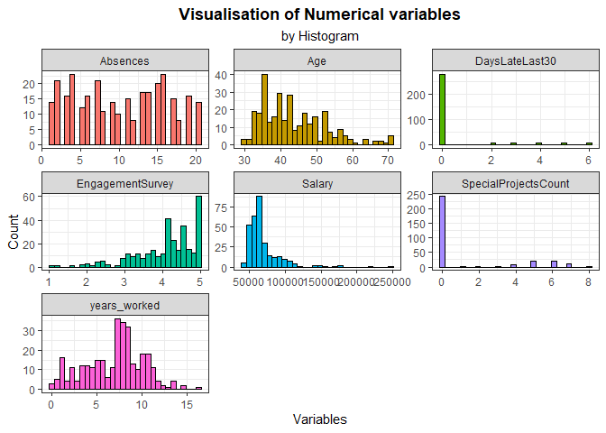

Human Resources Data Analysis using Principal Component Methods
================
Kar Ng
2022-05

-   [1 SUMMARY](#1-summary)
-   [2 R PACKAGES](#2-r-packages)
-   [3 INTRODUCTION](#3-introduction)
-   [4 DATA PREPARATION](#4-data-preparation)
    -   [4.1 Data import](#41-data-import)
    -   [4.2 Data description](#42-data-description)
    -   [4.3 Data exploration](#43-data-exploration)
-   [5 DATA CLEANING](#5-data-cleaning)
    -   [5.1 Variables removals](#51-variables-removals)
    -   [5.2 New Variable: Age](#52-new-variable-age)
    -   [5.3 New Variable: years_worked](#53-new-variable-years_worked)
    -   [5.4 Trim](#54-trim)
    -   [5.5 Factor conversion](#55-factor-conversion)
    -   [5.6 CitizenDesc](#56-citizendesc)
    -   [5.7 HispanicLatino](#57-hispaniclatino)
    -   [5.8 Missing data check](#58-missing-data-check)
-   [6 VISUALISATION](#6-visualisation)
    -   [6.1 Numerical variables](#61-numerical-variables)
    -   [6.2 factor variables 1](#62-factor-variables-1)
-   [MACHINE LEARNING (PC METHODS)](#machine-learning-pc-methods)
    -   [](#section)
-   [REFERENCE](#reference)

## 1 SUMMARY

## 2 R PACKAGES

``` r
library(tidyverse)
library(kableExtra)
library(lubridate)
library(skimr)
library(tidytext)
```

## 3 INTRODUCTION

This project analyses a set of human resource data by applying one of
the core machine learning technique, “Principal Components (PC)
methods”, which belong to the “unsupervised” branch of machine learning
domain.

There are 5 types of principal components methods:

-   Principal Component Analysis (PCA)  
-   Correspondence Analysis (CA)  
-   Multiple Correspondence Analysis (MCA)  
-   Factor Analysis of Mixed Data (FAMD)  
-   Multiple Factor Analysis (MFA)

These PC methods are designed for different type of datasets, I would
not explain why and how are these methods different from each other here
and for which type of datasets but I will apply the most appropriate one
for the dataset used in this project.

Principal component methods are typically used for multivariate analysis
(MVA) when we are analysing datasets that have many variables. PC
methods will quickly help us identifying the most important variables
that contribute the most in explaining the variations in the data sets.

During computation, PC methods will extract all the variations in the
multivariate dataframe and expressed them into a few new variables
called principal components (there are other inter-changeable terms with
similar meaning in this context, such as “dims” or “axes”). After
previous step, many special plots of PC will be plotted to understand
the result. Important to note that the goal of PC methods is to identify
main directions along which the variation is maximal (KASSAMBARA A
2017).

## 4 DATA PREPARATION

A public dataset called “Human Resources Data Set” by DR.RICH on
Kaggle.com has been downloaded for analysis. *Kaggle.com* is a popular
website for data science community to share datasets, codes and
knowledge.

This dataset

### 4.1 Data import

Following code upload the dataset into R.

``` r
hr <- read.csv("hr_dataset.csv", header = T,
               fileEncoding = "UTF-8-BOM", 
               row.names = 1, 
               na.strings = T)
```

### 4.2 Data description

Following is the data dictionary/description of this dataset, downloaded
from this link: [Rpubs](https://rpubs.com/rhuebner/hrd_cb_v14), created
by the author, Dr. Rich Huebner.


### 4.3 Data exploration

There are 311 rows and 35 columns in the dataset. Following show the
variable “type” allocated by R to each of the column (also known as
variables or features), along with several starting values of these
variables.

``` r
glimpse(hr)
```

    ## Rows: 311
    ## Columns: 35
    ## $ EmpID                      <int> 10026, 10084, 10196, 10088, 10069, 10002, 1~
    ## $ MarriedID                  <int> 0, 1, 1, 1, 0, 0, 0, 0, 0, 0, 1, 1, 0, 0, 0~
    ## $ MaritalStatusID            <int> 0, 1, 1, 1, 2, 0, 0, 4, 0, 2, 1, 1, 2, 0, 2~
    ## $ GenderID                   <int> 1, 1, 0, 0, 0, 0, 0, 1, 0, 1, 0, 1, 1, 1, 1~
    ## $ EmpStatusID                <int> 1, 5, 5, 1, 5, 1, 1, 1, 3, 1, 5, 5, 1, 1, 5~
    ## $ DeptID                     <int> 5, 3, 5, 5, 5, 5, 4, 5, 5, 3, 5, 5, 3, 5, 5~
    ## $ PerfScoreID                <int> 4, 3, 3, 3, 3, 4, 3, 3, 3, 3, 3, 3, 4, 3, 3~
    ## $ FromDiversityJobFairID     <int> 0, 0, 0, 0, 0, 0, 0, 0, 1, 0, 1, 1, 1, 0, 0~
    ## $ Salary                     <int> 62506, 104437, 64955, 64991, 50825, 57568, ~
    ## $ Termd                      <int> 0, 1, 1, 0, 1, 0, 0, 0, 0, 0, 1, 1, 0, 0, 1~
    ## $ PositionID                 <int> 19, 27, 20, 19, 19, 19, 24, 19, 19, 14, 19,~
    ## $ Position                   <chr> "Production Technician I", "Sr. DBA", "Prod~
    ## $ State                      <chr> "MA", "MA", "MA", "MA", "MA", "MA", "MA", "~
    ## $ Zip                        <int> 1960, 2148, 1810, 1886, 2169, 1844, 2110, 2~
    ## $ DOB                        <chr> "07/10/83", "05/05/75", "09/19/88", "09/27/~
    ## $ Sex                        <chr> "M ", "M ", "F", "F", "F", "F", "F", "M ", ~
    ## $ MaritalDesc                <chr> "Single", "Married", "Married", "Married", ~
    ## $ CitizenDesc                <chr> "US Citizen", "US Citizen", "US Citizen", "~
    ## $ HispanicLatino             <chr> "No", "No", "No", "No", "No", "No", "No", "~
    ## $ RaceDesc                   <chr> "White", "White", "White", "White", "White"~
    ## $ DateofHire                 <chr> "7/5/2011", "3/30/2015", "7/5/2011", "1/7/2~
    ## $ DateofTermination          <chr> "", "6/16/2016", "9/24/2012", "", "9/6/2016~
    ## $ TermReason                 <chr> "N/A-StillEmployed", "career change", "hour~
    ## $ EmploymentStatus           <chr> "Active", "Voluntarily Terminated", "Volunt~
    ## $ Department                 <chr> "Production       ", "IT/IS", "Production  ~
    ## $ ManagerName                <chr> "Michael Albert", "Simon Roup", "Kissy Sull~
    ## $ ManagerID                  <int> 22, 4, 20, 16, 39, 11, 10, 19, 12, 7, 14, 2~
    ## $ RecruitmentSource          <chr> "LinkedIn", "Indeed", "LinkedIn", "Indeed",~
    ## $ PerformanceScore           <chr> "Exceeds", "Fully Meets", "Fully Meets", "F~
    ## $ EngagementSurvey           <dbl> 4.60, 4.96, 3.02, 4.84, 5.00, 5.00, 3.04, 5~
    ## $ EmpSatisfaction            <int> 5, 3, 3, 5, 4, 5, 3, 4, 3, 5, 4, 3, 4, 4, 5~
    ## $ SpecialProjectsCount       <int> 0, 6, 0, 0, 0, 0, 4, 0, 0, 6, 0, 0, 5, 0, 0~
    ## $ LastPerformanceReview_Date <chr> "1/17/2019", "2/24/2016", "5/15/2012", "1/3~
    ## $ DaysLateLast30             <int> 0, 0, 0, 0, 0, 0, 0, 0, 0, 0, 0, 0, 0, 0, 0~
    ## $ Absences                   <int> 1, 17, 3, 15, 2, 15, 19, 19, 4, 16, 12, 15,~

Randomly sample 10 rows of data from the table:

``` r
sample_n(hr, 10)
```

    ##                      EmpID MarriedID MaritalStatusID GenderID EmpStatusID
    ## LaRotonda, William   10038         0               2        1           1
    ## Bernstein, Sean      10046         0               0        1           1
    ## Salter, Jason        10229         0               2        1           5
    ## Adinolfi, Wilson  K  10026         0               0        1           1
    ## Linden, Mathew       10137         1               1        1           3
    ## Roehrich, Bianca     10149         0               0        0           5
    ## Jhaveri, Sneha       10060         0               3        0           1
    ## Foss, Jason          10015         0               0        1           1
    ## Shepard, Anita       10179         1               1        0           1
    ## Spirea, Kelley       10090         1               1        0           1
    ##                      DeptID PerfScoreID FromDiversityJobFairID Salary Termd
    ## LaRotonda, William        1           3                      0  64520     0
    ## Bernstein, Sean           5           3                      0  51044     0
    ## Salter, Jason             3           3                      0  88527     1
    ## Adinolfi, Wilson  K       5           4                      0  62506     0
    ## Linden, Mathew            5           3                      0  63450     0
    ## Roehrich, Bianca          3           3                      0 120000     1
    ## Jhaveri, Sneha            5           3                      0  60436     0
    ## Foss, Jason               3           4                      0 178000     0
    ## Shepard, Anita            3           3                      0  50750     0
    ## Spirea, Kelley            5           3                      0  65714     0
    ##                      PositionID                 Position State  Zip      DOB
    ## LaRotonda, William            1             Accountant I    MA 1460 04/26/84
    ## Bernstein, Sean              19  Production Technician I    MA 2072 12/22/70
    ## Salter, Jason                 9            Data Analyst     MA 2452 12/17/87
    ## Adinolfi, Wilson  K          19  Production Technician I    MA 1960 07/10/83
    ## Linden, Mathew               20 Production Technician II    MA 1770 03/19/79
    ## Roehrich, Bianca             29 Principal Data Architect    MA 2703 05/27/73
    ## Jhaveri, Sneha               19  Production Technician I    MA 2109 04/13/64
    ## Foss, Jason                  12              IT Director    MA 1460 07/05/80
    ## Shepard, Anita               15         Network Engineer    MA 1773 04/14/81
    ## Spirea, Kelley               18       Production Manager    MA 2451 09/30/75
    ##                      Sex MaritalDesc CitizenDesc HispanicLatino
    ## LaRotonda, William    M     Divorced  US Citizen             No
    ## Bernstein, Sean       M       Single  US Citizen            Yes
    ## Salter, Jason         M     Divorced  US Citizen             No
    ## Adinolfi, Wilson  K   M       Single  US Citizen             No
    ## Linden, Mathew        M      Married  US Citizen             No
    ## Roehrich, Bianca       F      Single  US Citizen            Yes
    ## Jhaveri, Sneha         F   Separated  US Citizen             No
    ## Foss, Jason           M       Single  US Citizen             No
    ## Shepard, Anita         F     Married  US Citizen             No
    ## Spirea, Kelley         F     Married  US Citizen             No
    ##                                       RaceDesc DateofHire DateofTermination
    ## LaRotonda, William   Black or African American   1/6/2014                  
    ## Bernstein, Sean                          White   4/2/2012                  
    ## Salter, Jason        Black or African American   1/5/2015        10/31/2015
    ## Adinolfi, Wilson  K                      White   7/5/2011                  
    ## Linden, Mathew                           White   7/8/2013                  
    ## Roehrich, Bianca                         White   1/5/2015        11/10/2018
    ## Jhaveri, Sneha                           White   1/6/2014                  
    ## Foss, Jason          Black or African American  4/15/2011                  
    ## Shepard, Anita                           White  9/30/2014                  
    ## Spirea, Kelley                           White  10/2/2012                  
    ##                             TermReason       EmploymentStatus        Department
    ## LaRotonda, William   N/A-StillEmployed                 Active     Admin Offices
    ## Bernstein, Sean      N/A-StillEmployed                 Active Production       
    ## Salter, Jason                    hours Voluntarily Terminated             IT/IS
    ## Adinolfi, Wilson  K  N/A-StillEmployed                 Active Production       
    ## Linden, Mathew       N/A-StillEmployed                 Active Production       
    ## Roehrich, Bianca      Another position Voluntarily Terminated             IT/IS
    ## Jhaveri, Sneha       N/A-StillEmployed                 Active Production       
    ## Foss, Jason          N/A-StillEmployed                 Active             IT/IS
    ## Shepard, Anita       N/A-StillEmployed                 Active             IT/IS
    ## Spirea, Kelley       N/A-StillEmployed                 Active Production       
    ##                             ManagerName ManagerID RecruitmentSource
    ## LaRotonda, William   Brandon R. LeBlanc         1           Website
    ## Bernstein, Sean                Amy Dunn        11     Google Search
    ## Salter, Jason                Simon Roup         4          LinkedIn
    ## Adinolfi, Wilson  K      Michael Albert        22          LinkedIn
    ## Linden, Mathew            Kelley Spirea        18          LinkedIn
    ## Roehrich, Bianca             Simon Roup         4          LinkedIn
    ## Jhaveri, Sneha            Kelley Spirea        18          LinkedIn
    ## Foss, Jason             Jennifer Zamora         5            Indeed
    ## Shepard, Anita             Peter Monroe         7          LinkedIn
    ## Spirea, Kelley               Janet King         2          LinkedIn
    ##                      PerformanceScore EngagementSurvey EmpSatisfaction
    ## LaRotonda, William        Fully Meets             5.00               4
    ## Bernstein, Sean           Fully Meets             5.00               3
    ## Salter, Jason             Fully Meets             4.20               3
    ## Adinolfi, Wilson  K           Exceeds             4.60               5
    ## Linden, Mathew            Fully Meets             4.00               3
    ## Roehrich, Bianca          Fully Meets             3.88               3
    ## Jhaveri, Sneha            Fully Meets             5.00               5
    ## Foss, Jason                   Exceeds             5.00               5
    ## Shepard, Anita            Fully Meets             3.31               3
    ## Spirea, Kelley            Fully Meets             4.83               5
    ##                      SpecialProjectsCount LastPerformanceReview_Date
    ## LaRotonda, William                      4                  1/17/2019
    ## Bernstein, Sean                         0                  1/14/2019
    ## Salter, Jason                           5                  4/20/2015
    ## Adinolfi, Wilson  K                     0                  1/17/2019
    ## Linden, Mathew                          0                  2/18/2019
    ## Roehrich, Bianca                        7                  2/13/2018
    ## Jhaveri, Sneha                          0                  1/21/2019
    ## Foss, Jason                             5                   1/7/2019
    ## Shepard, Anita                          6                   1/7/2019
    ## Spirea, Kelley                          0                  2/14/2019
    ##                      DaysLateLast30 Absences
    ## LaRotonda, William                0        3
    ## Bernstein, Sean                   0       13
    ## Salter, Jason                     0        2
    ## Adinolfi, Wilson  K               0        1
    ## Linden, Mathew                    0        7
    ## Roehrich, Bianca                  0       12
    ## Jhaveri, Sneha                    0        9
    ## Foss, Jason                       0       15
    ## Shepard, Anita                    0        7
    ## Spirea, Kelley                    0       15

The first column is a column recording employee names. I have made this
column the name of each rows (or known as observation). It is the
standard format required for PC methods.

## 5 DATA CLEANING

The data may seem perfectly to go however numerous important cleaning
and manipulation tasks have been identified and will be perfectly
completed in this section.

### 5.1 Variables removals

I will be removing some irrelevant or repeated variables that may not
help in our analysis to understand the hidden trends in the data. They
are:

-   EmpID  
-   MaritalStatusID  
-   GenderID  
-   EmpStatusID  
-   DeptID  
-   PerfScoreID  
-   PositionID  
-   Zip  
-   ManagerID  
-   LastPerformanceReview_Date

After removal of above features, the numbers of columns have been
reduced from 35 to 25.

``` r
hr2 <- hr %>%
  dplyr::select(-EmpID, -MaritalStatusID, -GenderID, -EmpStatusID, -DeptID, -PerfScoreID, -PositionID, -Zip, -ManagerID, -LastPerformanceReview_Date)
  
glimpse(hr2)
```

    ## Rows: 311
    ## Columns: 25
    ## $ MarriedID              <int> 0, 1, 1, 1, 0, 0, 0, 0, 0, 0, 1, 1, 0, 0, 0, 0,~
    ## $ FromDiversityJobFairID <int> 0, 0, 0, 0, 0, 0, 0, 0, 1, 0, 1, 1, 1, 0, 0, 0,~
    ## $ Salary                 <int> 62506, 104437, 64955, 64991, 50825, 57568, 9566~
    ## $ Termd                  <int> 0, 1, 1, 0, 1, 0, 0, 0, 0, 0, 1, 1, 0, 0, 1, 1,~
    ## $ Position               <chr> "Production Technician I", "Sr. DBA", "Producti~
    ## $ State                  <chr> "MA", "MA", "MA", "MA", "MA", "MA", "MA", "MA",~
    ## $ DOB                    <chr> "07/10/83", "05/05/75", "09/19/88", "09/27/88",~
    ## $ Sex                    <chr> "M ", "M ", "F", "F", "F", "F", "F", "M ", "F",~
    ## $ MaritalDesc            <chr> "Single", "Married", "Married", "Married", "Div~
    ## $ CitizenDesc            <chr> "US Citizen", "US Citizen", "US Citizen", "US C~
    ## $ HispanicLatino         <chr> "No", "No", "No", "No", "No", "No", "No", "No",~
    ## $ RaceDesc               <chr> "White", "White", "White", "White", "White", "W~
    ## $ DateofHire             <chr> "7/5/2011", "3/30/2015", "7/5/2011", "1/7/2008"~
    ## $ DateofTermination      <chr> "", "6/16/2016", "9/24/2012", "", "9/6/2016", "~
    ## $ TermReason             <chr> "N/A-StillEmployed", "career change", "hours", ~
    ## $ EmploymentStatus       <chr> "Active", "Voluntarily Terminated", "Voluntaril~
    ## $ Department             <chr> "Production       ", "IT/IS", "Production      ~
    ## $ ManagerName            <chr> "Michael Albert", "Simon Roup", "Kissy Sullivan~
    ## $ RecruitmentSource      <chr> "LinkedIn", "Indeed", "LinkedIn", "Indeed", "Go~
    ## $ PerformanceScore       <chr> "Exceeds", "Fully Meets", "Fully Meets", "Fully~
    ## $ EngagementSurvey       <dbl> 4.60, 4.96, 3.02, 4.84, 5.00, 5.00, 3.04, 5.00,~
    ## $ EmpSatisfaction        <int> 5, 3, 3, 5, 4, 5, 3, 4, 3, 5, 4, 3, 4, 4, 5, 4,~
    ## $ SpecialProjectsCount   <int> 0, 6, 0, 0, 0, 0, 4, 0, 0, 6, 0, 0, 5, 0, 0, 0,~
    ## $ DaysLateLast30         <int> 0, 0, 0, 0, 0, 0, 0, 0, 0, 0, 0, 0, 0, 0, 0, 0,~
    ## $ Absences               <int> 1, 17, 3, 15, 2, 15, 19, 19, 4, 16, 12, 15, 9, ~

### 5.2 New Variable: Age

At the year of writing this project is 2022, and therefore the
calculation of age will be 2022 minus DOB (date of birth) in the
dataset. The DOB will be replaced with “Age”.

``` r
hr2 <- hr2 %>%  
  mutate(yearDOB = substr(DOB, start = 7, stop = 8),
         yearbirth = as.numeric(paste0(19, yearDOB)),
         Age = 2022 - yearbirth) %>%   
  relocate(Age, .after = State) %>% 
  dplyr::select(-DOB, -yearDOB, -yearbirth)
```

Now, the variable “DOB” has been replaced by “Age”, 7th variable, and
following shows the age of all employees in the dataset.

``` r
hr2$Age
```

    ##   [1] 39 47 34 34 33 45 43 39 52 34 48 48 34 39 45 41 56 52 36 43 52 64 33 32 55
    ##  [26] 58 35 52 32 35 39 53 58 42 45 56 39 35 39 36 59 71 50 43 39 52 39 34 37 41
    ##  [51] 44 42 45 43 47 39 45 36 35 57 32 70 44 43 34 45 43 47 71 55 39 40 35 44 36
    ##  [76] 34 52 34 49 49 31 48 44 33 39 33 35 44 35 67 33 35 41 41 39 47 42 43 59 54
    ## [101] 37 39 32 52 51 48 42 33 51 33 30 53 58 41 36 43 39 48 41 39 33 53 45 34 70
    ## [126] 48 38 50 34 38 38 56 37 36 38 30 46 46 31 50 56 36 58 63 36 53 36 33 46 43
    ## [151] 68 49 52 45 42 53 36 50 43 36 38 38 35 43 38 40 34 41 41 43 34 46 40 47 49
    ## [176] 50 36 46 36 48 35 45 35 35 38 54 46 41 37 30 36 52 46 43 38 48 42 52 33 39
    ## [201] 45 55 33 38 37 42 70 32 46 43 40 43 43 38 34 33 36 36 45 43 38 34 41 34 38
    ## [226] 61 52 38 42 38 68 40 49 41 50 48 37 37 41 49 50 48 35 49 58 36 54 48 36 35
    ## [251] 34 47 41 37 52 34 35 59 38 35 57 49 39 54 47 49 40 48 36 37 33 44 40 54 39
    ## [276] 35 47 69 57 57 47 55 54 39 34 39 37 53 31 35 54 33 36 36 37 46 67 42 41 44
    ## [301] 35 57 39 53 64 37 37 40 43 43 44

### 5.3 New Variable: years_worked

There are two variables in the date set: DateofHire and
DateofTermination.

I will compute the days of each employee worked/works by using the date
of termination (DateofTermination) minus date of hire (DateofHire), and
for present employee I will use today’s date (5-May-2022) minus the date
of hire to obtain the total number of days worked.

``` r
hr2 <- hr2 %>% 
  mutate(DateofHire = mdy(DateofHire),
         DateofTermination = mdy(DateofTermination),
         days_worked = ifelse(is.na(DateofTermination),
                              today() - DateofHire,
                              DateofTermination - DateofHire),
         years_worked = round(days_worked/365, 1)) %>% 
  relocate(years_worked, .after = RaceDesc) %>% 
  dplyr::select(-DateofHire, -DateofTermination, -days_worked)
```

Following shows number of years, with 1 decimal place, worked by each
employee in the dataset.

``` r
hr2$years_worked
```

    ##   [1] 10.8  1.2  1.2 14.3  5.2 10.3  7.5  8.6 12.8  7.3  6.0  4.5  7.5 10.2  4.5
    ##  [16]  6.5  5.8 11.1  1.2  8.8 10.1  8.7  7.8 11.1  3.2  2.0  7.2  0.9  1.2 13.5
    ##  [31]  7.6  8.5  3.0 10.2 11.1 10.7  6.3  8.5  8.1  5.8  7.7  7.6  5.7  8.0  8.8
    ##  [46] 10.0  4.4 10.6  9.7  1.6  1.1  5.8  8.8  5.2 11.8 13.3  7.3  7.1  5.8  7.5
    ##  [61]  8.0  7.5  9.8 10.5  3.8  5.1 10.3  7.6  4.6  7.8  5.2  8.0 10.2  9.3 10.1
    ##  [76]  7.3  8.3 11.3  7.6 12.0  6.2  7.5  8.1  7.8  6.5  4.0  2.1  7.8  8.2  4.5
    ##  [91]  7.0  7.1 10.3  2.1  1.8  3.9 11.1 13.3 10.7 12.0  7.1 11.0  7.1  5.0  1.2
    ## [106]  3.2  7.6  7.2  0.1  7.1  8.5 10.8  1.1  7.3  8.0  9.8  8.6  8.7  6.9  2.9
    ## [121]  5.0  2.7 10.4  8.5  3.9  8.0  9.7  2.4  7.7  0.6  7.1  8.0  0.2 10.2  5.9
    ## [136]  6.9  2.1  1.6  8.7  9.5  8.6 10.8  8.3  6.5  7.3  7.8  5.2  2.5  8.6  8.7
    ## [151]  9.8  3.7  2.3  8.2 11.3 11.2  7.5  4.9  1.2  9.8  8.3  1.0  5.6  6.9  6.3
    ## [166] 10.0 10.0  8.6  7.2  8.8 11.3  3.2  8.7  7.2  4.0  5.0  8.3  6.0  1.1  8.5
    ## [181]  8.5 10.9  7.1  9.3  5.8  4.6  7.1  9.7  3.1 10.5 10.2  9.0 10.3  7.2  9.1
    ## [196]  9.0  8.8  5.2  2.5  3.2  8.0  9.1  8.8  8.8  7.5  4.1  1.3  8.6  8.6  8.2
    ## [211]  7.3  2.9  3.8  1.4  7.0  4.2  4.4  1.7  5.6 10.1  7.5  1.4 14.5 10.3  7.1
    ## [226]  8.3  0.7  4.5  5.6  6.5  8.0  4.7 10.4  0.1  0.6  5.0  5.4  8.8  7.2  3.8
    ## [241]  5.3  8.3  7.4  9.3  3.8  9.5  5.8  9.6 11.7  0.8  7.6  8.6  7.6  8.7  7.3
    ## [256]  7.0  5.5  7.6  8.0  2.0  8.5 10.9  5.8 10.2  9.6  2.1 11.3  8.0  7.6  8.2
    ## [271] 11.6 13.3  7.3 10.0  7.8  5.0  3.9  6.2  7.6  5.2  3.2  9.2 16.3  8.2  1.1
    ## [286]  5.2  3.5  7.1 10.8  3.5 10.8 10.2  2.0  4.4  6.8  7.7  0.3  3.1  5.2  7.1
    ## [301]  3.3  4.3  1.3  3.5  3.1  7.6  7.8  7.1 12.1  7.1  7.6

### 5.4 Trim

This section trim the unnecessary leading and trailing whitespaces of
character variables in the dataset.

``` r
hr2 <- hr2 %>% 
  mutate_if(is.character, trimws)
```

### 5.5 Factor conversion

Some “numeric” and “textual” features will need to be converted into
“factor” type because of their categorical nature.

-   All textual features that formed by character “chr” in the dataset
    need conversion. Following shows all of these textual variables in
    the datasets.

``` r
str(hr2 %>% 
  select(is.character))
```

    ## Warning: Predicate functions must be wrapped in `where()`.
    ## 
    ##   # Bad
    ##   data %>% select(is.character)
    ## 
    ##   # Good
    ##   data %>% select(where(is.character))
    ## 
    ## i Please update your code.
    ## This message is displayed once per session.

    ## 'data.frame':    311 obs. of  13 variables:
    ##  $ Position         : chr  "Production Technician I" "Sr. DBA" "Production Technician II" "Production Technician I" ...
    ##  $ State            : chr  "MA" "MA" "MA" "MA" ...
    ##  $ Sex              : chr  "M" "M" "F" "F" ...
    ##  $ MaritalDesc      : chr  "Single" "Married" "Married" "Married" ...
    ##  $ CitizenDesc      : chr  "US Citizen" "US Citizen" "US Citizen" "US Citizen" ...
    ##  $ HispanicLatino   : chr  "No" "No" "No" "No" ...
    ##  $ RaceDesc         : chr  "White" "White" "White" "White" ...
    ##  $ TermReason       : chr  "N/A-StillEmployed" "career change" "hours" "N/A-StillEmployed" ...
    ##  $ EmploymentStatus : chr  "Active" "Voluntarily Terminated" "Voluntarily Terminated" "Active" ...
    ##  $ Department       : chr  "Production" "IT/IS" "Production" "Production" ...
    ##  $ ManagerName      : chr  "Michael Albert" "Simon Roup" "Kissy Sullivan" "Elijiah Gray" ...
    ##  $ RecruitmentSource: chr  "LinkedIn" "Indeed" "LinkedIn" "Indeed" ...
    ##  $ PerformanceScore : chr  "Exceeds" "Fully Meets" "Fully Meets" "Fully Meets" ...

Following codes complete the conversion task for these textual features.

``` r
hr2 <- hr2 %>% 
  mutate_if(is.character, as.factor)
```

-   With regards to numeric features, features that need to be converted
    into factor type are MarriedID, FromDiversityJobFairID, Termd, and
    EmpSatisfaction.

``` r
str(hr2 %>% 
      select(-is.factor))
```

    ## Warning: Predicate functions must be wrapped in `where()`.
    ## 
    ##   # Bad
    ##   data %>% select(is.factor)
    ## 
    ##   # Good
    ##   data %>% select(where(is.factor))
    ## 
    ## i Please update your code.
    ## This message is displayed once per session.

    ## 'data.frame':    311 obs. of  11 variables:
    ##  $ MarriedID             : int  0 1 1 1 0 0 0 0 0 0 ...
    ##  $ FromDiversityJobFairID: int  0 0 0 0 0 0 0 0 1 0 ...
    ##  $ Salary                : int  62506 104437 64955 64991 50825 57568 95660 59365 47837 50178 ...
    ##  $ Termd                 : int  0 1 1 0 1 0 0 0 0 0 ...
    ##  $ Age                   : num  39 47 34 34 33 45 43 39 52 34 ...
    ##  $ years_worked          : num  10.8 1.2 1.2 14.3 5.2 10.3 7.5 8.6 12.8 7.3 ...
    ##  $ EngagementSurvey      : num  4.6 4.96 3.02 4.84 5 5 3.04 5 4.46 5 ...
    ##  $ EmpSatisfaction       : int  5 3 3 5 4 5 3 4 3 5 ...
    ##  $ SpecialProjectsCount  : int  0 6 0 0 0 0 4 0 0 6 ...
    ##  $ DaysLateLast30        : int  0 0 0 0 0 0 0 0 0 0 ...
    ##  $ Absences              : int  1 17 3 15 2 15 19 19 4 16 ...

Following codes complete the conversion task for these selected
numerical features.

``` r
hr2 <- hr2 %>% 
  mutate(MarriedID = as.factor(MarriedID),
         FromDiversityJobFairID = as.factor(FromDiversityJobFairID),
         Termd = as.factor(Termd),
         EmpSatisfaction = as.factor(EmpSatisfaction))
```

After conversion, we are able to use following code to summaries the
dataset. For example, there are 187 of “0” and 124 of “1” for Married
ID. The type of this variable has to be in factor form to make this
summary feasible.

Different categories (or known as “level”) in each factor variables are
now feasible and countable.

``` r
summary(hr2 %>% 
          dplyr::select(is.factor))
```

    ##  MarriedID FromDiversityJobFairID Termd                       Position  
    ##  0:187     0:282                  0:207   Production Technician I :137  
    ##  1:124     1: 29                  1:104   Production Technician II: 57  
    ##                                           Area Sales Manager      : 27  
    ##                                           Production Manager      : 14  
    ##                                           Software Engineer       : 10  
    ##                                           Data Analyst            :  8  
    ##                                           (Other)                 : 58  
    ##      State     Sex        MaritalDesc               CitizenDesc  HispanicLatino
    ##  MA     :276   F:176   Divorced : 30   Eligible NonCitizen: 12   no :  1       
    ##  CT     :  6   M:135   Married  :124   Non-Citizen        :  4   No :282       
    ##  TX     :  3           Separated: 12   US Citizen         :295   yes:  1       
    ##  VT     :  2           Single   :137                             Yes: 27       
    ##  AL     :  1           Widowed  :  8                                           
    ##  AZ     :  1                                                                   
    ##  (Other): 22                                                                   
    ##                              RaceDesc               TermReason 
    ##  American Indian or Alaska Native:  3   N/A-StillEmployed:207  
    ##  Asian                           : 29   Another position : 20  
    ##  Black or African American       : 80   unhappy          : 14  
    ##  Hispanic                        :  1   more money       : 11  
    ##  Two or more races               : 11   career change    :  9  
    ##  White                           :187   hours            :  8  
    ##                                         (Other)          : 42  
    ##                EmploymentStatus                Department          ManagerName 
    ##  Active                :207     Admin Offices       :  9   Brannon Miller: 22  
    ##  Terminated for Cause  : 16     Executive Office    :  1   Elijiah Gray  : 22  
    ##  Voluntarily Terminated: 88     IT/IS               : 50   Kelley Spirea : 22  
    ##                                 Production          :209   Kissy Sullivan: 22  
    ##                                 Sales               : 31   Michael Albert: 22  
    ##                                 Software Engineering: 11   Amy Dunn      : 21  
    ##                                                            (Other)       :180  
    ##           RecruitmentSource          PerformanceScore EmpSatisfaction
    ##  Indeed            :87      Exceeds          : 37     1:  2          
    ##  LinkedIn          :76      Fully Meets      :243     2:  9          
    ##  Google Search     :49      Needs Improvement: 18     3:108          
    ##  Employee Referral :31      PIP              : 13     4: 94          
    ##  Diversity Job Fair:29                                5: 98          
    ##  CareerBuilder     :23                                               
    ##  (Other)           :16

### 5.6 CitizenDesc

There are three categories for the variable “CitizenDesc”, Eligible
NonCitizen (12 employees), Non-Citizen (4 employees) and 295 US Citizen
employees. I can’t see why I can’t merge “Eligible NonCitizen” and
“Non-Citizen”, and therefore this section will perform this task. 12 of
the “Eligible NonCitizen” will be grouped to “Non-Citizen”.

``` r
hr2 <- hr2 %>% 
  mutate(CitizenDesc = fct_recode(CitizenDesc,
                                  "Non-Citizen" = "Eligible NonCitizen"))
```

Let’s check, and the conversion has been completed.

``` r
table(hr2$CitizenDesc)
```

    ## 
    ## Non-Citizen  US Citizen 
    ##          16         295

### 5.7 HispanicLatino

The HispanicLatino has following 4 categories.

``` r
table(hr2$HispanicLatino)
```

    ## 
    ##  no  No yes Yes 
    ##   1 282   1  27

The “no” and “Yes” should be a mistake and have to be converted to “No”
and “Yes”. Following code complete the conversion.

``` r
hr2 <- hr2 %>% 
  mutate(HispanicLatino = fct_recode(HispanicLatino,
                                  "No" = "no",
                                  "Yes" = "yes"))
```

Let’s check, and the conversion has been completed.

``` r
table(hr2$HispanicLatino)
```

    ## 
    ##  No Yes 
    ## 283  28

### 5.8 Missing data check

This section check missing data (“NA”) in the dataset and will be
managed accordingly.

``` r
skim_without_charts(hr2)
```

<table style="width: auto;" class="table table-condensed">
<caption>
Data summary
</caption>
<thead>
<tr>
<th style="text-align:left;">
</th>
<th style="text-align:left;">
</th>
</tr>
</thead>
<tbody>
<tr>
<td style="text-align:left;">
Name
</td>
<td style="text-align:left;">
hr2
</td>
</tr>
<tr>
<td style="text-align:left;">
Number of rows
</td>
<td style="text-align:left;">
311
</td>
</tr>
<tr>
<td style="text-align:left;">
Number of columns
</td>
<td style="text-align:left;">
24
</td>
</tr>
<tr>
<td style="text-align:left;">
\_\_\_\_\_\_\_\_\_\_\_\_\_\_\_\_\_\_\_\_\_\_\_
</td>
<td style="text-align:left;">
</td>
</tr>
<tr>
<td style="text-align:left;">
Column type frequency:
</td>
<td style="text-align:left;">
</td>
</tr>
<tr>
<td style="text-align:left;">
factor
</td>
<td style="text-align:left;">
17
</td>
</tr>
<tr>
<td style="text-align:left;">
numeric
</td>
<td style="text-align:left;">
7
</td>
</tr>
<tr>
<td style="text-align:left;">
\_\_\_\_\_\_\_\_\_\_\_\_\_\_\_\_\_\_\_\_\_\_\_\_
</td>
<td style="text-align:left;">
</td>
</tr>
<tr>
<td style="text-align:left;">
Group variables
</td>
<td style="text-align:left;">
None
</td>
</tr>
</tbody>
</table>

**Variable type: factor**

<table>
<thead>
<tr>
<th style="text-align:left;">
skim_variable
</th>
<th style="text-align:right;">
n_missing
</th>
<th style="text-align:right;">
complete_rate
</th>
<th style="text-align:left;">
ordered
</th>
<th style="text-align:right;">
n_unique
</th>
<th style="text-align:left;">
top_counts
</th>
</tr>
</thead>
<tbody>
<tr>
<td style="text-align:left;">
MarriedID
</td>
<td style="text-align:right;">
0
</td>
<td style="text-align:right;">
1
</td>
<td style="text-align:left;">
FALSE
</td>
<td style="text-align:right;">
2
</td>
<td style="text-align:left;">
0: 187, 1: 124
</td>
</tr>
<tr>
<td style="text-align:left;">
FromDiversityJobFairID
</td>
<td style="text-align:right;">
0
</td>
<td style="text-align:right;">
1
</td>
<td style="text-align:left;">
FALSE
</td>
<td style="text-align:right;">
2
</td>
<td style="text-align:left;">
0: 282, 1: 29
</td>
</tr>
<tr>
<td style="text-align:left;">
Termd
</td>
<td style="text-align:right;">
0
</td>
<td style="text-align:right;">
1
</td>
<td style="text-align:left;">
FALSE
</td>
<td style="text-align:right;">
2
</td>
<td style="text-align:left;">
0: 207, 1: 104
</td>
</tr>
<tr>
<td style="text-align:left;">
Position
</td>
<td style="text-align:right;">
0
</td>
<td style="text-align:right;">
1
</td>
<td style="text-align:left;">
FALSE
</td>
<td style="text-align:right;">
31
</td>
<td style="text-align:left;">
Pro: 137, Pro: 57, Are: 27, Pro: 14
</td>
</tr>
<tr>
<td style="text-align:left;">
State
</td>
<td style="text-align:right;">
0
</td>
<td style="text-align:right;">
1
</td>
<td style="text-align:left;">
FALSE
</td>
<td style="text-align:right;">
28
</td>
<td style="text-align:left;">
MA: 276, CT: 6, TX: 3, VT: 2
</td>
</tr>
<tr>
<td style="text-align:left;">
Sex
</td>
<td style="text-align:right;">
0
</td>
<td style="text-align:right;">
1
</td>
<td style="text-align:left;">
FALSE
</td>
<td style="text-align:right;">
2
</td>
<td style="text-align:left;">
F: 176, M: 135
</td>
</tr>
<tr>
<td style="text-align:left;">
MaritalDesc
</td>
<td style="text-align:right;">
0
</td>
<td style="text-align:right;">
1
</td>
<td style="text-align:left;">
FALSE
</td>
<td style="text-align:right;">
5
</td>
<td style="text-align:left;">
Sin: 137, Mar: 124, Div: 30, Sep: 12
</td>
</tr>
<tr>
<td style="text-align:left;">
CitizenDesc
</td>
<td style="text-align:right;">
0
</td>
<td style="text-align:right;">
1
</td>
<td style="text-align:left;">
FALSE
</td>
<td style="text-align:right;">
2
</td>
<td style="text-align:left;">
US : 295, Non: 16
</td>
</tr>
<tr>
<td style="text-align:left;">
HispanicLatino
</td>
<td style="text-align:right;">
0
</td>
<td style="text-align:right;">
1
</td>
<td style="text-align:left;">
FALSE
</td>
<td style="text-align:right;">
2
</td>
<td style="text-align:left;">
No: 283, Yes: 28
</td>
</tr>
<tr>
<td style="text-align:left;">
RaceDesc
</td>
<td style="text-align:right;">
0
</td>
<td style="text-align:right;">
1
</td>
<td style="text-align:left;">
FALSE
</td>
<td style="text-align:right;">
6
</td>
<td style="text-align:left;">
Whi: 187, Bla: 80, Asi: 29, Two: 11
</td>
</tr>
<tr>
<td style="text-align:left;">
TermReason
</td>
<td style="text-align:right;">
0
</td>
<td style="text-align:right;">
1
</td>
<td style="text-align:left;">
FALSE
</td>
<td style="text-align:right;">
18
</td>
<td style="text-align:left;">
N/A: 207, Ano: 20, unh: 14, mor: 11
</td>
</tr>
<tr>
<td style="text-align:left;">
EmploymentStatus
</td>
<td style="text-align:right;">
0
</td>
<td style="text-align:right;">
1
</td>
<td style="text-align:left;">
FALSE
</td>
<td style="text-align:right;">
3
</td>
<td style="text-align:left;">
Act: 207, Vol: 88, Ter: 16
</td>
</tr>
<tr>
<td style="text-align:left;">
Department
</td>
<td style="text-align:right;">
0
</td>
<td style="text-align:right;">
1
</td>
<td style="text-align:left;">
FALSE
</td>
<td style="text-align:right;">
6
</td>
<td style="text-align:left;">
Pro: 209, IT/: 50, Sal: 31, Sof: 11
</td>
</tr>
<tr>
<td style="text-align:left;">
ManagerName
</td>
<td style="text-align:right;">
0
</td>
<td style="text-align:right;">
1
</td>
<td style="text-align:left;">
FALSE
</td>
<td style="text-align:right;">
21
</td>
<td style="text-align:left;">
Bra: 22, Eli: 22, Kel: 22, Kis: 22
</td>
</tr>
<tr>
<td style="text-align:left;">
RecruitmentSource
</td>
<td style="text-align:right;">
0
</td>
<td style="text-align:right;">
1
</td>
<td style="text-align:left;">
FALSE
</td>
<td style="text-align:right;">
9
</td>
<td style="text-align:left;">
Ind: 87, Lin: 76, Goo: 49, Emp: 31
</td>
</tr>
<tr>
<td style="text-align:left;">
PerformanceScore
</td>
<td style="text-align:right;">
0
</td>
<td style="text-align:right;">
1
</td>
<td style="text-align:left;">
FALSE
</td>
<td style="text-align:right;">
4
</td>
<td style="text-align:left;">
Ful: 243, Exc: 37, Nee: 18, PIP: 13
</td>
</tr>
<tr>
<td style="text-align:left;">
EmpSatisfaction
</td>
<td style="text-align:right;">
0
</td>
<td style="text-align:right;">
1
</td>
<td style="text-align:left;">
FALSE
</td>
<td style="text-align:right;">
5
</td>
<td style="text-align:left;">
3: 108, 5: 98, 4: 94, 2: 9
</td>
</tr>
</tbody>
</table>

**Variable type: numeric**

<table>
<thead>
<tr>
<th style="text-align:left;">
skim_variable
</th>
<th style="text-align:right;">
n_missing
</th>
<th style="text-align:right;">
complete_rate
</th>
<th style="text-align:right;">
mean
</th>
<th style="text-align:right;">
sd
</th>
<th style="text-align:right;">
p0
</th>
<th style="text-align:right;">
p25
</th>
<th style="text-align:right;">
p50
</th>
<th style="text-align:right;">
p75
</th>
<th style="text-align:right;">
p100
</th>
</tr>
</thead>
<tbody>
<tr>
<td style="text-align:left;">
Salary
</td>
<td style="text-align:right;">
0
</td>
<td style="text-align:right;">
1
</td>
<td style="text-align:right;">
69020.68
</td>
<td style="text-align:right;">
25156.64
</td>
<td style="text-align:right;">
45046.00
</td>
<td style="text-align:right;">
55501.50
</td>
<td style="text-align:right;">
62810.00
</td>
<td style="text-align:right;">
72036.0
</td>
<td style="text-align:right;">
250000.0
</td>
</tr>
<tr>
<td style="text-align:left;">
Age
</td>
<td style="text-align:right;">
0
</td>
<td style="text-align:right;">
1
</td>
<td style="text-align:right;">
43.41
</td>
<td style="text-align:right;">
8.87
</td>
<td style="text-align:right;">
30.00
</td>
<td style="text-align:right;">
36.00
</td>
<td style="text-align:right;">
42.00
</td>
<td style="text-align:right;">
49.0
</td>
<td style="text-align:right;">
71.0
</td>
</tr>
<tr>
<td style="text-align:left;">
years_worked
</td>
<td style="text-align:right;">
0
</td>
<td style="text-align:right;">
1
</td>
<td style="text-align:right;">
6.94
</td>
<td style="text-align:right;">
3.16
</td>
<td style="text-align:right;">
0.10
</td>
<td style="text-align:right;">
4.80
</td>
<td style="text-align:right;">
7.50
</td>
<td style="text-align:right;">
8.8
</td>
<td style="text-align:right;">
16.3
</td>
</tr>
<tr>
<td style="text-align:left;">
EngagementSurvey
</td>
<td style="text-align:right;">
0
</td>
<td style="text-align:right;">
1
</td>
<td style="text-align:right;">
4.11
</td>
<td style="text-align:right;">
0.79
</td>
<td style="text-align:right;">
1.12
</td>
<td style="text-align:right;">
3.69
</td>
<td style="text-align:right;">
4.28
</td>
<td style="text-align:right;">
4.7
</td>
<td style="text-align:right;">
5.0
</td>
</tr>
<tr>
<td style="text-align:left;">
SpecialProjectsCount
</td>
<td style="text-align:right;">
0
</td>
<td style="text-align:right;">
1
</td>
<td style="text-align:right;">
1.22
</td>
<td style="text-align:right;">
2.35
</td>
<td style="text-align:right;">
0.00
</td>
<td style="text-align:right;">
0.00
</td>
<td style="text-align:right;">
0.00
</td>
<td style="text-align:right;">
0.0
</td>
<td style="text-align:right;">
8.0
</td>
</tr>
<tr>
<td style="text-align:left;">
DaysLateLast30
</td>
<td style="text-align:right;">
0
</td>
<td style="text-align:right;">
1
</td>
<td style="text-align:right;">
0.41
</td>
<td style="text-align:right;">
1.29
</td>
<td style="text-align:right;">
0.00
</td>
<td style="text-align:right;">
0.00
</td>
<td style="text-align:right;">
0.00
</td>
<td style="text-align:right;">
0.0
</td>
<td style="text-align:right;">
6.0
</td>
</tr>
<tr>
<td style="text-align:left;">
Absences
</td>
<td style="text-align:right;">
0
</td>
<td style="text-align:right;">
1
</td>
<td style="text-align:right;">
10.24
</td>
<td style="text-align:right;">
5.85
</td>
<td style="text-align:right;">
1.00
</td>
<td style="text-align:right;">
5.00
</td>
<td style="text-align:right;">
10.00
</td>
<td style="text-align:right;">
15.0
</td>
<td style="text-align:right;">
20.0
</td>
</tr>
</tbody>
</table>

From the above function, there is no any missing data detected by the
column “n_missing” or by the column “complete_rate”.

Alternatively, I can count the number of missing value (“NA”) in each
column by following code.

``` r
colSums(is.na(hr2))
```

    ##              MarriedID FromDiversityJobFairID                 Salary 
    ##                      0                      0                      0 
    ##                  Termd               Position                  State 
    ##                      0                      0                      0 
    ##                    Age                    Sex            MaritalDesc 
    ##                      0                      0                      0 
    ##            CitizenDesc         HispanicLatino               RaceDesc 
    ##                      0                      0                      0 
    ##           years_worked             TermReason       EmploymentStatus 
    ##                      0                      0                      0 
    ##             Department            ManagerName      RecruitmentSource 
    ##                      0                      0                      0 
    ##       PerformanceScore       EngagementSurvey        EmpSatisfaction 
    ##                      0                      0                      0 
    ##   SpecialProjectsCount         DaysLateLast30               Absences 
    ##                      0                      0                      0

There is no any missing data detected.

## 6 VISUALISATION

This section will help to understand data distribution of each variable
and more importantly, to detect outliers.

There are different type of outliers, some outliers may arise from typos
but some may be real outliers. For example, executive members may have
significant higher salary than most of the employees. This section will
find and deal with false outliers, which are those that may be resulted
from human errors. The true outliers would not be an issue in this
project, because principal components methods will scale all numerical
variables to make all variables comparable, and therefore this step,
known as standardisation, will transform these true outliers.

### 6.1 Numerical variables

Insights from following summary:

-   All employees have their days of absences for worked evenly
    distributed between 0 to 20  
-   Most employees have age between 32 to 55  
-   Employees were very on time to work but except a few  
-   Employees were very engaging with majority of the scores fall
    between 4 to 5  
-   Typical salary range between 50k to 70k approximately  
-   There are a small number of employees had many special projects  
-   Most employees from this company worked between 5 to 10 years

``` r
# df

df6.1 <- hr2 %>% 
  dplyr::select(-is.factor) %>% 
  pivot_longer(1:7, names_to = "my_var", values_to = "my_values")

# graph

ggplot(df6.1, aes(x = my_values, fill = my_var)) +
  geom_histogram(color = "black") +
  facet_wrap(~my_var, scales = "free") +
  theme_bw() +
  theme(legend.position = "none",
        plot.title = element_text(face = "bold", hjust = 0.5),
        plot.subtitle = element_text(hjust = 0.5)) +
  labs(title = "Visualisation of Numerical variables",
       subtitle = "by Histogram",
       x = "Variables",
       y = "Count")
```

    ## `stat_bin()` using `bins = 30`. Pick better value with `binwidth`.

<!-- -->

### 6.2 factor variables 1

There are 17 factor variables to look at, I have spread this examination
into two parts. In this part “factor variables 1”, I will look at the
first 8 factor variables and examine the remaining in next section.

``` r
# df

df6.2 <- hr2 %>% 
  dplyr::select(is.factor) %>% 
  dplyr::select(-Position) %>% 
  pivot_longer(1:8, names_to = "my_var", values_to = "my_values") %>% 
  group_by(my_var, my_values) %>% 
  summarise(count = n()) %>% 
  ungroup() %>% 
  mutate(label = reorder_within(x = my_values, by = count, within = my_var))
```

    ## `summarise()` has grouped output by 'my_var'. You can override using the
    ## `.groups` argument.

``` r
# graph

ggplot(df6.2, aes(y = label, x = count, fill = my_values)) +
  geom_bar(stat = "identity") +
  geom_text(aes(label = count)) +
  facet_wrap(~my_var, scales = "free", ) +
  theme_bw() +
  theme(legend.position = "none",
        plot.title = element_text(face = "bold", hjust = 0.5),
        plot.subtitle = element_text(hjust = 0.5)) +
  scale_y_reordered() +
  labs(title = "Visualisation of factor variables 1",
       subtitle = "by Bar chart",
       y = "Variables",
       x = "Count")
```

<!-- -->

Following shows the number of workers in each position in the
organisation.

``` r
hr2 %>% 
  dplyr::select(Position) %>% 
  group_by(Position) %>% 
  summarise(count = n()) %>% 
  ggplot(aes(y = fct_reorder(Position, count), x = count)) +
  geom_bar(stat = "identity") +
  theme(plot.title = element_text(face = "bold", hjust = 0.5),
        plot.subtitle = element_text(hjust = 0.5)) +
  labs(title = "Visualisation of factor variables 1",
       subtitle = "by Bar chart",
       y = "Variables",
       x = "Count") +
  theme_bw()
```

<!-- -->

## MACHINE LEARNING (PC METHODS)

### 

## REFERENCE

KASSAMBARA A 2017, *Practical Guide To Principal Component Methods in
R*, Edition 1, sthda.com

Rich Huebner 2020, *Human Resources Data Set*, viewed 2 May 2022,
<https://www.kaggle.com/datasets/rhuebner/human-resources-data-set?resource=download>

Rich Huebner 2021, *Codebook - HR Dataset v14*, viewed 3 May 2022,
<https://rpubs.com/rhuebner/hrd_cb_v14>
